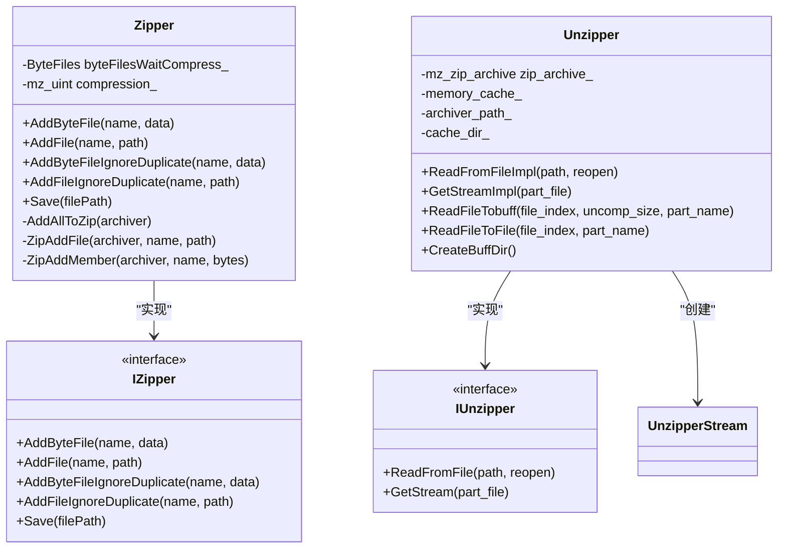
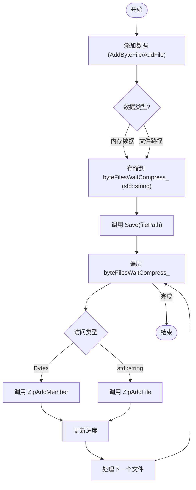
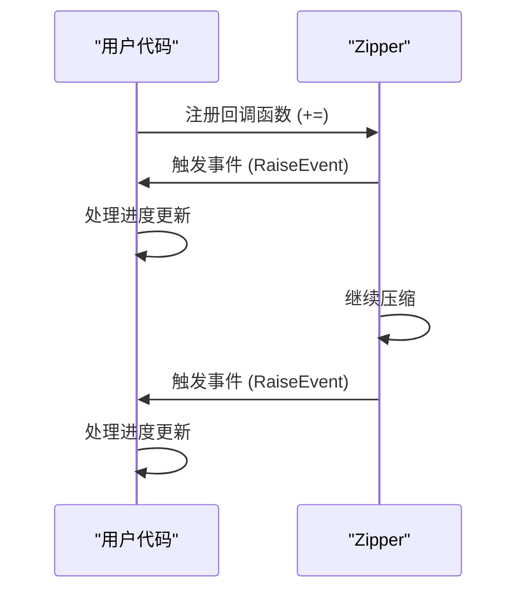
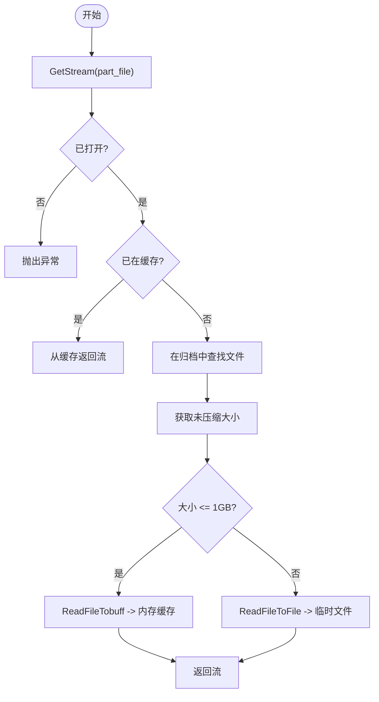
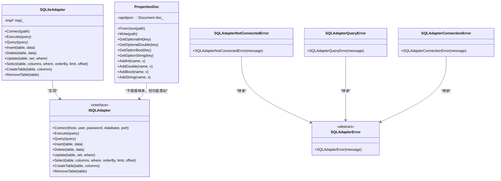
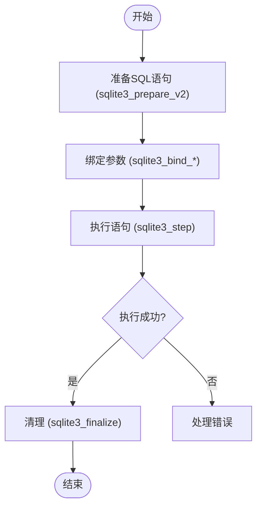

# 文件操作

<cite>
**本文档中引用的文件**  
- [zipper.hpp](file://fileoperator/zipper.hpp)
- [zipper.cpp](file://fileoperator/zipper.cpp)
- [unzipper.hpp](file://fileoperator/unzipper.hpp)
- [unzipper.cpp](file://fileoperator/unzipper.cpp)
- [bit7z_zipper.hpp](file://fileoperator/bit7z_zipper.hpp)
- [bit7z_zipper.cpp](file://fileoperator/bit7z_zipper.cpp)
- [bit7z_unzipper.hpp](file://fileoperator/bit7z_unzipper.hpp)
- [bit7z_unzipper.cpp](file://fileoperator/bit7z_unzipper.cpp)
- [sql_adapter.hpp](file://fileoperator/sql_adapter.hpp)
- [sql_adapter.cpp](file://fileoperator/sql_adapter.cpp)
- [properties_doc.hpp](file://fileoperator/properties_doc.hpp)
- [properties_doc.cpp](file://fileoperator/properties_doc.cpp)
- [zipper_test.cpp](file://tests/FilesOperator/zipper_test.cpp)
- [sqlite_test.cpp](file://tests/FilesOperator/sqlite_test.cpp)
</cite>

## 目录
1. [引言](#引言)
2. [压缩/解压子系统](#压缩解压子系统)
3. [数据库访问子系统](#数据库访问子系统)
4. [典型用例与集成](#典型用例与集成)
5. [性能与安全建议](#性能与安全建议)
6. [结论](#结论)

## 引言

本文件详细描述了HsBaSlicer项目中文件操作子系统的两大核心功能：ZIP压缩/解压与SQLite数据库访问。文档深入分析了`Zipper`、`Unzipper`、`SQLAdapter`等核心类的设计与实现，涵盖了双后端支持、内存管理、事件回调、事务处理和安全防护等关键特性。通过类图、流程图和代码示例，为开发者提供了全面的技术参考。

## 压缩/解压子系统

文件操作子系统的压缩/解压功能提供了灵活且高效的API，支持内存流与文件流的混合操作，并通过事件回调机制提供进度反馈。

### Zipper与Unzipper类设计

`Zipper`和`Unzipper`类是压缩/解压功能的核心，它们通过继承`IZipper`和`IUnzipper`接口实现了统一的API。`Zipper`类使用miniz库作为默认后端，负责将文件或内存数据添加到ZIP归档中并保存到磁盘。



**图源**  
- [zipper.hpp](file://fileoperator/zipper.hpp#L28-L57)
- [unzipper.hpp](file://fileoperator/unzipper.hpp#L15-L49)

### 双后端支持（miniz与bit7z）

系统支持双后端压缩库，以满足不同的功能需求。`Zipper`和`Unzipper`类使用轻量级的miniz库，适用于基本的ZIP格式操作。而`Bit7zZipper`和`Bit7ZUnzipper`类则封装了功能更强大的bit7z库，支持多种压缩格式（如7z、XZ、BZIP2等）和密码保护。

```mermaid
classDiagram
class Bit7zZipper {
-ByteFiles byteFilesWaitCompress_
-dll_path_
-format_
-password_
+AddByteFile(name, data)
+AddFile(name, path)
+Save(filePath)
-SaveAllFile(compress, path)
}
class Bit7ZUnzipper {
-archiver_
-dll_path_
-password_
+ReadFromFileImpl(path, reopen)
+GetStreamImpl(part_file)
+ReadFileTobuff(it, uncomp_size, part_name)
+ReadFileToFile(it, part_name)
+CreateBuffDir()
}
Bit7zZipper --> IZipper : "实现"
Bit7ZUnzipper --> IUnzipper : "实现"
Bit7zZipper ..> bit7z : : BitArchiveWriter : "使用"
Bit7ZUnzipper ..> bit7z : : BitArchiveReader : "使用"
```

**图源**  
- [bit7z_zipper.hpp](file://fileoperator/bit7z_zipper.hpp#L46-L70)
- [bit7z_unzipper.hpp](file://fileoperator/bit7z_unzipper.hpp#L20-L68)

### 内存流与文件流混合压缩

`Zipper`类通过`std::variant<Bytes, std::string>`类型统一管理内存数据和文件路径，实现了内存流与文件流的混合压缩。`AddByteFile`方法用于添加内存中的数据，而`AddFile`方法则用于添加磁盘上的文件。



**图源**  
- [zipper.hpp](file://fileoperator/zipper.hpp#L49-L51)
- [zipper.cpp](file://fileoperator/zipper.cpp#L94-L122)

### 进度事件回调机制（Utils::EventSource）

`Zipper`和`Unzipper`类均继承自`Utils::EventSource`，实现了进度事件回调机制。在压缩或解压过程中，系统会定期触发事件，通知监听者当前的进度和正在处理的文件名。



**图源**  
- [zipper.hpp](file://fileoperator/zipper.hpp#L28)
- [unzipper.hpp](file://fileoperator/unzipper.hpp#L17)

### 大文件缓存策略

`Unzipper`类实现了智能的大文件缓存策略。对于小于1GB的文件，系统将其解压到内存缓存中；对于更大的文件，则解压到临时文件中。这避免了内存溢出，同时保证了小文件的快速访问。



**图源**  
- [unzipper.hpp](file://fileoperator/unzipper.hpp#L39-L40)
- [unzipper.cpp](file://fileoperator/unzipper.cpp#L84-L88)

### AddFile/AddByteFile接口与异常处理

`AddFile`和`AddByteFile`接口用于向压缩包中添加内容。如果文件名重复，会抛出`InvalidArgumentError`异常。系统提供了`AddFileIgnoreDuplicate`和`AddByteFileIgnoreDuplicate`方法，它们会在文件名后添加"_duplicate"后缀来避免冲突。

**节源**  
- [zipper.hpp](file://fileoperator/zipper.hpp#L38-L42)
- [zipper.cpp](file://fileoperator/zipper.cpp#L33-L75)

## 数据库访问子系统

数据库访问子系统提供了对SQLite、MySQL和PostgreSQL等多种数据库的支持，其中`properties_doc`与`sql_adapter`专门用于实现键值对配置的持久化。

### properties_doc与sql_adapter设计

`properties_doc`类是一个简单的JSON文档管理器，用于存储和读取配置。`sql_adapter`则提供了对SQL数据库的统一访问接口，通过`SQLiteAdapter`、`MySQLAdapter`等具体实现类支持不同的数据库。



**图源**  
- [sql_adapter.hpp](file://fileoperator/sql_adapter.hpp#L20-L135)
- [properties_doc.hpp](file://fileoperator/properties_doc.hpp#L22-L113)

### 键值对配置持久化

`properties_doc`类通过`rapidjson`库将键值对配置以JSON格式持久化到文件中。它支持多种数据类型（int, double, bool, string）及其数组形式。

**节源**  
- [properties_doc.hpp](file://fileoperator/properties_doc.hpp#L26-L112)
- [properties_doc.cpp](file://fileoperator/properties_doc.cpp#L9-L283)

### 事务管理

`sql_adapter`通过使用`sqlite3_stmt`预编译语句和`sqlite3_step`执行，实现了隐式的事务管理。每个`Insert`、`Update`、`Delete`操作都是一个独立的事务。对于需要显式事务的场景，可以通过`Execute("BEGIN TRANSACTION")`和`Execute("COMMIT")`来控制。

**节源**  
- [sql_adapter.cpp](file://fileoperator/sql_adapter.cpp#L186-L235)

### SQL注入防护

系统通过使用预编译语句（Prepared Statements）和参数绑定（Parameter Binding）来有效防止SQL注入攻击。所有用户输入的数据都通过`?`占位符传递，并在执行时绑定，确保了数据的安全性。



**图源**  
- [sql_adapter.cpp](file://fileoperator/sql_adapter.cpp#L186-L235)

### 跨平台路径编码转换

系统通过`base/encoding_convert.hpp`中的`utf8_to_local`函数，将UTF-8编码的路径转换为本地编码（如Windows上的GBK），确保了在不同操作系统上文件路径的正确处理。

**节源**  
- [zipper.cpp](file://fileoperator/zipper.cpp#L35)
- [properties_doc.cpp](file://fileoperator/properties_doc.cpp#L11)

## 典型用例与集成

本节提供将切片结果打包为ZIP并嵌入元数据数据库的典型用例代码。

### 打包切片结果为ZIP

```cpp
// 创建压缩器
HsBa::Slicer::Zipper zipper(HsBa::Slicer::MinizCompression::Tight);
// 注册进度回调
zipper += [](double rate, std::string_view filename) {
    std::cout << "压缩进度: " << rate * 100.0 << "% - " << filename << std::endl;
};

// 添加切片结果文件
zipper.AddFile("layer_0.gcode", "output/layer_0.gcode");
zipper.AddFile("layer_1.gcode", "output/layer_1.gcode");

// 添加元数据JSON
HsBa::Slicer::Config::PropertiesDoc metadata;
metadata.AddString("model_name", "test_model");
metadata.AddInt("layer_count", 100);
std::string metadata_str = /* 将metadata序列化为JSON字符串 */;
zipper.AddByteFile("metadata.json", metadata_str);

// 保存ZIP文件
zipper.Save("sliced_result.zip");
```

### 嵌入元数据到SQLite数据库

```cpp
// 连接到SQLite数据库
HsBa::Slicer::SQL::SQLiteAdapter db;
db.Connect("sliced_result.db");

// 创建表
db.CreateTable("metadata", {{"key", "TEXT PRIMARY KEY"}, {"value", "TEXT"}});

// 插入元数据
db.Insert("metadata", {{"key", std::string("model_name")}, {"value", std::string("test_model")}});
db.Insert("metadata", {{"key", std::string("layer_count")}, {"value", std::string("100")}});
```

**节源**  
- [zipper_test.cpp](file://tests/FilesOperator/zipper_test.cpp#L24-L55)
- [sqlite_test.cpp](file://tests/FilesOperator/sqlite_test.cpp#L25-L56)

## 性能与安全建议

### 压缩性能对比

| 后端 | 优点 | 缺点 | 适用场景 |
| :--- | :--- | :--- | :--- |
| miniz | 轻量、快速、无外部依赖 | 格式支持有限 | 基本ZIP操作 |
| bit7z | 支持多种格式、高压缩率、支持加密 | 依赖外部DLL、体积大 | 需要高级功能 |

### 安全审计建议

1.  **输入验证**：在调用`AddFile`或`AddByteFile`前，验证文件名和路径的有效性，防止路径遍历攻击。
2.  **资源清理**：确保`Unzipper`对象在析构时能正确清理临时文件和内存缓存。
3.  **异常处理**：在数据库操作中，始终使用`try-catch`块捕获`SQLAdapterError`及其派生异常。
4.  **连接管理**：及时关闭数据库连接，避免连接泄露。
5.  **权限最小化**：数据库连接应使用具有最小必要权限的账户。

## 结论

HsBaSlicer的文件操作子系统设计精良，功能全面。其双后端压缩支持提供了灵活性，而智能的缓存策略保证了性能。数据库访问层通过统一的接口和严格的SQL注入防护，确保了数据的安全与可靠。结合`properties_doc`进行配置管理，开发者可以轻松实现复杂的数据持久化需求。