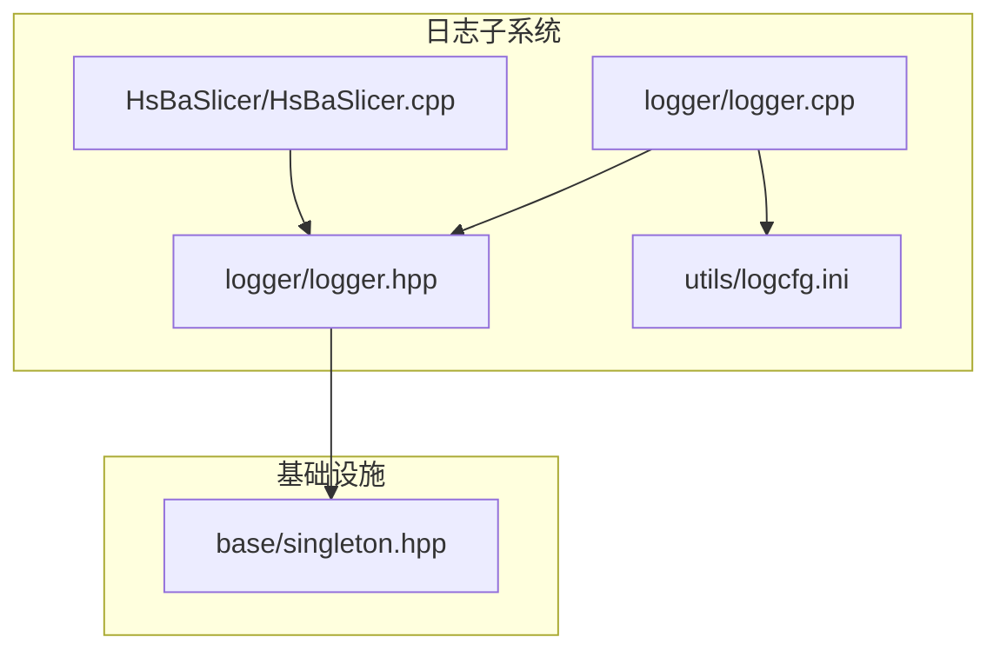
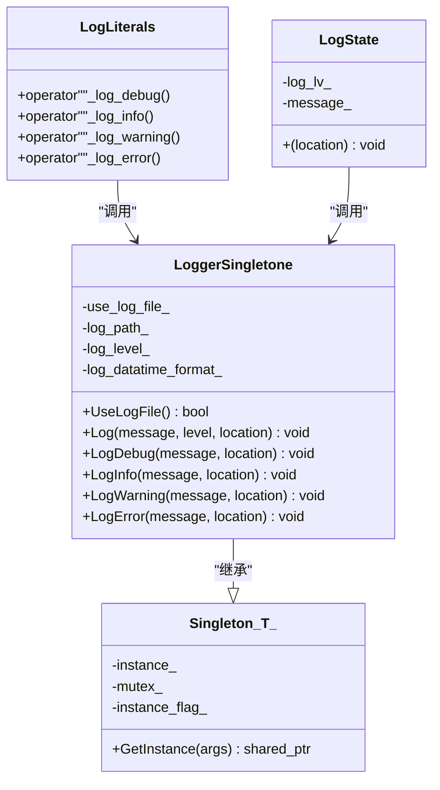
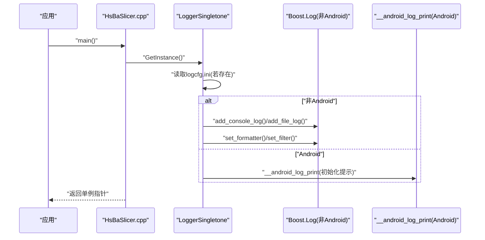
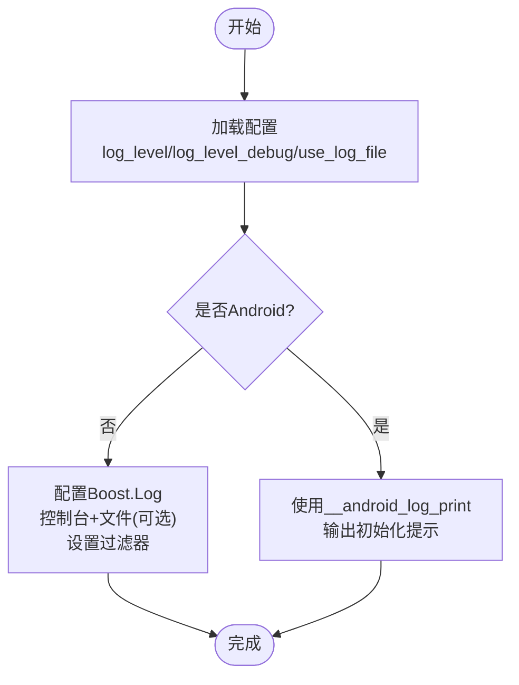
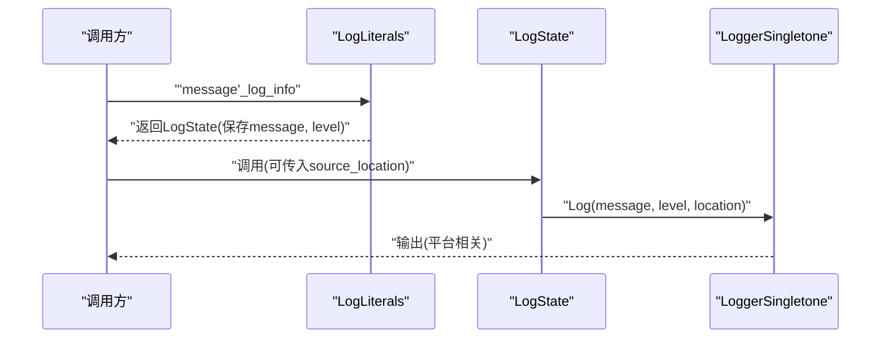
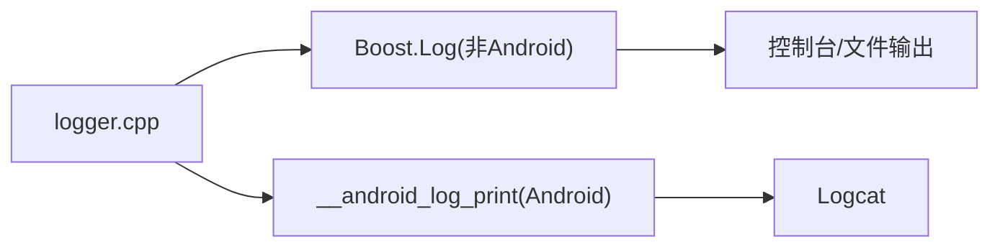
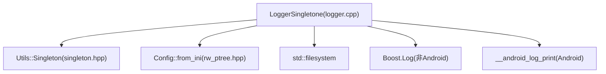
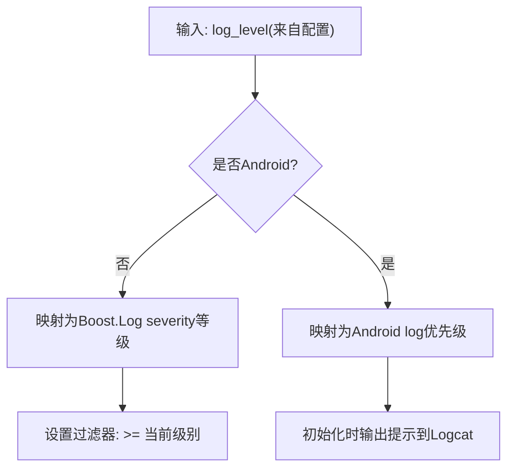

# 日志系统

<cite>
**本文引用的文件**
- [logger.hpp](file://logger/logger.hpp)
- [logger.cpp](file://logger/logger.cpp)
- [singleton.hpp](file://base/singleton.hpp)
- [logcfg.ini](file://utils/logcfg.ini)
- [HsBaSlicer.cpp](file://HsBaSlicer/HsBaSlicer.cpp)
</cite>

## 目录
1. [简介](#简介)
2. [项目结构](#项目结构)
3. [核心组件](#核心组件)
4. [架构总览](#架构总览)
5. [详细组件分析](#详细组件分析)
6. [依赖关系分析](#依赖关系分析)
7. [性能考量](#性能考量)
8. [故障排查指南](#故障排查指南)
9. [结论](#结论)
10. [附录](#附录)

## 简介
本文件围绕 LoggerSingletone 单例日志系统进行深入解析，涵盖：
- 单例设计与跨平台适配（Windows/Linux 使用 Boost.Log；Android 使用 __android_log_print 转发到 Logcat）
- 多级别日志输出（trace/debug/info/warning/error/fatal）
- 配置文件 logcfg.ini 的语法结构与生效逻辑
- 源码位置自动捕获（source_location）的实现原理
- 日志级别决策树、高频调用场景下的性能评估与优化建议
- 分布式环境下的日志聚合建议

## 项目结构
日志系统位于 logger 子目录，核心文件为 logger.hpp 和 logger.cpp；单例基类位于 base/singleton.hpp；日志配置位于 utils/logcfg.ini；示例使用位于 HsBaSlicer/HsBaSlicer.cpp。

图表来源
- [logger.hpp](file://logger/logger.hpp#L1-L61)
- [logger.cpp](file://logger/logger.cpp#L1-L293)
- [singleton.hpp](file://base/singleton.hpp#L1-L46)
- [logcfg.ini](file://utils/logcfg.ini#L1-L8)
- [HsBaSlicer.cpp](file://HsBaSlicer/HsBaSlicer.cpp#L1-L25)

章节来源
- [logger.hpp](file://logger/logger.hpp#L1-L61)
- [logger.cpp](file://logger/logger.cpp#L1-L293)
- [singleton.hpp](file://base/singleton.hpp#L1-L46)
- [logcfg.ini](file://utils/logcfg.ini#L1-L8)
- [HsBaSlicer.cpp](file://HsBaSlicer/HsBaSlicer.cpp#L1-L25)

## 核心组件
- LoggerSingletone：线程安全的单例日志器，负责初始化、配置加载、级别映射、输出分派与 Android 特殊处理。
- Utils::Singleton<T>：通用单例模板，提供一次性创建与共享指针管理。
- LogLiterals 命名空间：提供带字面量后缀的便捷日志接口，延迟到调用时才输出。

关键职责与行为：
- 初始化阶段从当前工作目录查找 logcfg.ini 并加载配置；若缺失则采用默认值。
- Windows/Linux：使用 Boost.Log 输出到控制台与（可选）文件；文件滚动策略与时间戳格式由配置决定。
- Android：直接通过 __android_log_print 输出到 Logcat，同时打印初始化提示。
- 日志级别：trace/debug/info/warning/error/fatal，支持运行期过滤。
- 自动源码位置：通过 std::source_location 自动注入文件名、行号、函数名。

章节来源
- [logger.hpp](file://logger/logger.hpp#L14-L61)
- [logger.cpp](file://logger/logger.cpp#L72-L142)
- [singleton.hpp](file://base/singleton.hpp#L11-L46)

## 架构总览
LoggerSingletone 通过 Utils::Singleton<T> 实现线程安全的单例；构造函数中根据配置决定输出目标与级别过滤；对外提供静态方法与字面量接口，内部根据平台宏选择具体实现。

图表来源
- [logger.hpp](file://logger/logger.hpp#L14-L61)
- [logger.cpp](file://logger/logger.cpp#L228-L293)
- [singleton.hpp](file://base/singleton.hpp#L11-L46)

## 详细组件分析

### LoggerSingletone 单例与初始化
- 单例模式：通过 Utils::Singleton<T> 提供线程安全的一次性实例化，避免重复初始化。
- 配置加载：
  - 默认级别：调试构建使用较低级别，发布构建使用较高级别。
  - 配置项：log_level、log_level_debug、use_log_file、log_file、log_format.log_datatime_format。
  - 若配置文件不存在或字段缺失，回退到默认值。
- 输出目标：
  - Windows/Linux：控制台与（可选）文件；文件滚动策略为按天旋转，大小上限为固定值；设置全局时间戳属性。
  - Android：直接使用 __android_log_print 输出到 Logcat，并打印初始化提示。

图表来源
- [logger.cpp](file://logger/logger.cpp#L72-L142)
- [logcfg.ini](file://utils/logcfg.ini#L1-L8)
- [HsBaSlicer.cpp](file://HsBaSlicer/HsBaSlicer.cpp#L9-L24)

章节来源
- [logger.cpp](file://logger/logger.cpp#L72-L142)
- [logcfg.ini](file://utils/logcfg.ini#L1-L8)

### 日志级别与过滤
- 级别映射：
  - Windows/Linux：trace/debug/info/warning/error/fatal 对应 Boost.Log 的 severity 等级。
  - Android：verbose/debug/info/warn/error/fatal 对应 Android log 优先级。
- 过滤策略：
  - 构造时根据配置设置最小可见级别；仅输出大于等于该级别的日志。
  - 调试构建默认较低级别，发布构建默认较高级别。

图表来源
- [logger.cpp](file://logger/logger.cpp#L72-L142)

章节来源
- [logger.cpp](file://logger/logger.cpp#L31-L69)
- [logger.cpp](file://logger/logger.cpp#L112-L137)

### 字面量日志接口与 source_location 自动捕获
- 字面量接口：提供 _log_debug/_log_info/_log_warning/_log_error 四个字面量后缀，延迟到调用 operator""(...) 时才创建 LogState，并在 LogState::operator() 中调用 LoggerSingletone::Log。
- 自动捕获：LogState::operator() 接收 std::source_location，默认参数为当前调用点，GetSourceLocation 将文件名、行号、函数名拼接为统一格式。

图表来源
- [logger.hpp](file://logger/logger.hpp#L38-L61)
- [logger.cpp](file://logger/logger.cpp#L263-L293)
- [logger.cpp](file://logger/logger.cpp#L25-L30)

章节来源
- [logger.hpp](file://logger/logger.hpp#L38-L61)
- [logger.cpp](file://logger/logger.cpp#L25-L30)
- [logger.cpp](file://logger/logger.cpp#L263-L293)

### 跨平台适配与 Android 特殊处理
- 非 Android：包含 Boost.Log 头文件，配置控制台与文件输出，设置时间戳属性与过滤器。
- Android：不包含 Boost.Log，直接包含 <android/log.h>，在构造时打印初始化提示，并在 Log() 中通过 __android_log_print 输出。

图表来源
- [logger.cpp](file://logger/logger.cpp#L1-L17)
- [logger.cpp](file://logger/logger.cpp#L137-L141)

章节来源
- [logger.cpp](file://logger/logger.cpp#L1-L17)
- [logger.cpp](file://logger/logger.cpp#L137-L141)

### 配置文件 logcfg.ini 语法与语义
- 结构：
  - [log]：log_level、log_level_debug、use_log_file、log_file
  - [log_format]：log_datatime_format、log_time_format
- 语义：
  - log_level：发布构建使用的最小级别
  - log_level_debug：调试构建使用的最小级别
  - use_log_file：是否启用文件输出
  - log_file：文件路径（相对于当前工作目录）
  - log_datatime_format：日期时间格式串
  - log_time_format：时间格式串（当前未在初始化中使用）

章节来源
- [logcfg.ini](file://utils/logcfg.ini#L1-L8)
- [logger.cpp](file://logger/logger.cpp#L82-L111)
- [logger.cpp](file://logger/logger.cpp#L116-L136)

### 在模块中调用日志接口
- 获取单例：通过 LoggerSingletone::GetInstance() 获取共享指针。
- 使用字面量接口：在需要的位置引入命名空间后，使用 "消息内容"_log_info 等字面量后缀快速输出。
- 条件判断：UseLogFile() 可用于判断当前是否启用文件输出（Android 总是视为启用）。

章节来源
- [HsBaSlicer.cpp](file://HsBaSlicer/HsBaSlicer.cpp#L9-L24)
- [logger.hpp](file://logger/logger.hpp#L38-L61)
- [logger.cpp](file://logger/logger.cpp#L144-L152)

## 依赖关系分析
- LoggerSingletone 依赖：
  - Utils::Singleton<T>：提供线程安全单例基础设施
  - Boost.Log（非 Android）：控制台与文件输出、格式化、过滤
  - Android NDK（Android）：__android_log_print
  - 配置解析：fileoperator/rw_ptree（通过 Config::from_ini）
  - 文件系统：std::filesystem 用于定位配置文件
  - 时间格式：boost::log::expressions::format_date_time

图表来源
- [logger.cpp](file://logger/logger.cpp#L1-L20)
- [logger.cpp](file://logger/logger.cpp#L72-L142)
- [singleton.hpp](file://base/singleton.hpp#L11-L46)

章节来源
- [logger.cpp](file://logger/logger.cpp#L1-L20)
- [logger.cpp](file://logger/logger.cpp#L72-L142)
- [singleton.hpp](file://base/singleton.hpp#L11-L46)

## 性能考量
- 高频调用场景：
  - 级别过滤：构造时设置最小级别，可在源头减少昂贵的格式化与输出成本。
  - 字面量接口：延迟到调用时才创建 LogState，避免无谓对象分配。
  - Android 输出：__android_log_print 通常较轻量，但频繁调用仍可能影响 UI 线程或造成阻塞，建议批量输出或合并日志。
  - 文件输出：Boost.Log 文件写入涉及磁盘 I/O 与滚动策略，建议在高频场景下降低日志级别或减少格式化开销。
- 优化建议：
  - 合理设置 log_level/log_level_debug，避免在生产环境输出过多 debug 信息。
  - 使用字面量接口，减少显式 source_location 参数传递。
  - 对于 Android，避免在 UI 线程中进行大量日志输出；必要时考虑异步缓冲队列。
  - 控制日志消息长度与格式复杂度，减少字符串拼接与格式化成本。

[本节为通用性能讨论，无需列出章节来源]

## 故障排查指南
- 配置文件未生效：
  - 确认当前工作目录下存在 logcfg.ini；否则将使用默认配置。
  - 检查配置项名称与类型是否匹配（如 log_level 应为整数）。
- 输出异常：
  - 非 Android 平台：确认 Boost.Log 已正确链接且 add_console_log/add_file_log 成功。
  - Android 平台：确认已包含 <android/log.h>，并在构造时看到初始化提示。
- 日志级别不符合预期：
  - 调试构建与发布构建使用不同的默认级别；可通过 log_level_debug/log_level 控制。
- 源码位置信息缺失：
  - 确保调用处未显式覆盖 source_location；默认会自动捕获文件名、行号、函数名。

章节来源
- [logger.cpp](file://logger/logger.cpp#L72-L111)
- [logger.cpp](file://logger/logger.cpp#L112-L137)
- [logger.cpp](file://logger/logger.cpp#L137-L141)
- [logger.cpp](file://logger/logger.cpp#L25-L30)

## 结论
LoggerSingletone 通过单例与跨平台适配，提供了统一的日志接口与灵活的配置能力。借助 Boost.Log（非 Android）与 Android NDK（Android），系统能够在桌面与移动平台上一致地输出 trace/debug/info/warning/error/fatal 级别的日志。结合字面量接口与 source_location 自动捕获，开发者可以以极低的侵入性获得丰富的上下文信息。在高频调用场景下，建议合理设置日志级别与输出策略，以平衡可观测性与性能。

[本节为总结性内容，无需列出章节来源]

## 附录

### 日志级别决策树

图表来源
- [logger.cpp](file://logger/logger.cpp#L31-L69)
- [logger.cpp](file://logger/logger.cpp#L137-L141)

### 分布式环境日志聚合建议
- 结构化日志：在日志中加入服务名、实例 ID、请求 ID、时间戳等上下文字段，便于检索与关联。
- 统一日志格式：使用统一的时间戳格式与字段顺序，便于下游解析。
- 输出目标：在容器或云环境中，优先将日志输出到标准输出或标准错误，交由平台收集器统一采集。
- 压缩与轮转：对文件输出实施压缩与轮转策略，避免磁盘占用过大。
- 异步与缓冲：在高吞吐场景下使用异步日志或环形缓冲，降低阻塞风险。

[本节为通用建议，无需列出章节来源]