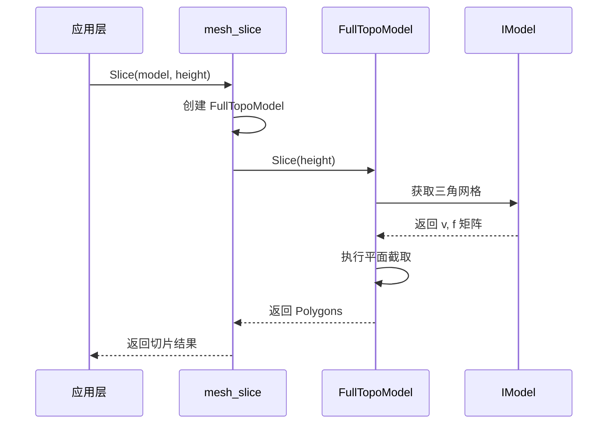
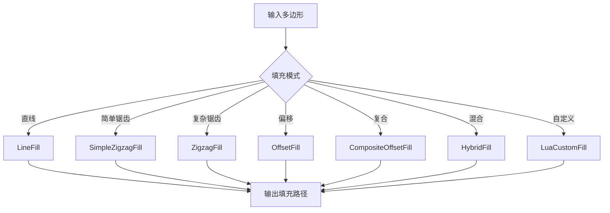
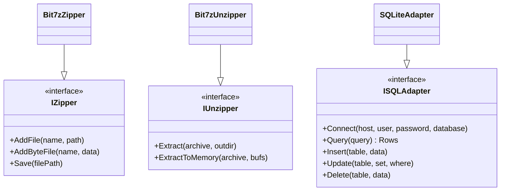
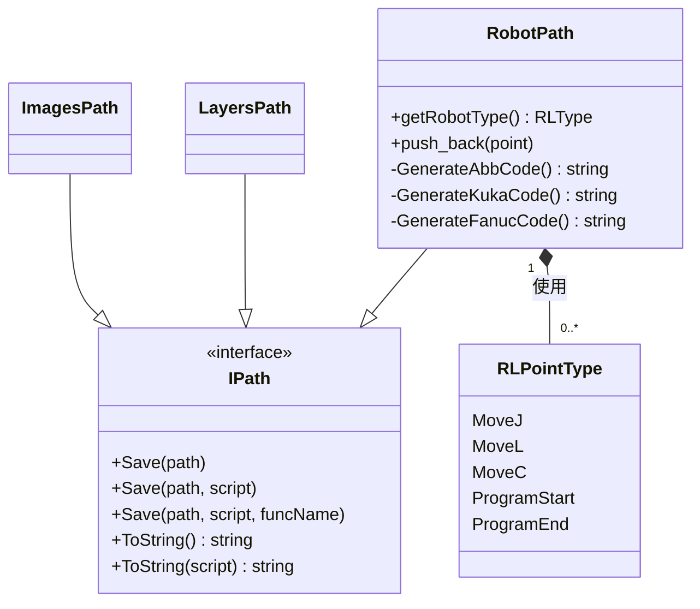

# 核心模块详解

<cite>
**本文档中引用的文件**  
- [IModel.hpp](file://base/IModel.hpp)
- [CgalModel.hpp](file://meshmodel/CgalModel.hpp)
- [OcctModel.hpp](file://cadmodel/OcctModel.hpp)
- [mesh_slice.hpp](file://LibHsBaSlicer/Slice/mesh_slice.hpp)
- [mesh_slice.cpp](file://LibHsBaSlicer/Slice/mesh_slice.cpp)
- [PolygonFill.hpp](file://2D/PolygonFill.hpp)
- [LuaAdapter.hpp](file://2D/LuaAdapter.hpp)
- [bit7z_zipper.hpp](file://fileoperator/bit7z_zipper.hpp)
- [bit7z_unzipper.hpp](file://fileoperator/bit7z_unzipper.hpp)
- [sql_adapter.hpp](file://fileoperator/sql_adapter.hpp)
- [logger.hpp](file://logger/logger.hpp)
- [IPath.hpp](file://paths/IPath.hpp)
- [imagespath.hpp](file://paths/imagespath.hpp)
- [layerspath.hpp](file://paths/layerspath.hpp)
- [robotpath.hpp](file://paths/robotpath.hpp)
</cite>

## 目录
1. [模型抽象层 IModel](#模型抽象层-imodel)  
2. [切片引擎 mesh_slice](#切片引擎-mesh_slice)  
3. [2D路径填充模块](#2d路径填充模块)  
4. [文件操作模块](#文件操作模块)  
5. [日志系统 LoggerSingletone](#日志系统-loggersingletone)  
6. [路径输出模块](#路径输出模块)

## 模型抽象层 IModel

`IModel` 是 HsBaSlicer 中所有3D模型实现的公共接口，定义在 `base/IModel.hpp` 中。该接口为上层模块提供了统一的模型操作方法，屏蔽了底层几何内核的差异，实现了模型处理的抽象化。

接口主要包含以下功能：
- **文件操作**：`Load` 和 `Save` 方法支持从文件加载模型和保存模型到文件，支持多种格式。
- **几何变换**：提供 `Translate`、`Rotate`、`Scale` 和多种 `Transform` 重载方法，支持对模型进行平移、旋转、缩放和仿射变换。
- **属性查询**：`BoundingBox` 获取模型的轴对齐包围盒，`Volume` 计算模型体积。
- **数据导出**：`TriangleMesh` 方法返回 Eigen 矩阵格式的三角网格数据，便于与其他库集成。

该接口有两个主要实现类：`CgalModel` 和 `OcctModel`。

`CgalModel`（位于 `meshmodel/CgalModel.hpp`）基于 CGAL 几何库实现，适用于需要高精度布尔运算和网格处理的场景。它支持通过 `Union`、`Intersection`、`Difference` 等友元函数进行布尔操作，并提供了 `CreateBox`、`CreateSphere` 等静态方法创建基本几何体。

`OcctModel`（位于 `cadmodel/OcctModel.hpp`）基于 OpenCASCADE Technology (OCCT) 实现，更适合处理复杂的CAD模型和STEP/IGES等工业标准格式。它支持通过 `ThickSolid` 进行抽壳操作，并能更好地保持CAD模型的拓扑结构。

开发者在选择实现时，应根据应用场景权衡：若侧重算法精度和网格处理，推荐使用 `CgalModel`；若侧重CAD兼容性和复杂曲面处理，则 `OcctModel` 更为合适。

**Section sources**
- [IModel.hpp](file://base/IModel.hpp#L1-L37)
- [CgalModel.hpp](file://meshmodel/CgalModel.hpp#L1-L82)
- [OcctModel.hpp](file://cadmodel/OcctModel.hpp#L1-L80)

## 切片引擎 mesh_slice

切片引擎 `mesh_slice` 是 HsBaSlicer 的核心功能之一，负责将3D模型沿Z轴切片生成2D轮廓。其接口定义在 `LibHsBaSlicer/Slice/mesh_slice.hpp` 中。

主要提供以下函数：
- `Slice(const IModel&, const float)`：进行安全切片，返回封闭的多边形轮廓。这是推荐的常规切片方法。
- `UnSafeSlice(const IModel&, const float)`：进行非安全切片，可能包含不封闭的轮廓。适用于送丝等特定工艺。
- `SliceLua` 和 `UnSafeSliceLua`：支持通过Lua脚本定制切片逻辑，提供高度灵活性。

从 `mesh_slice.cpp` 的实现可以看出，这些函数内部都通过创建 `FullTopoModel` 对象来完成实际的切片工作。`FullTopoModel` 是一个完整的拓扑模型处理器，能够处理模型的拓扑结构，确保切片结果的几何正确性。

切片过程的核心是平面截取算法，即用一个Z值固定的平面与3D模型相交，计算交线并生成闭合的2D多边形。该过程需要处理复杂的拓扑情况，如多个轮廓、内外环关系等。

**Diagram sources**
- [mesh_slice.hpp](file://LibHsBaSlicer/Slice/mesh_slice.hpp#L1-L20)
- [mesh_slice.cpp](file://LibHsBaSlicer/Slice/mesh_slice.cpp#L1-L28)

**Section sources**
- [mesh_slice.hpp](file://LibHsBaSlicer/Slice/mesh_slice.hpp#L1-L20)
- [mesh_slice.cpp](file://LibHsBaSlicer/Slice/mesh_slice.cpp#L1-L28)

## 2D路径填充模块

2D路径填充模块位于 `2D/` 目录下，负责将切片得到的2D轮廓转换为实际的加工路径。其核心功能定义在 `PolygonFill.hpp` 中。

该模块提供了多种填充算法：
- **直线填充 (LineFill)**：生成平行直线路径，可通过 `angle_deg` 参数设置填充角度。
- **锯齿填充 (SimpleZigzagFill, ZigzagFill)**：生成锯齿形路径，减少抬笔次数，提高加工效率。
- **偏移填充 (OffsetFill)**：从轮廓边界开始，向内逐层偏移生成路径。
- **复合填充 (CompositeOffsetFill, HybridFill)**：结合偏移和内部填充，先进行若干次偏移，再对剩余区域进行直线或锯齿填充。

填充算法支持通过 `spacing` 参数控制路径间距，`lineThickness` 控制线宽，并可通过 `JoinType` 参数控制路径连接处的样式（如方形、圆形等）。

模块最大的亮点是支持通过Lua脚本扩展自定义填充行为。`LuaCustomFill` 和 `LuaCustomFillString` 函数允许开发者编写Lua脚本，实现完全自定义的填充逻辑，极大地增强了系统的可扩展性。

**Diagram sources**
- [PolygonFill.hpp](file://2D/PolygonFill.hpp#L1-L46)

**Section sources**
- [PolygonFill.hpp](file://2D/PolygonFill.hpp#L1-L46)
- [LuaAdapter.hpp](file://2D/LuaAdapter.hpp#L1-L25)

## 文件操作模块

文件操作模块负责处理文件的压缩/解压和数据库访问，位于 `fileoperator/` 目录。

**ZIP压缩/解压**：基于 `bit7z` 库实现，通过 `bit7z_zipper.hpp` 和 `bit7z_unzipper.hpp` 提供功能。`Bit7zZipper` 类实现了 `IZipper` 接口，支持多种格式（ZIP, 7z, RAR等）的压缩和解压。它支持添加文件或字节数据到压缩包，并可通过事件机制报告压缩进度。

**SQLite数据库访问**：通过 `sql_adapter.hpp` 提供。`SQLiteAdapter` 类实现了 `ISQLAdapter` 接口，封装了SQLite数据库的连接、查询、增删改查等操作。该模块设计了丰富的异常类型（如 `SQLAdapterConnectionError`、`SQLAdapterQueryError`）来处理数据库操作中的各种错误。此外，还提供了流畅的API设计，支持通过操作符重载（如 `|`）进行链式调用，使数据库操作代码更加简洁。

**Diagram sources**
- [bit7z_zipper.hpp](file://fileoperator/bit7z_zipper.hpp#L1-L74)
- [bit7z_unzipper.hpp](file://fileoperator/bit7z_unzipper.hpp)
- [sql_adapter.hpp](file://fileoperator/sql_adapter.hpp#L1-L336)

**Section sources**
- [bit7z_zipper.hpp](file://fileoperator/bit7z_zipper.hpp#L1-L74)
- [bit7z_unzipper.hpp](file://fileoperator/bit7z_unzipper.hpp)
- [sql_adapter.hpp](file://fileoperator/sql_adapter.hpp#L1-L336)

## 日志系统 LoggerSingletone

日志系统 `LoggerSingletone` 定义在 `logger/logger.hpp` 中，采用单例模式实现，确保全局只有一个日志实例。

该系统的主要特点包括：
- **多级别输出**：提供 `LogDebug`、`LogInfo`、`LogWarning`、`LogError` 等静态方法，支持不同严重级别的日志记录。
- **源码位置追踪**：利用C++20的 `std::source_location`，自动记录日志输出的文件名、行号和函数名，便于调试。
- **Android平台适配**：通过 `__ANDROID__` 宏判断平台，在Android上使用特定的日志机制，而在其他平台使用Boost.Log。
- **字面量操作符**：定义了 `_log_debug`、`_log_info` 等用户定义字面量，允许使用 `"Message"_log_info` 这样的简洁语法记录日志。

`LoggerSingletone` 类继承自 `Utils::Singleton`，确保了单例的正确实现。其构造函数为私有，并通过友元类 `Utils::Singleton` 进行受保护的实例化。

**Section sources**
- [logger.hpp](file://logger/logger.hpp#L1-L62)

## 路径输出模块

路径输出模块负责将生成的2D路径保存为不同格式，所有输出类均继承自 `IPath` 接口（定义在 `paths/IPath.hpp`）。

`IPath` 接口定义了统一的保存和序列化方法：
- `Save(path)`：将路径保存到指定文件。
- `Save(path, script)` 和 `Save(path, script, funcName)`：支持通过Lua脚本定制输出格式。
- `ToString()` 及其重载：将路径转换为字符串表示。

具体实现包括：
- **ImagesPath**：将路径保存为图像文件，适用于可视化预览。
- **LayersPath**：将分层的路径数据保存为结构化文件，适用于3D打印等分层制造工艺。
- **RobotPath**：专为机器人加工设计，支持生成ABB、KUKA、FANUC等不同品牌机器人的G代码。`RobotPath` 内部通过 `RLPointType` 枚举区分不同的运动指令（如MoveJ、MoveL），并通过 `GenerateAbbCode`、`GenerateKukaCode` 等私有方法生成对应品牌的代码。

该模块的设计充分体现了开闭原则：对扩展开放（可通过继承 `IPath` 添加新的输出格式），对修改关闭（现有代码无需改动）。

**Diagram sources**
- [IPath.hpp](file://paths/IPath.hpp#L1-L34)
- [imagespath.hpp](file://paths/imagespath.hpp#L1-L38)
- [layerspath.hpp](file://paths/layerspath.hpp#L1-L39)
- [robotpath.hpp](file://paths/robotpath.hpp#L1-L75)

**Section sources**
- [IPath.hpp](file://paths/IPath.hpp#L1-L34)
- [imagespath.hpp](file://paths/imagespath.hpp#L1-L38)
- [layerspath.hpp](file://paths/layerspath.hpp#L1-L39)
- [robotpath.hpp](file://paths/robotpath.hpp#L1-L75)