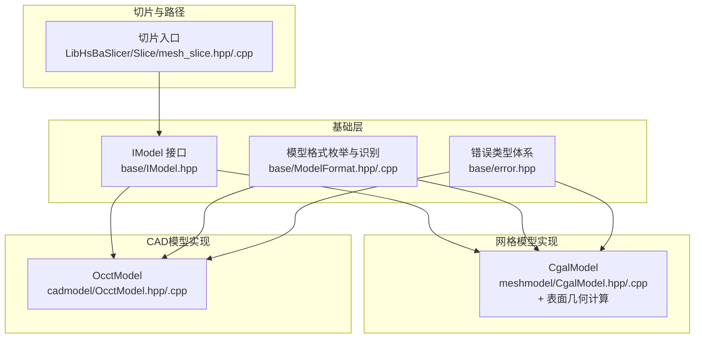
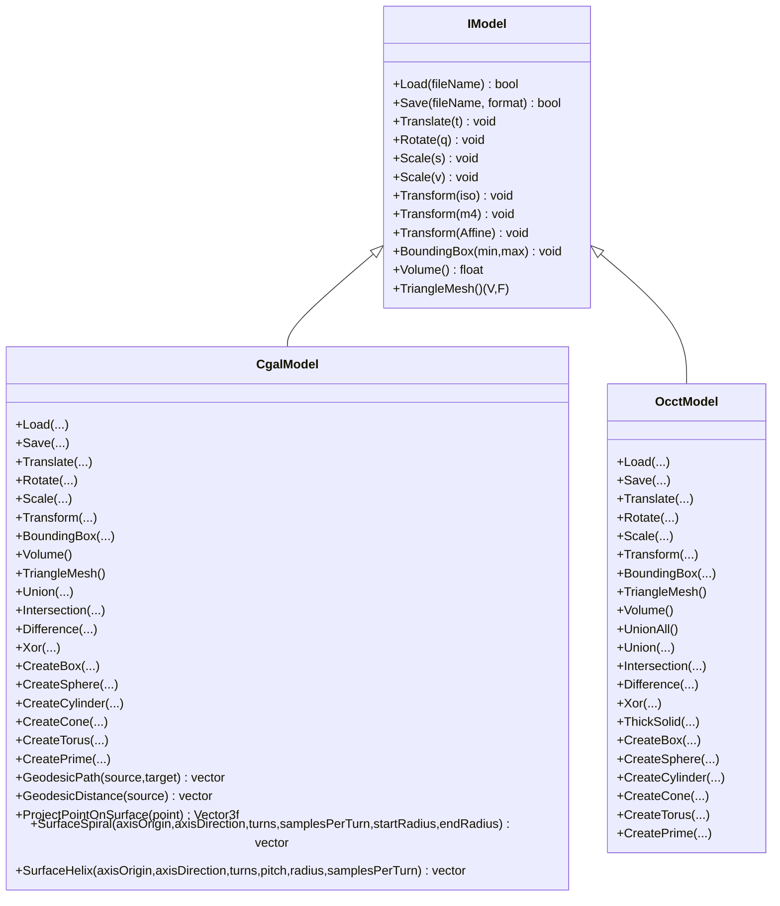
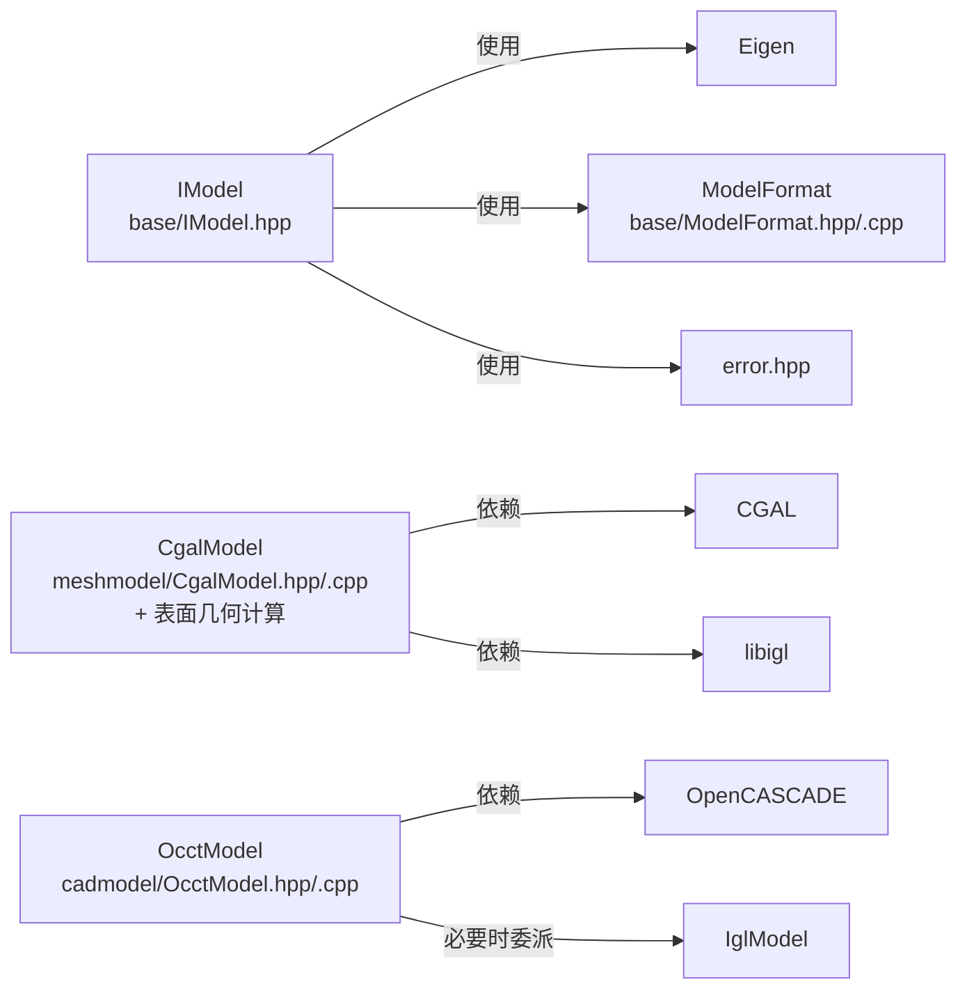
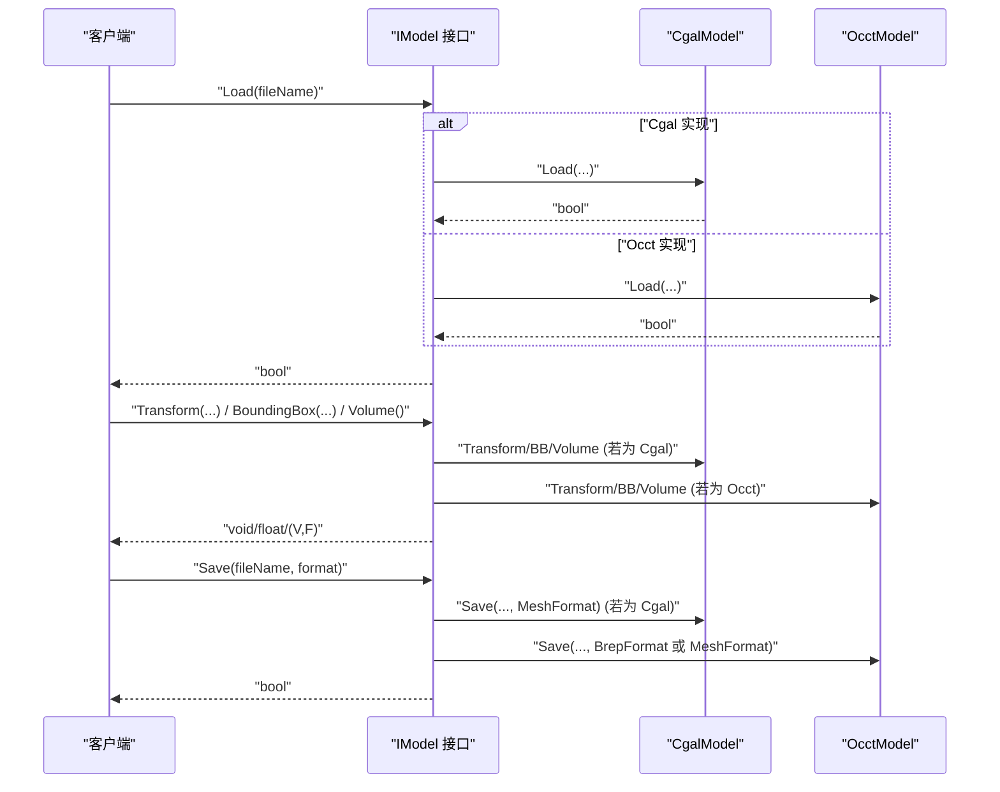
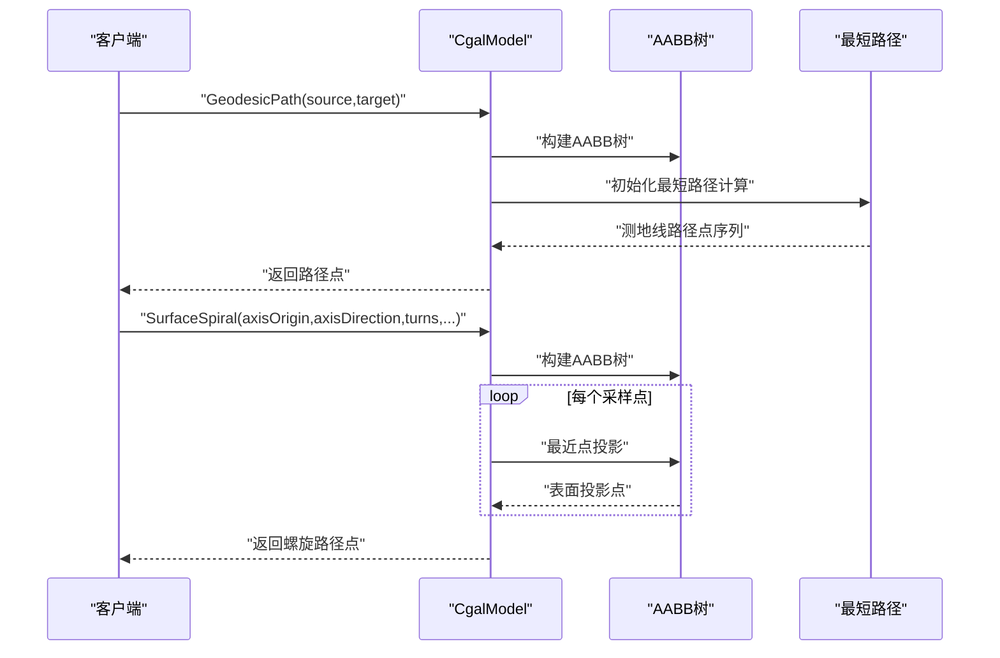
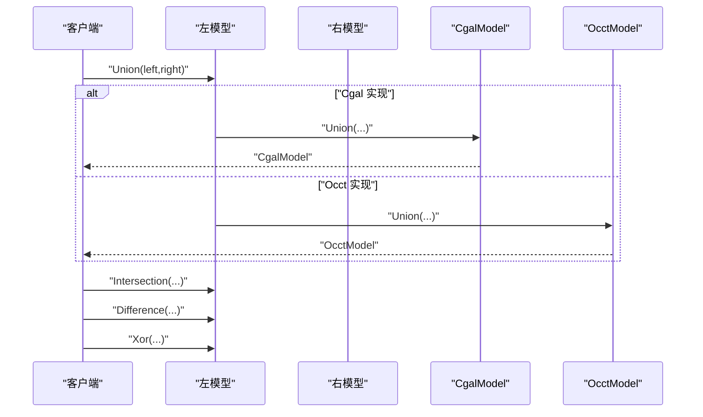

# 模型抽象层

<cite>
**本文引用的文件列表**
- [IModel.hpp](file://base/IModel.hpp)
- [ModelFormat.hpp](file://base/ModelFormat.hpp)
- [ModelFormat.cpp](file://base/ModelFormat.cpp)
- [error.hpp](file://base/error.hpp)
- [CgalModel.hpp](file://meshmodel/CgalModel.hpp)
- [CgalModel.cpp](file://meshmodel/CgalModel.cpp)
- [OcctModel.hpp](file://cadmodel/OcctModel.hpp)
- [OcctModel.cpp](file://cadmodel/OcctModel.cpp)
- [mesh_slice.hpp](file://LibHsBaSlicer/Slice/mesh_slice.hpp)
- [mesh_slice.cpp](file://LibHsBaSlicer/Slice/mesh_slice.cpp)
- [cgal_model_test.cpp](file://tests/Models/cgal_model_test.cpp)
- [occt_model_test.cpp](file://tests/Models/occt_model_test.cpp)
</cite>

## 更新摘要
**变更内容**
- 新增CGAL模型的表面几何计算功能，包括测地线路径计算、表面曲线生成和增强的多边形三角剖分
- 更新了CgalModel类的接口定义，添加了GeodesicPath、GeodesicDistance、ProjectPointOnSurface、SurfaceSpiral、SurfaceHelix等新方法
- 增强了多边形拉伸功能的鲁棒性，改进了孔洞处理和三角剖分算法
- 更新了相关测试用例以验证新功能

## 目录
1. [引言](#引言)
2. [项目结构](#项目结构)
3. [核心组件](#核心组件)
4. [架构总览](#架构总览)
5. [详细组件分析](#详细组件分析)
6. [依赖分析](#依赖分析)
7. [性能考量](#性能考量)
8. [故障排查指南](#故障排查指南)
9. [结论](#结论)
10. [附录](#附录)

## 引言
本文件系统性剖析 IModel 接口的设计原理与实现机制，阐明其作为所有 3D 模型实现的公共契约，覆盖 Load、Save、Transform 等核心方法的语义定义。同时对比 CgalModel 与 OcctModel 两种具体实现的技术差异：前者基于 CGAL 提供高精度布尔运算与切片能力，适用于通用 3D 打印场景；后者基于 OpenCASCADE 支持 STEP/IGES 等工业 CAD 格式，适合复杂机械零件处理。**最新更新**：CgalModel现已增强表面几何计算能力，包括测地线路径计算、表面螺旋线生成和点投影等功能，进一步提升了其在复杂几何分析中的应用价值。文档还说明两者在三角网格生成、体积计算、包围盒提取等方面的一致性保证，并给出通过多态接口统一操作不同模型类型的示例路径，阐述工厂模式在模型创建中的应用。最后提供接口继承关系图、典型调用序列图以及常见错误处理策略。

## 项目结构
该仓库采用按功能域分层的组织方式：
- base：跨模块的基础抽象与通用工具（如 IModel 抽象接口、模型格式枚举与识别、错误类型体系）
- meshmodel：基于网格的模型实现（CgalModel），**已增强表面几何计算功能**
- cadmodel：基于边界表示（B-Rep）的模型实现（OcctModel）
- LibHsBaSlicer：面向切片与路径规划的高层模块，依赖 meshmodel 与 cadmodel
- tests：针对各模型实现的功能与行为测试

**图表来源**
- [IModel.hpp:1-150](file://base/IModel.hpp#L1-L150)
- [ModelFormat.hpp:1-66](file://base/ModelFormat.hpp#L1-L66)
- [ModelFormat.cpp:1-166](file://base/ModelFormat.cpp#L1-L166)
- [CgalModel.hpp:1-136](file://meshmodel/CgalModel.hpp#L1-L136)
- [CgalModel.cpp:1-1202](file://meshmodel/CgalModel.cpp#L1-L1202)
- [OcctModel.hpp:1-92](file://cadmodel/OcctModel.hpp#L1-L92)
- [OcctModel.cpp:1-458](file://cadmodel/OcctModel.cpp#L1-L458)
- [mesh_slice.hpp:1-19](file://LibHsBaSlicer/Slice/mesh_slice.hpp#L1-L19)
- [mesh_slice.cpp:1-27](file://LibHsBaSlicer/Slice/mesh_slice.cpp#L1-L27)

**章节来源**
- [IModel.hpp:1-150](file://base/IModel.hpp#L1-L150)
- [CgalModel.hpp:1-136](file://meshmodel/CgalModel.hpp#L1-L136)
- [OcctModel.hpp:1-92](file://cadmodel/OcctModel.hpp#L1-L92)
- [mesh_slice.hpp:1-19](file://LibHsBaSlicer/Slice/mesh_slice.hpp#L1-L19)

## 核心组件
- IModel 抽象接口：定义统一的模型加载/保存、变换、几何查询与网格导出能力，确保上层业务逻辑与底层实现解耦。
- **增强的 CgalModel**：基于 CGAL 的多面体网格模型，支持布尔运算、体积计算、包围盒提取、三角网格转换，**新增表面几何计算功能**包括测地线路径、表面螺旋线和点投影。
- OcctModel：基于 OpenCASCADE 的 TopoDS_Shape 边界表示模型，支持 STEP/IGES 读写、布尔运算、体积计算、包围盒提取与三角网格转换。
- 切片入口：通过 IModel 多态统一调用，内部可桥接至 FullTopoModel 完成切片与路径规划。

**章节来源**
- [IModel.hpp:1-150](file://base/IModel.hpp#L1-L150)
- [CgalModel.hpp:1-136](file://meshmodel/CgalModel.hpp#L1-L136)
- [OcctModel.hpp:1-92](file://cadmodel/OcctModel.hpp#L1-L92)
- [mesh_slice.cpp:1-27](file://LibHsBaSlicer/Slice/mesh_slice.cpp#L1-L27)

## 架构总览
IModel 作为公共契约，向上承接切片与路径规划模块，向下由 CgalModel 与 OcctModel 实现。两者均遵循一致的几何语义（体积、包围盒、三角网格），并通过统一的保存/加载接口与格式识别机制协作。**CgalModel现已扩展了丰富的表面几何计算能力**。

**图表来源**
- [IModel.hpp:1-150](file://base/IModel.hpp#L1-L150)
- [CgalModel.hpp:1-136](file://meshmodel/CgalModel.hpp#L1-L136)
- [OcctModel.hpp:1-92](file://cadmodel/OcctModel.hpp#L1-L92)

## 详细组件分析

### IModel 接口设计与语义
- 加载/保存：Load 接受文件名，返回布尔成功标志；Save 接受文件名与格式枚举，返回布尔成功标志。格式识别由 ModelFormat 提供。
- 变换族：提供平移、旋转（四元数）、均匀缩放、非均匀缩放以及多种矩阵形式的仿射变换重载，确保与上层几何管线兼容。
- 几何查询：BoundingBox 返回轴对齐包围盒，Volume 返回体积，TriangleMesh 返回 igl 风格的顶点与三角面索引。
- 一致性要求：两种实现必须保证相同输入与变换序列下，BoundingBox、Volume、TriangleMesh 的结果在数值上保持一致（误差在工程允许范围内）。

**章节来源**
- [IModel.hpp:1-150](file://base/IModel.hpp#L1-L150)
- [ModelFormat.hpp:1-66](file://base/ModelFormat.hpp#L1-L66)
- [ModelFormat.cpp:1-166](file://base/ModelFormat.cpp#L1-L166)

### 增强的 CgalModel 实现要点
- 数据结构：内部维护 CGAL::Polyhedron_3，构造函数支持从 CGAL 多面体或 igl 风格网格构建。
- 加载/保存：Load 使用 CGAL IO 读取网格；Save 支持 STL/PLY/OBJ/OFF 等网格格式，抛出不支持时的错误。
- 变换：通过 CGAL::Aff_transformation_3 与 Polygon_mesh_processing::transform 应用变换。
- 包围盒：遍历顶点坐标更新 min/max。
- 体积：使用 CGAL::Polygon_mesh_processing::volume 计算。
- 三角网格：先确保三角化，再转换为 igl 风格网格。
- 布尔运算：基于 CGAL Nef Polyhedron 的 join/intersection/difference/symmetric_difference，返回新的 CgalModel。
- 几何构造：提供 CreateBox/CreateSphere/CreateCylinder/CreateCone/CreateTorus 工厂方法。
- **新增表面几何计算功能**：
  - **GeodesicPath**：计算表面上两点间的最短测地线路径，使用CGAL的表面最短路径算法
  - **GeodesicDistance**：计算源点到所有网格顶点的测地线距离
  - **ProjectPointOnSurface**：将3D空间中的点投影到最近的网格表面位置
  - **SurfaceSpiral**：围绕给定轴生成表面螺旋路径，支持变半径螺旋
  - **SurfaceHelix**：围绕给定轴生成表面螺旋线，支持固定螺距螺旋

**更新** 新增了完整的表面几何计算功能集，包括测地线分析和参数化曲线生成。

**章节来源**
- [CgalModel.hpp:1-136](file://meshmodel/CgalModel.hpp#L1-L136)
- [CgalModel.cpp:1-1202](file://meshmodel/CgalModel.cpp#L1-L1202)

### OcctModel 实现要点
- 数据结构：内部持有 TopoDS_Shape，支持添加形状、合并为复合体。
- 加载/保存：Load 依据扩展名识别 STEP/IGES 并读取；Save 支持 STEP/IGES，若请求网格格式则委托 IglModel 写出。
- 变换：使用 gp_Trsf 与 BRepBuilderAPI_Transform 应用变换。
- 包围盒：遍历顶点顶点坐标更新 min/max。
- 体积：使用 BRepGProp 与 GProp_GProps 计算质量属性。
- 三角网格：遍历面片上的 Poly_Triangulation，收集节点与三角形，处理朝向差异。
- 布尔运算：基于 BRepAlgoAPI_Fuse/Common/Cut 实现并返回新 OcctModel。
- 几何构造：提供 CreateBox/CreateSphere/CreateCylinder/CreateCone/CreateTorus 工厂方法。
- 组合操作：UnionAll 将 Solid 合并为单一形状。

**章节来源**
- [OcctModel.hpp:1-92](file://cadmodel/OcctModel.hpp#L1-L92)
- [OcctModel.cpp:1-458](file://cadmodel/OcctModel.cpp#L1-L458)

### 切片与路径规划集成
- 入口函数通过 IModel 多态统一调用，内部可桥接 FullTopoModel 完成切片与路径规划。
- 这种设计使得上层无需关心具体实现类型即可进行切片与路径生成。

**章节来源**
- [mesh_slice.hpp:1-19](file://LibHsBaSlicer/Slice/mesh_slice.hpp#L1-L19)
- [mesh_slice.cpp:1-27](file://LibHsBaSlicer/Slice/mesh_slice.cpp#L1-L27)

### 多态统一操作与工厂模式
- 多态统一：通过 IModel 指针/引用，可对 CgalModel 与 OcctModel 一视同仁地执行变换、查询与保存。
- 工厂方法：两类实现均提供静态工厂方法 CreateBox/Sphere/Cylinder/Cone/Torus，便于快速构造标准几何体。
- 测试验证：单元测试分别验证了布尔运算、体积与网格导出等行为，体现接口一致性。

**章节来源**
- [cgal_model_test.cpp:1-179](file://tests/Models/cgal_model_test.cpp#L1-L179)
- [occt_model_test.cpp:1-47](file://tests/Models/occt_model_test.cpp#L1-L47)
- [CgalModel.hpp:1-136](file://meshmodel/CgalModel.hpp#L1-L136)
- [OcctModel.hpp:1-92](file://cadmodel/OcctModel.hpp#L1-L92)

## 依赖分析
- IModel 依赖：
  - Eigen：用于向量、矩阵与变换参数传递
  - ModelFormat：用于文件格式识别与分类
  - 错误类型：统一异常体系
- CgalModel 依赖：
  - CGAL：网格读写、布尔运算、体积与变换、**表面几何计算**
  - libigl：网格与多面体互转
- OcctModel 依赖：
  - OpenCASCADE：STEP/IGES 读写、布尔运算、体积与变换、三角化遍历
  - IglModel：当需要网格输出时委派写出

**图表来源**
- [IModel.hpp:1-150](file://base/IModel.hpp#L1-L150)
- [ModelFormat.hpp:1-66](file://base/ModelFormat.hpp#L1-L66)
- [error.hpp:1-139](file://base/error.hpp#L1-L139)
- [CgalModel.cpp:1-1202](file://meshmodel/CgalModel.cpp#L1-L1202)
- [OcctModel.cpp:1-458](file://cadmodel/OcctModel.cpp#L1-L458)

**章节来源**
- [CgalModel.cpp:1-1202](file://meshmodel/CgalModel.cpp#L1-L1202)
- [OcctModel.cpp:1-458](file://cadmodel/OcctModel.cpp#L1-L458)

## 性能考量
- 网格生成与布尔运算：
  - CgalModel 在 Save 前会强制三角化，确保下游库稳定；布尔运算基于 Nef Polyhedron，精度高但计算成本较高。
  - OcctModel 的布尔运算基于 BRepAlgoAPI，对复杂拓扑更稳健；三角网格遍历按面片逐个处理，注意大规模面片数量的开销。
- 包围盒与体积：
  - 两者的包围盒与体积计算均为线性复杂度（遍历顶点/面片），在大模型上应避免重复计算，缓存中间结果。
- 文件 I/O：
  - CGAL/STEP/IGES 读写可能涉及大量几何数据解析，建议批量处理与异步化（结合上层任务调度）。
- 转换一致性：
  - 由于底层算法差异，同一模型在不同实现间的体积与网格可能有微小差异，应在测试中设定可接受误差范围。
- **新增表面几何计算的性能考虑**：
  - 测地线计算使用AABB树加速最近点查询，时间复杂度约为O(log n)
  - 表面曲线生成需要多次投影计算，对于大型网格应考虑采样率优化
  - 建议在批量操作中复用已构建的AABB树以提高性能

[本节为通用性能讨论，不直接分析具体文件]

## 故障排查指南
- 常见错误类型：
  - NotSupportedError：当请求的格式不受支持时抛出
  - IOError：文件读写失败时抛出
  - RuntimeError：运行期异常基类
  - InvalidArgumentError：参数验证失败时抛出（新增于表面几何计算）
- 触发场景举例：
  - CgalModel::Save 遇到不支持的网格格式时抛出"不支持"错误
  - OcctModel::Load 遇到未知扩展名时抛出"不支持"错误
  - STEP/IGES 读写失败时抛出"IO 错误"
  - **SurfaceSpiral/SurfaceHelix** 参数验证失败时抛出"无效参数"错误
- 排查步骤：
  - 确认文件扩展名与格式映射是否正确（参考 ModelFormat）
  - 检查文件编码与路径合法性（UTF-8 到本地编码转换）
  - 对于布尔运算失败的模型，优先检查拓扑完整性（自相交、非流形等）
  - **对于表面几何计算错误，检查输入点是否在模型附近，验证轴方向向量的有效性**

**章节来源**
- [error.hpp:1-139](file://base/error.hpp#L1-L139)
- [CgalModel.cpp:1-1202](file://meshmodel/CgalModel.cpp#L1-L1202)
- [OcctModel.cpp:1-458](file://cadmodel/OcctModel.cpp#L1-L458)
- [ModelFormat.cpp:1-166](file://base/ModelFormat.cpp#L1-L166)

## 结论
IModel 通过清晰的契约约束，将网格与 CAD 两大实现统一在一套多态接口之下。CgalModel 侧重高精度布尔与切片，**现已增强表面几何计算能力**，OcctModel 侧重工业级 CAD 格式与复杂拓扑。两者在体积、包围盒与三角网格导出方面保持一致的语义，配合统一的格式识别与错误处理，使上层业务能够以最小代价适配不同模型类型。通过工厂方法与多态接口，系统既具备良好的扩展性，也保证了使用层面的一致性与易用性。**新增的表面几何计算功能进一步扩展了CgalModel在复杂几何分析中的应用场景**。

[本节为总结性内容，不直接分析具体文件]

## 附录

### 典型调用序列：多态统一操作
以下序列图展示了通过 IModel 指针统一调用不同实现的典型流程。

**图表来源**
- [IModel.hpp:1-150](file://base/IModel.hpp#L1-L150)
- [CgalModel.hpp:1-136](file://meshmodel/CgalModel.hpp#L1-L136)
- [OcctModel.hpp:1-92](file://cadmodel/OcctModel.hpp#L1-L92)

### 典型调用序列：表面几何计算
以下序列图展示CgalModel新增的表面几何计算功能调用链。

**图表来源**
- [CgalModel.cpp:1049-1186](file://meshmodel/CgalModel.cpp#L1049-L1186)

### 典型调用序列：布尔运算
以下序列图展示 CgalModel 与 OcctModel 的布尔运算调用链。

**图表来源**
- [CgalModel.cpp:234-272](file://meshmodel/CgalModel.cpp#L234-L272)
- [OcctModel.cpp:364-382](file://cadmodel/OcctModel.cpp#L364-L382)

### 一致性保证说明
- 体积与包围盒：两者均基于底层几何库的体积/质心/边界计算，接口语义一致，误差在工程范围内可接受。
- 三角网格：两者均返回 igl 风格的 (V,F)，用于后续切片与路径规划；CGAL 侧在导出前强制三角化，OCCT 侧按面片遍历生成。
- 变换：均支持平移、旋转、缩放与仿射变换，语义一致，便于上层几何管线复用。
- **表面几何计算**：CgalModel独有的表面几何计算功能提供了额外的分析能力，包括测地线分析和参数化曲线生成。

**章节来源**
- [CgalModel.cpp:219-233](file://meshmodel/CgalModel.cpp#L219-L233)
- [CgalModel.cpp:1049-1186](file://meshmodel/CgalModel.cpp#L1049-L1186)
- [OcctModel.cpp:244-314](file://cadmodel/OcctModel.cpp#L244-L314)

### 新增表面几何计算功能详解

#### 测地线计算
- **GeodesicPath**：使用CGAL的表面最短路径算法计算表面上两点间的最短路径
- **GeodesicDistance**：计算从源点到所有网格顶点的测地线距离分布
- 实现细节：通过AABB树加速最近点查询，使用双重心坐标系统进行精确投影

#### 表面曲线生成
- **SurfaceSpiral**：生成围绕指定轴的螺旋路径，支持变半径和自定义采样率
- **SurfaceHelix**：生成具有固定螺距的螺旋线，适用于螺纹建模等应用场景
- 实现细节：通过参数化曲线生成候选点，然后投影到最近表面位置

#### 点投影功能
- **ProjectPointOnSurface**：将任意3D空间点投影到最近的网格表面位置
- 实现细节：利用AABB树进行高效的最近点搜索，支持大规模网格的快速查询

**章节来源**
- [CgalModel.hpp:72-120](file://meshmodel/CgalModel.hpp#L72-L120)
- [CgalModel.cpp:951-1186](file://meshmodel/CgalModel.cpp#L951-L1186)