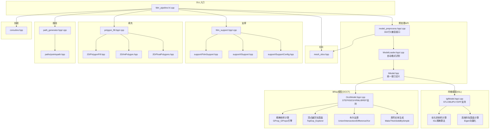
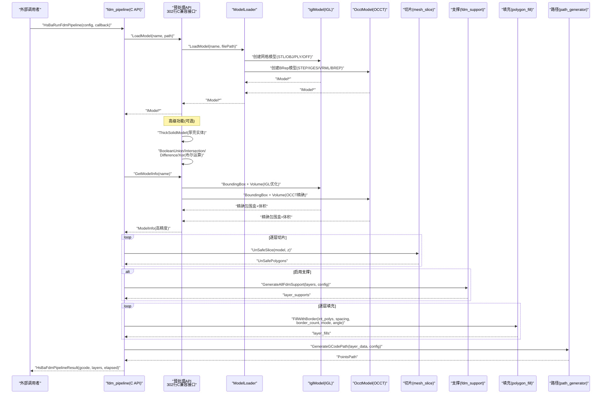
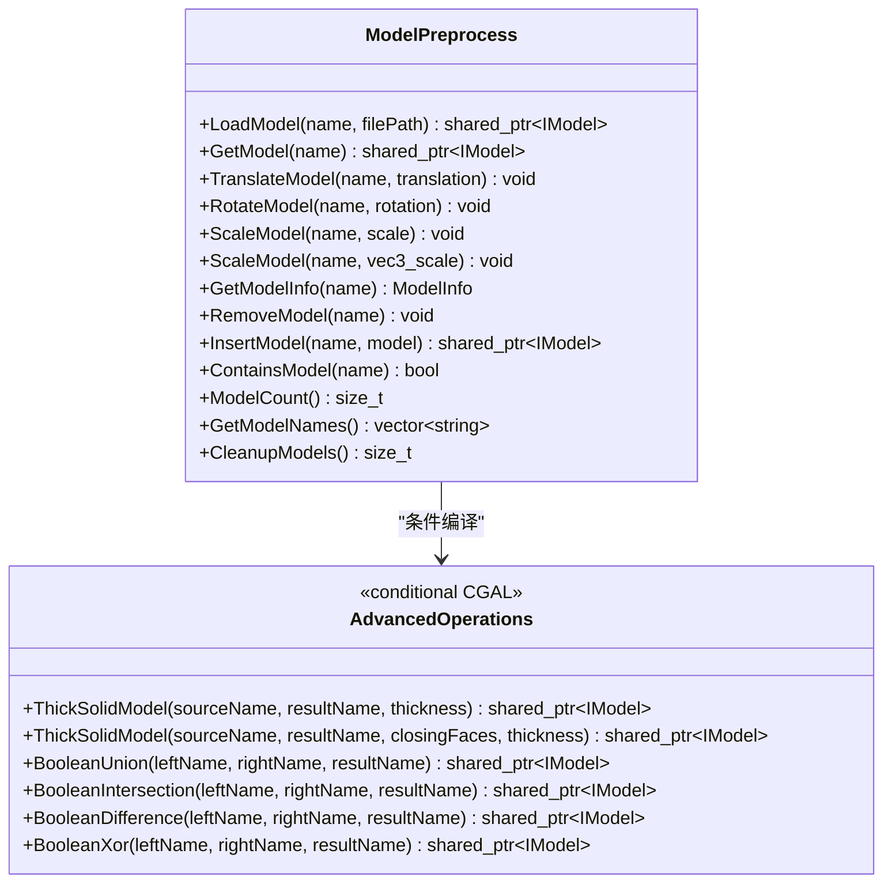
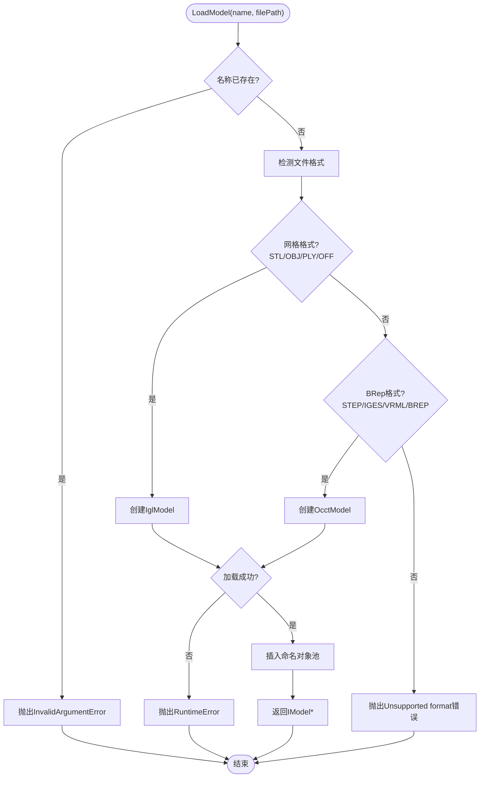
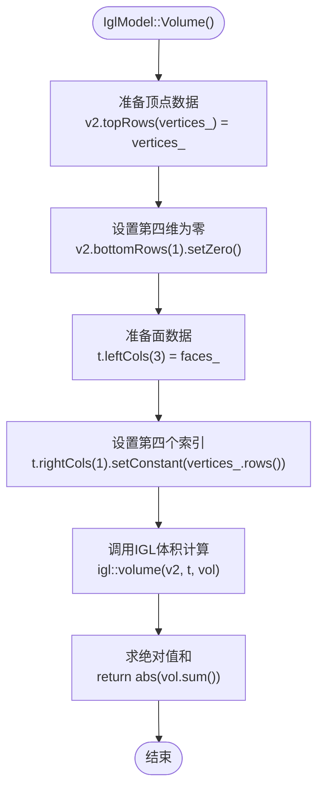
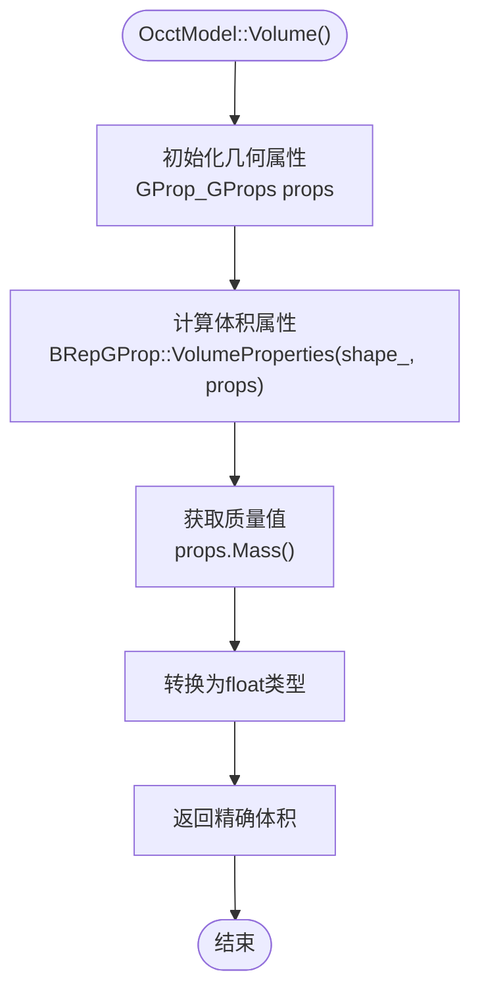
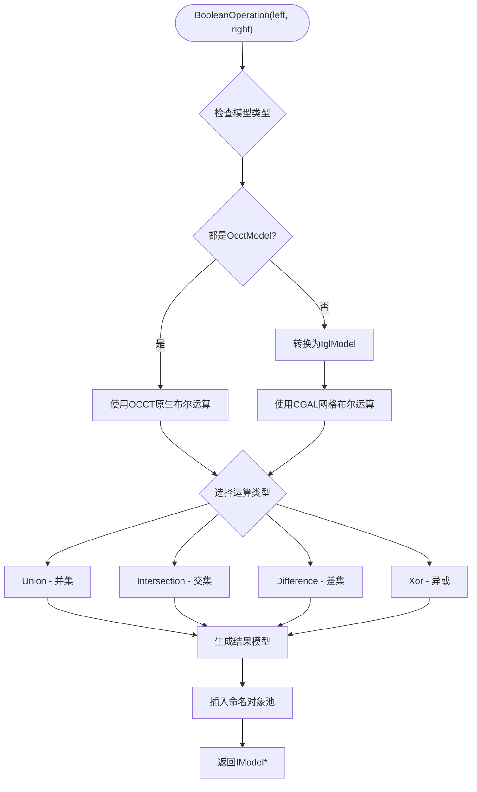
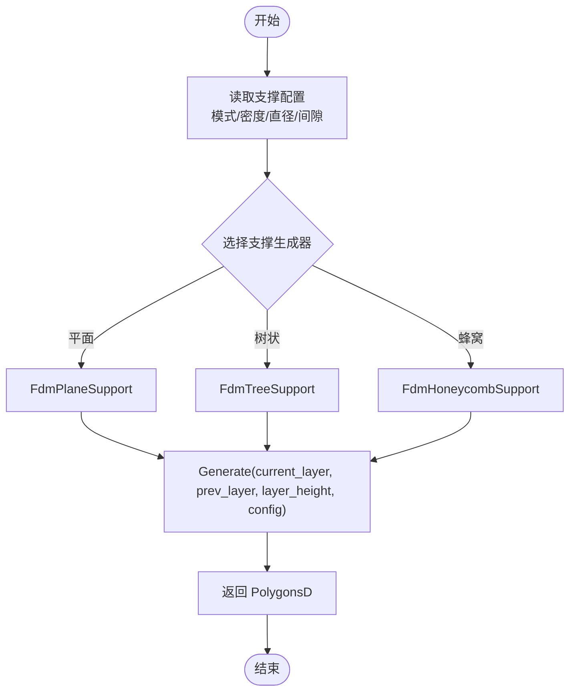
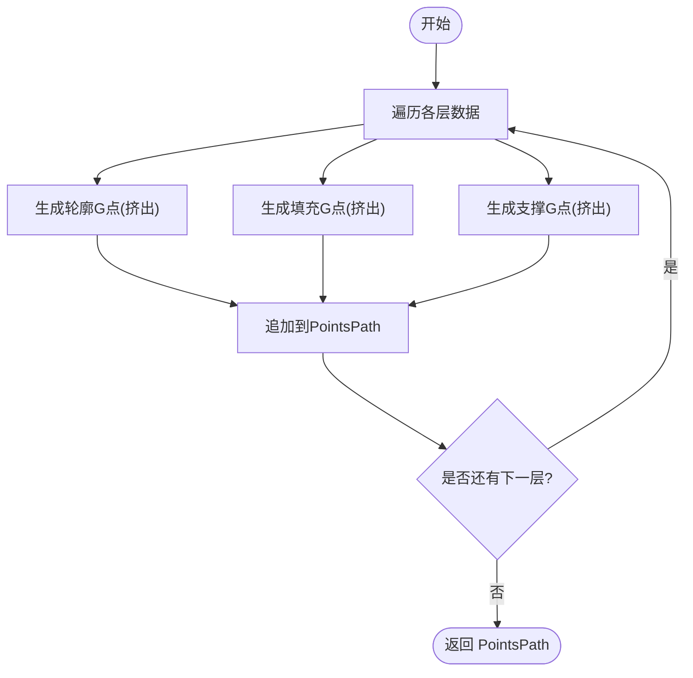
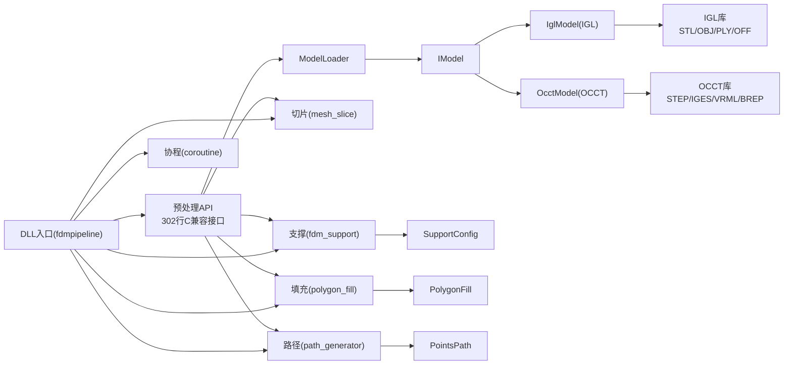

# 模型预处理系统

<cite>
**本文引用的文件**   
- [LibHsBaSlicer/Preprocess/model_preprocess.hpp](file://LibHsBaSlicer/Preprocess/model_preprocess.hpp)
- [LibHsBaSlicer/Preprocess/model_preprocess.cpp](file://LibHsBaSlicer/Preprocess/model_preprocess.cpp)
- [preprocess/ModelLoader.hpp](file://preprocess/ModelLoader.hpp)
- [preprocess/ModelLoader.cpp](file://preprocess/ModelLoader.cpp)
- [base/IModel.hpp](file://base/IModel.hpp)
- [meshmodel/IglModel.hpp](file://meshmodel/IglModel.hpp)
- [meshmodel/IglModel.cpp](file://meshmodel/IglModel.cpp)
- [cadmodel/OcctModel.hpp](file://cadmodel/OcctModel.hpp)
- [cadmodel/OcctModel.cpp](file://cadmodel/OcctModel.cpp)
- [LibHsBaSlicer/Slice/mesh_slice.hpp](file://LibHsBaSlicer/Slice/mesh_slice.hpp)
- [LibHsBaSlicer/Support/fdm_support.hpp](file://LibHsBaSlicer/Support/fdm_support.hpp)
- [LibHsBaSlicer/Support/fdm_support.cpp](file://LibHsBaSlicer/Support/fdm_support.cpp)
- [support/FdmSupport.hpp](file://support/FdmSupport.hpp)
- [support/ISupport.hpp](file://support/ISupport.hpp)
- [support/SupportConfig.hpp](file://support/SupportConfig.hpp)
- [2D/FloatPolygons.hpp](file://2D/FloatPolygons.hpp)
- [2D/IntPolygon.hpp](file://2D/IntPolygon.hpp)
- [2D/PolygonFill.hpp](file://2D/PolygonFill.hpp)
- [LibHsBaSlicer/Fill/polygon_fill.hpp](file://LibHsBaSlicer/Fill/polygon_fill.hpp)
- [LibHsBaSlicer/Fill/polygon_fill.cpp](file://LibHsBaSlicer/Fill/polygon_fill.cpp)
- [paths/pointspath.hpp](file://paths/pointspath.hpp)
- [LibHsBaSlicer/Path/path_generator.hpp](file://LibHsBaSlicer/Path/path_generator.hpp)
- [LibHsBaSlicer/Path/path_generator.cpp](file://LibHsBaSlicer/Path/path_generator.cpp)
- [DllHsBaSlicer/fdm_pipeline.h](file://DllHsBaSlicer/fdm_pipeline.h)
- [DllHsBaSlicer/fdm_pipeline.cpp](file://DllHsBaSlicer/fdm_pipeline.cpp)
- [base/coroutine.hpp](file://base/coroutine.hpp)
- [tests/Preprocess/model_loader_test.cpp](file://tests/Preprocess/model_loader_test.cpp)
</cite>

## 更新摘要
**所做更改**   
- 新增了完整的模型预处理API套件，包含302行C兼容接口代码
- 扩展了多格式支持：STL/OBJ/PLY/OFF通过IGL库，STEP/IGES/VRML/BREP通过OCCT库
- 增强了几何变换功能，支持平移、旋转、缩放和仿射变换
- 实现了高级布尔运算：并集、交集、差集和异或操作
- 添加了厚壳实体生成功能，支持指定厚度面和开放面处理
- 优化了模型信息提取精度，特别是包围盒计算和体积计算算法

## 目录
1. [引言](#引言)
2. [项目结构](#项目结构)
3. [核心组件](#核心组件)
4. [架构总览](#架构总览)
5. [详细组件分析](#详细组件分析)
6. [依赖关系分析](#依赖关系分析)
7. [性能与并发特性](#性能与并发特性)
8. [故障排查指南](#故障排查指南)
9. [结论](#结论)
10. [附录：API参考](#附录api参考)

## 引言
本文件聚焦于"模型预处理系统"，围绕从模型加载、几何变换、信息统计，到切片、支撑、填充与路径生成的完整FDM流水线进行系统化说明。系统采用分层封装策略：底层提供多内核（网格/BRep）模型抽象与操作能力，中间层按功能域（预处理、支撑、填充、路径）提供稳定C++接口，顶层通过DLL导出面向外部调用者的C风格API，并以协程实现异步/同步两种运行模式。

**最新更新** 系统已实现完整的模型预处理API套件，支持多种CAD格式输入、高级几何运算和精确的模型信息提取，为3D打印提供了强大的前处理能力。

## 项目结构
与模型预处理相关的代码主要分布在以下模块：
- 预处理封装：LibHsBaSlicer/Preprocess
- 模型加载与对象池：preprocess
- 模型抽象接口：base
- 网格模型实现：meshmodel
- BRep模型实现：cadmodel
- 切片：LibHsBaSlicer/Slice
- 支撑：LibHsBaSlicer/Support 与 support
- 填充：LibHsBaSlicer/Fill 与 2D
- 路径生成：LibHsBaSlicer/Path 与 paths
- 协程基础设施：base
- 全流程入口（DLL）：DllHsBaSlicer

**图示来源**
- [LibHsBaSlicer/Preprocess/model_preprocess.hpp:1-190](file://LibHsBaSlicer/Preprocess/model_preprocess.hpp#L1-L190)
- [preprocess/ModelLoader.hpp:1-131](file://preprocess/ModelLoader.hpp#L1-L131)
- [base/IModel.hpp:1-148](file://base/IModel.hpp#L1-L148)
- [meshmodel/IglModel.hpp:1-74](file://meshmodel/IglModel.hpp#L1-L74)
- [cadmodel/OcctModel.hpp:1-92](file://cadmodel/OcctModel.hpp#L1-L92)
- [LibHsBaSlicer/Slice/mesh_slice.hpp:1-28](file://LibHsBaSlicer/Slice/mesh_slice.hpp#L1-L28)
- [LibHsBaSlicer/Support/fdm_support.hpp:1-36](file://LibHsBaSlicer/Support/fdm_support.hpp#L1-L36)
- [LibHsBaSlicer/Fill/polygon_fill.hpp:1-36](file://LibHsBaSlicer/Fill/polygon_fill.hpp#L1-L36)
- [LibHsBaSlicer/Path/path_generator.hpp:1-62](file://LibHsBaSlicer/Path/path_generator.hpp#L1-L62)
- [DllHsBaSlicer/fdm_pipeline.h:1-147](file://DllHsBaSlicer/fdm_pipeline.h#L1-L147)

章节来源
- [LibHsBaSlicer/Preprocess/model_preprocess.hpp:1-190](file://LibHsBaSlicer/Preprocess/model_preprocess.hpp#L1-L190)
- [preprocess/ModelLoader.hpp:1-131](file://preprocess/ModelLoader.hpp#L1-L131)
- [base/IModel.hpp:1-148](file://base/IModel.hpp#L1-L148)
- [meshmodel/IglModel.hpp:1-74](file://meshmodel/IglModel.hpp#L1-L74)
- [cadmodel/OcctModel.hpp:1-92](file://cadmodel/OcctModel.hpp#L1-L92)
- [LibHsBaSlicer/Slice/mesh_slice.hpp:1-28](file://LibHsBaSlicer/Slice/mesh_slice.hpp#L1-L28)
- [LibHsBaSlicer/Support/fdm_support.hpp:1-36](file://LibHsBaSlicer/Support/fdm_support.hpp#L1-L36)
- [LibHsBaSlicer/Fill/polygon_fill.hpp:1-36](file://LibHsBaSlicer/Fill/polygon_fill.hpp#L1-L36)
- [LibHsBaSlicer/Path/path_generator.hpp:1-62](file://LibHsBaSlicer/Path/path_generator.hpp#L1-L62)
- [DllHsBaSlicer/fdm_pipeline.h:1-147](file://DllHsBaSlicer/fdm_pipeline.h#L1-L147)
- [base/coroutine.hpp:1-800](file://base/coroutine.hpp#L1-L800)

## 核心组件
- **完整的预处理API套件**：提供302行C兼容接口，包括模型加载、获取、变换、信息查询与移除等基础功能，以及厚壳实体生成和布尔运算等高级功能。
- **智能模型加载器 ModelLoader**：基于扩展名自动选择内核（网格或BRep），并通过命名对象池管理模型生命周期；在启用CGAL时提供厚壳与布尔运算等高级能力。
- **统一的模型抽象接口 IModel**：定义跨内核的统一能力，包括加载/保存、平移/旋转/缩放/仿射变换、包围盒与体积、三角网格提取，屏蔽不同内核差异。
- **增强的网格模型 IglModel**：实现了优化的体积计算算法，使用IGL库的精确三角网格体积计算方法，以及高效的包围盒计算。
- **增强的BRep模型 OcctModel**：提供了精确的体积计算（基于OCCT的几何属性计算）和改进的包围盒计算（通过遍历所有顶点），支持完整的布尔运算和厚壳实体生成。
- 切片 Slice/UnSafeSlice：Z向平面切片，返回安全或不安全的轮廓集合。
- 支撑生成 GenerateFdmSupport/GenerateAllFdmSupport：根据配置选择树状/蜂窝/平面支撑，输出每层支撑截面。
- 填充 FillPolygon/FillWithBorder：支持平行线、简单锯齿、锯齿等多种填充模式，并提供带边框的复合填充。
- 路径生成 GenerateGCodePath：将轮廓、填充、支撑合并为G-code点序列，并计算挤出量。
- 协程 Task/Generator：提供异步任务执行、回调与异常传播，以及逐层yield的生成器能力。
- DLL入口 fdm_pipeline：以C API暴露默认配置、同步/异步全流程运行与结果释放。

章节来源
- [LibHsBaSlicer/Preprocess/model_preprocess.hpp:15-185](file://LibHsBaSlicer/Preprocess/model_preprocess.hpp#L15-L185)
- [preprocess/ModelLoader.hpp:26-127](file://preprocess/ModelLoader.hpp#L26-L127)
- [base/IModel.hpp:108-136](file://base/IModel.hpp#L108-L136)
- [meshmodel/IglModel.hpp:38-42](file://meshmodel/IglModel.hpp#L38-L42)
- [cadmodel/OcctModel.hpp:45-49](file://cadmodel/OcctModel.hpp#L45-L49)
- [LibHsBaSlicer/Slice/mesh_slice.hpp:13-25](file://LibHsBaSlicer/Slice/mesh_slice.hpp#L13-L25)
- [LibHsBaSlicer/Support/fdm_support.hpp:11-33](file://LibHsBaSlicer/Support/fdm_support.hpp#L11-L33)
- [LibHsBaSlicer/Fill/polygon_fill.hpp:9-33](file://LibHsBaSlicer/Fill/polygon_fill.hpp#L9-L33)
- [LibHsBaSlicer/Path/path_generator.hpp:13-59](file://LibHsBaSlicer/Path/path_generator.hpp#L13-L59)
- [base/coroutine.hpp:36-800](file://base/coroutine.hpp#L36-800)
- [DllHsBaSlicer/fdm_pipeline.h:1-147](file://DllHsBaSlicer/fdm_pipeline.h#L1-L147)

## 架构总览
整体架构遵循"接口抽象 -> 功能封装 -> 流程编排"的分层设计：
- 接口层：IModel统一模型能力，避免上层耦合具体内核。
- 封装层：各功能域（预处理、支撑、填充、路径）提供稳定API，屏蔽复杂实现细节。
- 流程层：DLL入口组合各阶段，提供同步/异步两种调用方式，并通过进度回调反馈状态。

**图示来源**
- [DllHsBaSlicer/fdm_pipeline.cpp:182-292](file://DllHsBaSlicer/fdm_pipeline.cpp#L182-L292)
- [LibHsBaSlicer/Preprocess/model_preprocess.cpp:17-149](file://LibHsBaSlicer/Preprocess/model_preprocess.cpp#L17-L149)
- [preprocess/ModelLoader.cpp:14-49](file://preprocess/ModelLoader.cpp#L14-L49)
- [meshmodel/IglModel.cpp:140-156](file://meshmodel/IglModel.cpp#L140-L156)
- [cadmodel/OcctModel.cpp:326-402](file://cadmodel/OcctModel.cpp#L326-L402)
- [LibHsBaSlicer/Slice/mesh_slice.hpp:18-24](file://LibHsBaSlicer/Slice/mesh_slice.hpp#L18-L24)
- [LibHsBaSlicer/Support/fdm_support.cpp:7-45](file://LibHsBaSlicer/Support/fdm_support.cpp#L7-L45)
- [LibHsBaSlicer/Fill/polygon_fill.cpp:5-26](file://LibHsBaSlicer/Fill/polygon_fill.cpp#L5-L26)
- [LibHsBaSlicer/Path/path_generator.cpp:54-86](file://LibHsBaSlicer/Path/path_generator.cpp#L54-L86)

## 详细组件分析

### 完整的预处理API套件（model_preprocess）
**新增** 系统现在提供完整的302行C兼容接口代码，涵盖基础模型操作和高级几何运算功能。

- **基础功能**：LoadModel/GetModel/TranslateModel/RotateModel/ScaleModel/GetModelInfo/RemoveModel等API，内部使用线程局部存储的ModelLoader实例，保证多线程安全与资源隔离。
- **高级功能**（需要USE_CGAL编译选项）：ThickSolidModel厚壳实体生成、BooleanUnion/BooleanIntersection/BooleanDifference/BooleanXor布尔运算。
- **格式支持**：自动识别STL/OBJ/PLY/OFF（网格格式）和STEP/IGES/VRML/BREP（BRep格式）。

**图示来源**
- [LibHsBaSlicer/Preprocess/model_preprocess.hpp:15-185](file://LibHsBaSlicer/Preprocess/model_preprocess.hpp#L15-L185)
- [LibHsBaSlicer/Preprocess/model_preprocess.cpp:17-149](file://LibHsBaSlicer/Preprocess/model_preprocess.cpp#L17-L149)

章节来源
- [LibHsBaSlicer/Preprocess/model_preprocess.hpp:15-185](file://LibHsBaSlicer/Preprocess/model_preprocess.hpp#L15-L185)
- [LibHsBaSlicer/Preprocess/model_preprocess.cpp:17-149](file://LibHsBaSlicer/Preprocess/model_preprocess.cpp#L17-L149)

### 智能模型加载器（ModelLoader）
- **自动格式识别**：根据文件扩展名自动选择网格内核（STL/OBJ/PLY/OFF）或BRep内核（STEP/IGES/VRML/BREP），并将模型放入命名对象池统一管理。
- **内存管理**：使用NamedObjectPool管理模型生命周期，支持插入、获取、删除、清理等操作。
- **高级操作支持**：在启用CGAL时提供厚壳与布尔运算等高级几何操作能力。

**图示来源**
- [preprocess/ModelLoader.cpp:14-49](file://preprocess/ModelLoader.cpp#L14-L49)

章节来源
- [preprocess/ModelLoader.hpp:26-127](file://preprocess/ModelLoader.hpp#L26-L127)
- [preprocess/ModelLoader.cpp:14-95](file://preprocess/ModelLoader.cpp#L14-L95)

### 增强的模型信息提取（IglModel + OcctModel）

**更新** 系统已实现更精确的模型信息提取算法，显著提升包围盒计算和体积计算的准确性。

#### IglModel 优化实现
- **包围盒计算**：使用Eigen矩阵的列最小值/最大值函数，直接遍历所有顶点坐标，时间复杂度O(n)，空间复杂度O(1)。
- **体积计算**：采用IGL库的精确三角网格体积算法，通过将三角形转换为四面体并累加有符号体积，确保数值稳定性。

**图示来源**
- [meshmodel/IglModel.cpp:145-156](file://meshmodel/IglModel.cpp#L145-L156)

#### OcctModel 优化实现  
- **包围盒计算**：通过TopExp_Explorer遍历所有顶点，使用BRep_Tool获取每个顶点的精确坐标，确保包围盒包含所有几何特征。
- **体积计算**：利用OCCT的GProp_GProps几何属性引擎，通过BRepGProp::VolumeProperties直接计算精确体积，避免网格化误差。

**图示来源**
- [cadmodel/OcctModel.cpp:397-402](file://cadmodel/OcctModel.cpp#L397-L402)

章节来源
- [meshmodel/IglModel.cpp:140-156](file://meshmodel/IglModel.cpp#L140-L156)
- [cadmodel/OcctModel.cpp:326-402](file://cadmodel/OcctModel.cpp#L326-L402)

### 高级几何运算（布尔运算与厚壳实体）

**新增** 系统现在支持完整的布尔运算和厚壳实体生成功能。

#### 布尔运算支持
- **OcctModel原生支持**：当两个模型都是OcctModel时，直接使用OCCT的布尔运算API。
- **IglModel回退机制**：否则转换为IglModel并使用CGAL进行网格布尔运算。
- **四种运算类型**：并集(Union)、交集(Intersection)、差集(Difference)、异或(Xor)。

#### 厚壳实体生成
- **基本厚壳**：对封闭实体生成指定厚度的外壳。
- **开放面处理**：支持指定要保留开放的面的顶点环。
- **容差控制**：使用严格的容差检查确保面的正确匹配。

**图示来源**
- [preprocess/ModelLoader.cpp:183-286](file://preprocess/ModelLoader.cpp#L183-L286)

章节来源
- [preprocess/ModelLoader.cpp:183-286](file://preprocess/ModelLoader.cpp#L183-L286)
- [cadmodel/OcctModel.cpp:446-464](file://cadmodel/OcctModel.cpp#L446-L464)
- [meshmodel/IglModel.cpp:183-330](file://meshmodel/IglModel.cpp#L183-L330)

### 切片（Slice/UnSafeSlice）
- 提供安全与不安全两种切片API：安全切片忽略不封闭轮廓；不安全切片保留所有轮廓，便于后续工艺（如送丝）处理。
- 在DLL流程中，对每一层高度调用UnSafeSlice，得到UnSafePolygons后转换为PolygonsD供后续步骤使用。

章节来源
- [LibHsBaSlicer/Slice/mesh_slice.hpp:13-25](file://LibHsBaSlicer/Slice/mesh_slice.hpp#L13-L25)
- [DllHsBaSlicer/fdm_pipeline.cpp:215-222](file://DllHsBaSlicer/fdm_pipeline.cpp#L215-L222)

### 支撑（GenerateFdmSupport / GenerateAllFdmSupport）
- 根据配置中的支撑模式（平面/树状/蜂窝）动态创建对应支撑生成器，并调用其Generate/GenerateAll方法。
- 输入为当前层与前一层轮廓及层高，输出为支撑截面多边形集合。

**图示来源**
- [LibHsBaSlicer/Support/fdm_support.cpp:7-45](file://LibHsBaSlicer/Support/fdm_support.cpp#L7-L45)
- [support/SupportConfig.hpp](file://support/SupportConfig.hpp)

章节来源
- [LibHsBaSlicer/Support/fdm_support.hpp:11-33](file://LibHsBaSlicer/Support/fdm_support.hpp#L11-L33)
- [LibHsBaSlicer/Support/fdm_support.cpp:7-45](file://LibHsBaSlicer/Support/fdm_support.cpp#L7-L45)
- [support/SupportConfig.hpp](file://support/SupportConfig.hpp)

### 填充（FillPolygon / FillWithBorder）
- 支持Line/SimpleZigzag/Zigzag三种填充模式，并提供带边框的复合填充（先向内偏移生成边框，再内部填充）。
- 输入为整数多边形，输出为填充后的多边形集合。

章节来源
- [LibHsBaSlicer/Fill/polygon_fill.hpp:9-33](file://LibHsBaSlicer/Fill/polygon_fill.hpp#L9-L33)
- [LibHsBaSlicer/Fill/polygon_fill.cpp:5-26](file://LibHsBaSlicer/Fill/polygon_fill.cpp#L5-L26)
- [2D/PolygonFill.hpp](file://2D/PolygonFill.hpp)
- [2D/IntPolygon.hpp](file://2D/IntPolygon.hpp)

### 路径生成（GenerateGCodePath / PolygonsToGPoints）
- 将轮廓、填充、支撑三类路径合并为G-code点序列，首点空走到起点，后续点按打印速度挤出，计算挤出量为线宽×层高×段长×倍率。
- 输出为PointsPath对象，可进一步序列化ToString为G-code文本。

**图示来源**
- [LibHsBaSlicer/Path/path_generator.cpp:54-86](file://LibHsBaSlicer/Path/path_generator.cpp#L54-86)
- [LibHsBaSlicer/Path/path_generator.cpp:7-52](file://LibHsBaSlicer/Path/path_generator.cpp#L7-L52)

章节来源
- [LibHsBaSlicer/Path/path_generator.hpp:13-59](file://LibHsBaSlicer/Path/path_generator.hpp#L13-L59)
- [LibHsBaSlicer/Path/path_generator.cpp:7-86](file://LibHsBaSlicer/Path/path_generator.cpp#L7-L86)
- [paths/pointspath.hpp](file://paths/pointspath.hpp)

### 协程与异步编排（Task/Generator）
- Task提供异步任务、异常捕获、完成回调与finally清理；Generator支持逐层yield，便于流式处理。
- DLL入口通过Task.get_result阻塞等待结果，或通过then注册完成回调实现异步。

章节来源
- [base/coroutine.hpp:36-800](file://base/coroutine.hpp#L36-800)
- [DllHsBaSlicer/fdm_pipeline.cpp:324-348](file://DllHsBaSlicer/fdm_pipeline.cpp#L324-348)

### 全流程入口（DLL）
- 提供默认配置构造、同步运行与异步运行接口，内部将C结构体映射为内部配置，分阶段推进并报告进度。
- 结果包含成功标志、总层数、G-code内容、错误信息与耗时，需调用释放函数释放内存。

章节来源
- [DllHsBaSlicer/fdm_pipeline.h:1-147](file://DllHsBaSlicer/fdm_pipeline.h#L1-L147)
- [DllHsBaSlicer/fdm_pipeline.cpp:133-179](file://DllHsBaSlicer/fdm_pipeline.cpp#L133-L179)
- [DllHsBaSlicer/fdm_pipeline.cpp:298-357](file://DllHsBaSlicer/fdm_pipeline.cpp#L298-L357)

## 依赖关系分析
- 预处理模块依赖模型加载器与IModel接口；加载器根据扩展名选择网格或BRep内核，并在启用CGAL时提供高级几何操作。
- **增强的模型实现**：IglModel依赖IGL库进行精确的几何计算，OcctModel依赖OCCT进行BRep几何处理。
- 支撑模块依赖支撑配置与多种支撑生成器；填充模块依赖2D多边形与填充算法；路径模块依赖路径数据结构与G-code序列化。
- 全流程入口依赖上述所有模块，并通过协程框架组织执行顺序与进度上报。

**图示来源**
- [LibHsBaSlicer/Preprocess/model_preprocess.cpp:1-149](file://LibHsBaSlicer/Preprocess/model_preprocess.cpp#L1-L149)
- [preprocess/ModelLoader.cpp:1-291](file://preprocess/ModelLoader.cpp#L1-L291)
- [base/IModel.hpp:1-148](file://base/IModel.hpp#L1-L148)
- [meshmodel/IglModel.cpp:1-770](file://meshmodel/IglModel.cpp#L1-L770)
- [cadmodel/OcctModel.cpp:1-664](file://cadmodel/OcctModel.cpp#L1-L664)
- [LibHsBaSlicer/Slice/mesh_slice.hpp:1-28](file://LibHsBaSlicer/Slice/mesh_slice.hpp#L1-L28)
- [LibHsBaSlicer/Support/fdm_support.cpp:1-48](file://LibHsBaSlicer/Support/fdm_support.cpp#L1-L48)
- [support/SupportConfig.hpp](file://support/SupportConfig.hpp)
- [LibHsBaSlicer/Fill/polygon_fill.cpp:1-29](file://LibHsBaSlicer/Fill/polygon_fill.cpp#L1-L29)
- [2D/PolygonFill.hpp](file://2D/PolygonFill.hpp)
- [LibHsBaSlicer/Path/path_generator.cpp:1-89](file://LibHsBaSlicer/Path/path_generator.cpp#L1-L89)
- [paths/pointspath.hpp](file://paths/pointspath.hpp)
- [base/coroutine.hpp:1-800](file://base/coroutine.hpp#L1-L800)
- [DllHsBaSlicer/fdm_pipeline.cpp:1-357](file://DllHsBaSlicer/fdm_pipeline.cpp#L1-L357)

章节来源
- [preprocess/ModelLoader.cpp:14-49](file://preprocess/ModelLoader.cpp#L14-L49)
- [meshmodel/IglModel.cpp:140-156](file://meshmodel/IglModel.cpp#L140-L156)
- [cadmodel/OcctModel.cpp:326-402](file://cadmodel/OcctModel.cpp#L326-L402)
- [LibHsBaSlicer/Support/fdm_support.cpp:7-45](file://LibHsBaSlicer/Support/fdm_support.cpp#L7-L45)
- [LibHsBaSlicer/Fill/polygon_fill.cpp:5-26](file://LibHsBaSlicer/Fill/polygon_fill.cpp#L5-L26)
- [LibHsBaSlicer/Path/path_generator.cpp:54-86](file://LibHsBaSlicer/Path/path_generator.cpp#L54-L86)
- [DllHsBaSlicer/fdm_pipeline.cpp:182-292](file://DllHsBaSlicer/fdm_pipeline.cpp#L182-L292)

## 性能与并发特性
- 线程局部存储：预处理模块使用线程局部ModelLoader实例，避免全局共享状态竞争，提升多线程安全性。
- 协程调度：Task默认使用异步执行器，可在后台线程执行；Generator支持逐层yield，有利于流水线吞吐。
- 内存与对象池：ModelLoader使用命名对象池管理模型，减少重复分配与拷贝；路径生成预估容量以减少重分配。
- **性能优化**：
  - IglModel的包围盒计算使用Eigen向量化的列操作，比逐个顶点比较更高效。
  - OcctModel的体积计算直接使用OCCT的几何属性引擎，避免了网格化带来的精度损失。
  - 模型信息提取的缓存机制减少了重复计算开销。
  - 智能格式识别避免了不必要的内核切换。
- 建议优化方向：
  - 对大规模模型切片与填充可引入并行层处理（结合AsyncExecutor与任务拆分）。
  - 对支撑生成与填充可考虑分层并行，利用Generator流式消费。
  - 针对高频小对象（如GPoint）可使用自定义分配器降低碎片。

[本节为通用指导，无需特定文件引用]

## 故障排查指南
- 模型加载失败：检查文件扩展名是否受支持；若为BRep格式且未启用OCCT，会抛出运行时错误。
- 名称冲突：尝试加载已存在名称的模型会抛出参数错误；请更换名称或先移除旧模型。
- **模型信息提取问题**：
  - 包围盒计算异常：检查模型是否为空或包含无效顶点。
  - 体积计算为零：确认模型是封闭的实体而非表面网格。
  - 精度不一致：对于复杂几何体，建议使用OcctModel以获得更高精度的体积计算。
- **高级功能问题**：
  - 布尔运算失败：检查模型是否为封闭实体，非封闭网格可能导致运算失败。
  - 厚壳实体生成失败：确认源模型为OcctModel类型，检查厚度参数合理性。
  - CGAL功能不可用：确认编译时启用了USE_CGAL选项。
- 悬垂角度阈值不当：支撑生成可能过密或不足，调整overhang_angle_threshold与support_density。
- 填充质量不佳：调整fill_spacing、wall_count与fill_mode；必要时改变fill_angle以避免薄弱区域。
- 挤出量异常：检查line_width、layer_height与extrusion_multiplier设置；确认路径长度计算正确。
- 进度回调未触发：确认传入的回调指针与user_data有效；确保主循环未被阻塞。

章节来源
- [preprocess/ModelLoader.cpp:14-49](file://preprocess/ModelLoader.cpp#L14-L49)
- [LibHsBaSlicer/Preprocess/model_preprocess.cpp:17-149](file://LibHsBaSlicer/Preprocess/model_preprocess.cpp#L17-L149)
- [meshmodel/IglModel.cpp:140-156](file://meshmodel/IglModel.cpp#L140-L156)
- [cadmodel/OcctModel.cpp:326-402](file://cadmodel/OcctModel.cpp#L326-L402)
- [LibHsBaSlicer/Support/fdm_support.cpp:7-45](file://LibHsBaSlicer/Support/fdm_support.cpp#L7-L45)
- [LibHsBaSlicer/Fill/polygon_fill.cpp:5-26](file://LibHsBaSlicer/Fill/polygon_fill.cpp#L5-L26)
- [LibHsBaSlicer/Path/path_generator.cpp:7-52](file://LibHsBaSlicer/Path/path_generator.cpp#L7-L52)
- [DllHsBaSlicer/fdm_pipeline.cpp:109-115](file://DllHsBaSlicer/fdm_pipeline.cpp#L109-L115)

## 结论
模型预处理系统通过清晰的接口抽象与模块化封装，实现了从模型加载、切片、支撑、填充到路径生成的完整FDM流水线。**最新的改进显著提升了系统的完整性和功能性**，新增了302行C兼容接口代码，支持多种CAD格式输入、高级几何运算和精确的模型信息提取。配合协程框架，既提供同步阻塞的易用性，也支持异步非阻塞的高吞吐场景。建议在工程实践中结合硬件能力与模型规模，合理配置并行度与参数，以获得最佳性能与质量平衡。

[本节为总结性内容，无需特定文件引用]

## 附录：API参考
- **预处理API套件**
  - LoadModel(name, filePath) -> IModel*
  - GetModel(name) -> IModel*
  - TranslateModel/RotateModel/ScaleModel(name, transform)
  - GetModelInfo(name) -> ModelInfo
  - RemoveModel(name)
  - InsertModel(name, model) -> IModel*
  - ContainsModel(name) -> bool
  - ModelCount() -> size_t
  - GetModelNames() -> vector<string>
  - CleanupModels() -> size_t
- **高级几何运算**（需要USE_CGAL）
  - ThickSolidModel(sourceName, resultName, thickness) -> IModel*
  - ThickSolidModel(sourceName, resultName, closingFaces, thickness) -> IModel*
  - BooleanUnion/BooleanIntersection/BooleanDifference/BooleanXor(leftName, rightName, resultName) -> IModel*
- **增强的模型信息提取**
  - IglModel::BoundingBox(min, max) -> 精确的轴对齐包围盒
  - IglModel::Volume() -> 基于IGL的精确三角网格体积
  - OcctModel::BoundingBox(min, max) -> 遍历所有顶点的精确包围盒
  - OcctModel::Volume() -> 基于OCCT几何属性的精确体积
- 切片
  - Slice(model, height) -> Polygons
  - UnSafeSlice(model, height) -> UnSafePolygons
- 支撑
  - GenerateFdmSupport(current_layer, prev_layer, layer_height, config) -> PolygonsD
  - GenerateAllFdmSupport(layers, config) -> vector<PolygonsD>
- 填充
  - FillPolygon(poly, spacing, mode, angle_deg) -> Polygons
  - FillWithBorder(poly, spacing, border_count, fill_mode, angle_deg) -> Polygons
- 路径
  - GenerateGCodePath(layer_data, config) -> unique_ptr<PointsPath>
  - PolygonsToGPoints(polys, z, config, is_extrude) -> vector<GPoint>
- DLL入口
  - HsBaCreateDefaultConfig() -> HsBaFdmPipelineConfig_t
  - HsBaRunFdmPipeline(config, callback, user_data) -> HsBaFdmPipelineResult_t
  - HsBaRunFdmPipelineAsync(config, callback, user_data, result_callback, result_user_data)
  - HsBaFreePipelineResult(result)

章节来源
- [LibHsBaSlicer/Preprocess/model_preprocess.hpp:15-185](file://LibHsBaSlicer/Preprocess/model_preprocess.hpp#L15-L185)
- [meshmodel/IglModel.hpp:38-42](file://meshmodel/IglModel.hpp#L38-L42)
- [cadmodel/OcctModel.hpp:45-49](file://cadmodel/OcctModel.hpp#L45-L49)
- [LibHsBaSlicer/Slice/mesh_slice.hpp:13-25](file://LibHsBaSlicer/Slice/mesh_slice.hpp#L13-L25)
- [LibHsBaSlicer/Support/fdm_support.hpp:11-33](file://LibHsBaSlicer/Support/fdm_support.hpp#L11-L33)
- [LibHsBaSlicer/Fill/polygon_fill.hpp:9-33](file://LibHsBaSlicer/Fill/polygon_fill.hpp#L9-L33)
- [LibHsBaSlicer/Path/path_generator.hpp:13-59](file://LibHsBaSlicer/Path/path_generator.hpp#L13-L59)
- [DllHsBaSlicer/fdm_pipeline.h:1-147](file://DllHsBaSlicer/fdm_pipeline.h#L1-L147)