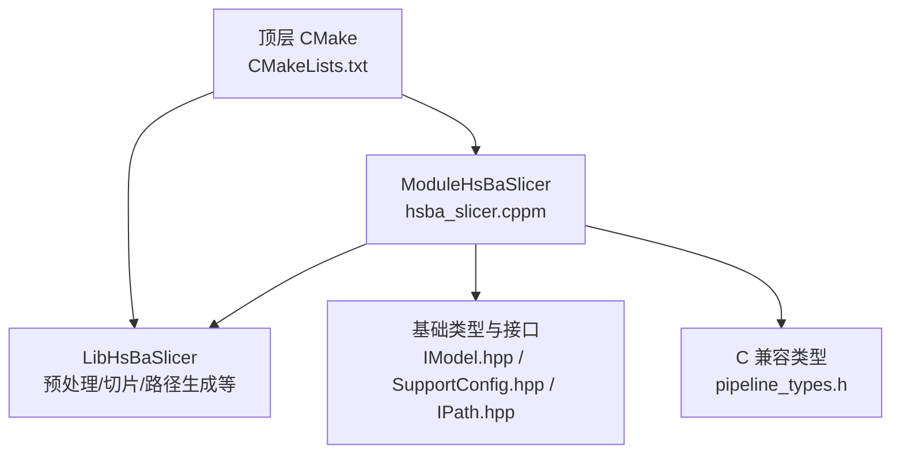
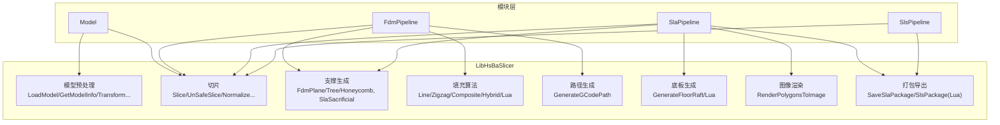
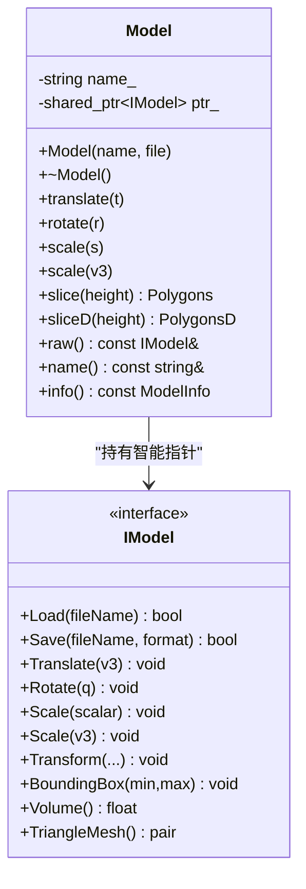
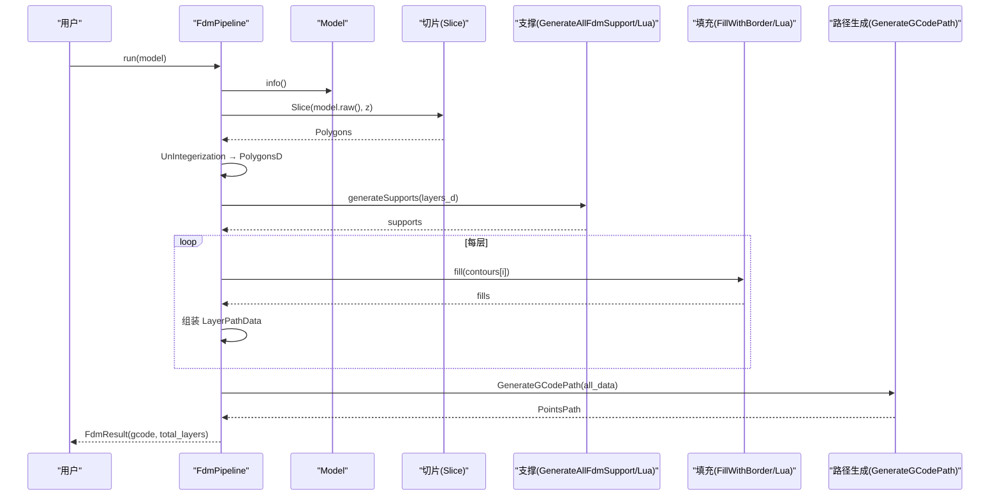
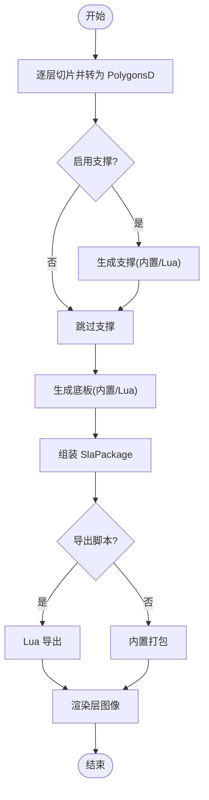
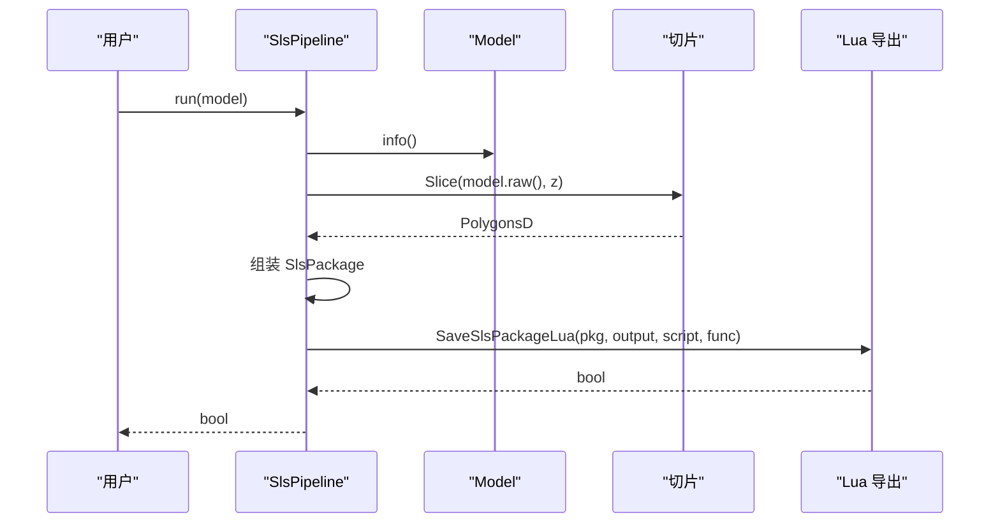
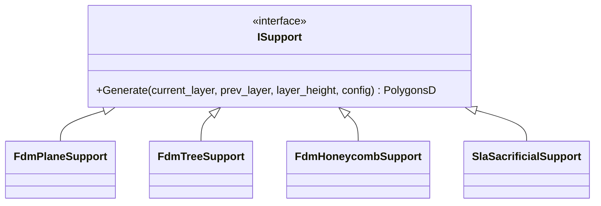
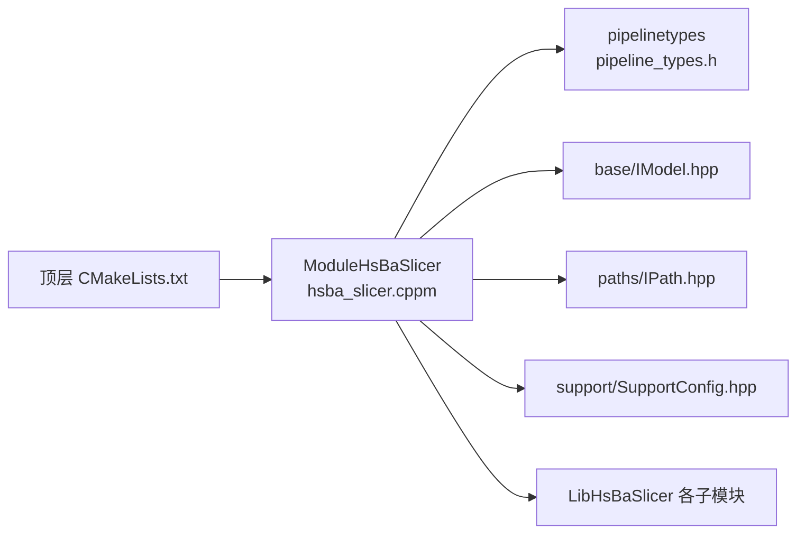

# 流水线类型架构重构

<cite>
**本文引用的文件**   
- [hsba_slicer.cppm](file://ModuleHsBaSlicer/hsba_slicer.cppm)
- [module_anchor.cpp](file://ModuleHsBaSlicer/module_anchor.cpp)
- [CMakeLists.txt](file://CMakeLists.txt)
- [pipeline_types.h](file://pipelinetypes/pipeline_types.h)
- [export.h](file://LibHsBaSlicer/export.h)
- [model_preprocess.hpp](file://LibHsBaSlicer/Preprocess/model_preprocess.hpp)
- [mesh_slice.hpp](file://LibHsBaSlicer/Slice/mesh_slice.hpp)
- [path_generator.hpp](file://LibHsBaSlicer/Path/path_generator.hpp)
- [IModel.hpp](file://base/IModel.hpp)
- [SupportConfig.hpp](file://support/SupportConfig.hpp)
- [FdmSupport.hpp](file://support/FdmSupport.hpp)
- [SlaSupport.hpp](file://support/SlaSupport.hpp)
- [PolygonFill.hpp](file://2D/PolygonFill.hpp)
- [IPath.hpp](file://paths/IPath.hpp)
</cite>

## 目录
1. [引言](#引言)
2. [项目结构](#项目结构)
3. [核心组件](#核心组件)
4. [架构总览](#架构总览)
5. [详细组件分析](#详细组件分析)
6. [依赖关系分析](#依赖关系分析)
7. [性能考量](#性能考量)
8. [故障排查指南](#故障排查指南)
9. [结论](#结论)
10. [附录](#附录)

## 引言
本文件围绕“流水线类型架构重构”的目标，系统性梳理 HsBaSlicer 的 C++20 模块包装层 ModuleHsBaSlicer 的设计与实现。该重构将 LibHsBaSlicer 的自由函数 API 封装为面向对象的类（Model、FdmPipeline、SlaPipeline、SlsPipeline），并以 C++20 module 形式对外暴露，统一异常模型、RAII 资源管理以及更直观的调用方式。同时保留 C 兼容的类型定义（pipelinetypes）以支持跨语言与旧接口兼容。

## 项目结构
本次重构的关键新增位于 ModuleHsBaSlicer 目录，提供单一模块接口单元 hsba_slicer.cppm，并在顶层 CMake 中通过选项控制是否构建该模块目标。

图示来源
- [CMakeLists.txt:349-351](file://CMakeLists.txt#L349-L351)
- [hsba_slicer.cppm:58-60](file://ModuleHsBaSlicer/hsba_slicer.cppm#L58-L60)

章节来源
- [CMakeLists.txt:108-119](file://CMakeLists.txt#L108-L119)
- [CMakeLists.txt:349-351](file://CMakeLists.txt#L349-L351)
- [CMakeLists.txt:395-404](file://CMakeLists.txt#L395-L404)

## 核心组件
- 模块接口与命名空间：在 export module hsba.slicer; 下导出 HsBa::Slicer 命名空间中的类与工具函数。
- Model（RAII）：封装模型加载、变换、切片与生命周期管理，内部持有 IModel 智能指针。
- FdmPipeline：FDM 全流程（切片→支撑→填充→路径生成），返回 C++ 风格结果对象。
- SlaPipeline：SLA 全流程（切片→支撑→底板→渲染→打包）。
- SlsPipeline：SLS 流程（切片→Lua 导出）。
- Lua 自定义扩展：填充、支撑、底板的 Lua 脚本入口。
- 版本信息与精度转换工具：versionJson/versionXml、toDouble/toInt。

章节来源
- [hsba_slicer.cppm:58-276](file://ModuleHsBaSlicer/hsba_slicer.cppm#L58-L276)

## 架构总览
下图展示模块层对底层库的调用关系与数据流向。

图示来源
- [hsba_slicer.cppm:297-641](file://ModuleHsBaSlicer/hsba_slicer.cppm#L297-L641)
- [model_preprocess.hpp:35-83](file://LibHsBaSlicer/Preprocess/model_preprocess.hpp#L35-L83)
- [mesh_slice.hpp:18-36](file://LibHsBaSlicer/Slice/mesh_slice.hpp#L18-L36)
- [path_generator.hpp:45-57](file://LibHsBaSlicer/Path/path_generator.hpp#L45-L57)
- [FdmSupport.hpp:15-59](file://support/FdmSupport.hpp#L15-L59)
- [SlaSupport.hpp:16-38](file://support/SlaSupport.hpp#L16-L38)
- [PolygonFill.hpp:23-132](file://2D/PolygonFill.hpp#L23-L132)

## 详细组件分析

### 模块接口与类型重导出
- 模块声明与全局片段：使用 module; 块引入标准库与第三方头文件，避免重复导入问题。
- 类型别名：重导出 Clipper2 的 Point/Polygon 系列，以及 pipelinetypes 的配置/结果类型，便于消费者直接使用。
- 默认配置工厂：defaultFdmConfig/defaultSlaConfig/defaultSlsConfig 直接转发到 C 兼容初始化器，避免消费者依赖 GMF 静态符号。

章节来源
- [hsba_slicer.cppm:10-56](file://ModuleHsBaSlicer/hsba_slicer.cppm#L10-L56)
- [hsba_slicer.cppm:78-107](file://ModuleHsBaSlicer/hsba_slicer.cppm#L78-L107)
- [hsba_slicer.cppm:289-291](file://ModuleHsBaSlicer/hsba_slicer.cppm#L289-L291)
- [pipeline_types.h:297-393](file://pipelinetypes/pipeline_types.h#L297-L393)

### Model（RAII 模型句柄）
- 构造/析构：构造时 LoadModel，析构时 RemoveModel；移动语义保证安全转移。
- 变换与信息：Translate/Rotate/Scale 委托至预处理层；info() 返回包围盒与体积。
- 切片：slice/sliceD 分别返回整型与双精度多边形集合。
- 原始访问：raw() 暴露底层 IModel 引用，供高级用法。

图示来源
- [hsba_slicer.cppm:114-152](file://ModuleHsBaSlicer/hsba_slicer.cppm#L114-L152)
- [hsba_slicer.cppm:297-345](file://ModuleHsBaSlicer/hsba_slicer.cppm#L297-L345)
- [IModel.hpp:108-136](file://base/IModel.hpp#L108-L136)

章节来源
- [hsba_slicer.cppm:297-345](file://ModuleHsBaSlicer/hsba_slicer.cppm#L297-L345)
- [model_preprocess.hpp:35-83](file://LibHsBaSlicer/Preprocess/model_preprocess.hpp#L35-L83)
- [IModel.hpp:108-136](file://base/IModel.hpp#L108-L136)

### FdmPipeline（FDM 全流程）
- run(model)：切片→转双精度→支撑→填充→组装 LayerPathData→路径生成→可选保存→返回 FdmResult。
- sliceAll：按层高计算层数并逐层切片。
- generateSupports：根据配置选择内置或 Lua 支撑算法。
- fill：根据填充模式与间距生成填充，支持 Lua 自定义。
- generatePath：基于 LayerPathData 与 FdmPathConfig 生成 G 代码路径。

图示来源
- [hsba_slicer.cppm:351-465](file://ModuleHsBaSlicer/hsba_slicer.cppm#L351-L465)
- [mesh_slice.hpp:18-24](file://LibHsBaSlicer/Slice/mesh_slice.hpp#L18-L24)
- [path_generator.hpp:45-57](file://LibHsBaSlicer/Path/path_generator.hpp#L45-L57)
- [PolygonFill.hpp:23-132](file://2D/PolygonFill.hpp#L23-L132)

章节来源
- [hsba_slicer.cppm:351-465](file://ModuleHsBaSlicer/hsba_slicer.cppm#L351-L465)
- [path_generator.hpp:18-57](file://LibHsBaSlicer/Path/path_generator.hpp#L18-L57)

### SlaPipeline（SLA 全流程）
- run(model, output_zip)：切片→支撑→底板→打包→渲染→返回 SlaResult。
- generateFloor：根据配置选择内置或 Lua 底板生成。
- renderLayer：将多边形渲染为位图或矢量图。
- savePackage：支持内置或 Lua 导出脚本。

图示来源
- [hsba_slicer.cppm:471-570](file://ModuleHsBaSlicer/hsba_slicer.cppm#L471-L570)

章节来源
- [hsba_slicer.cppm:471-570](file://ModuleHsBaSlicer/hsba_slicer.cppm#L471-L570)

### SlsPipeline（SLS 流程）
- run(model)：要求配置包含导出脚本；切片后组装 SlsPackage，交由 Lua 导出。

图示来源
- [hsba_slicer.cppm:576-601](file://ModuleHsBaSlicer/hsba_slicer.cppm#L576-L601)

章节来源
- [hsba_slicer.cppm:576-601](file://ModuleHsBaSlicer/hsba_slicer.cppm#L576-L601)

### 支撑与填充算法（类层次）
- 支撑：FdmPlaneSupport、FdmTreeSupport、FdmHoneycombSupport 继承 ISupport；SlaSacrificialSupport 用于树脂打印。
- 填充：提供 Line、SimpleZigzag、Zigzag、CompositeOffsetFill、HybridFill 及 Lua 自定义入口。

图示来源
- [FdmSupport.hpp:15-59](file://support/FdmSupport.hpp#L15-L59)
- [SlaSupport.hpp:16-38](file://support/SlaSupport.hpp#L16-L38)

章节来源
- [FdmSupport.hpp:15-59](file://support/FdmSupport.hpp#L15-L59)
- [SlaSupport.hpp:16-38](file://support/SlaSupport.hpp#L16-L38)
- [PolygonFill.hpp:23-132](file://2D/PolygonFill.hpp#L23-L132)

### Lua 自定义扩展
- 填充：luaCustomFill 对应 LuaCustomFillByFile。
- 底板：luaCustomFloor 对应 LuaCustomFloorByFile。
- 支撑：luaCustomSupport 对应 GenerateAllLuaSupport。

章节来源
- [hsba_slicer.cppm:607-625](file://ModuleHsBaSlicer/hsba_slicer.cppm#L607-L625)

### 版本信息与工具函数
- versionJson/versionXml：获取版本信息 JSON/XML。
- toDouble/toInt：整数与双精度多边形互转。

章节来源
- [hsba_slicer.cppm:631-639](file://ModuleHsBaSlicer/hsba_slicer.cppm#L631-L639)

## 依赖关系分析
- 模块层依赖：
  - 基础接口：IModel、IPath、SupportConfig。
  - 算法与管线：切片、支撑、填充、路径生成、底板、渲染、打包。
  - C 兼容类型：pipelinetypes 提供配置/结果结构体与默认初始化器。
- 构建系统：
  - 顶层 CMake 检测 C++20 modules 支持，并通过 HSBA_SLICER_MODULE 开关决定是否构建 ModuleHsBaSlicer。
  - 安装阶段导出模块 FILE_SET 与相关头文件。

图示来源
- [hsba_slicer.cppm:38-55](file://ModuleHsBaSlicer/hsba_slicer.cppm#L38-L55)
- [CMakeLists.txt:108-119](file://CMakeLists.txt#L108-L119)
- [CMakeLists.txt:349-351](file://CMakeLists.txt#L349-L351)
- [CMakeLists.txt:395-404](file://CMakeLists.txt#L395-L404)

章节来源
- [CMakeLists.txt:108-119](file://CMakeLists.txt#L108-L119)
- [CMakeLists.txt:349-351](file://CMakeLists.txt#L349-L351)
- [CMakeLists.txt:395-404](file://CMakeLists.txt#L395-L404)

## 性能考量
- 内存与对象池：模型对象池大小由编译期宏控制（HSBA_MODEL_POOL_SIZE），在桌面平台默认较大以提升复用率。
- 精度转换：频繁在整型与双精度之间转换会带来额外开销，建议在批量处理时尽量复用中间结果。
- 并行与协程：线程池与协程特性可通过编译选项启用，有助于提升切片与路径生成的吞吐。
- 算法选择：复杂填充与支撑算法（如树形支撑、蜂窝支撑）会增加计算时间，应根据模型复杂度与工艺需求权衡。

[本节为通用指导，不直接分析具体文件]

## 故障排查指南
- 模块未生成静态库归档：
  - 现象：某些 CMake 版本下仅含模块文件的静态库可能不会触发归档器。
  - 解决：使用 module_anchor.cpp 作为锚点源文件确保生成 .lib/.a。
- 模块导入错误（MSVC C2572）：
  - 现象：隐式导入 std:: 导致重定义。
  - 解决：采用单接口单元（无分离实现单元）以避免 MSVC 的隐式导入问题。
- 缺少导出符号：
  - 检查 LibHsBaSlicer 的导出宏 HSBA_SLICER_LIB_API 是否正确生效。
- Lua 脚本路径或函数名错误：
  - 确认脚本路径存在且函数名与配置一致。

章节来源
- [module_anchor.cpp:1-13](file://ModuleHsBaSlicer/module_anchor.cpp#L1-L13)
- [hsba_slicer.cppm:1-9](file://ModuleHsBaSlicer/hsba_slicer.cppm#L1-L9)
- [export.h:1-15](file://LibHsBaSlicer/export.h#L1-L15)

## 结论
本次重构通过 C++20 模块与面向对象封装，显著提升了 HsBaSlicer 的可维护性与易用性：统一的异常模型、RAII 资源管理、清晰的流水线类职责划分，以及对 Lua 扩展的良好支持。同时保留 C 兼容类型与默认初始化器，确保向后兼容与跨语言集成能力。建议后续在性能优化方面关注精度转换与算法选择的平衡，并结合平台特性启用协程与线程池以提升吞吐。

[本节为总结性内容，不直接分析具体文件]

## 附录
- 构建与安装：
  - 启用模块：设置 HSBA_SLICER_MODULE=ON（默认开启，需编译器支持 C++20 modules）。
  - 安装模块文件：FILE_SET hsba_slicer_modules 安装到 include 目录下的 modules 子目录。
- 关键头文件与导出：
  - 模块接口：hsba_slicer.cppm
  - 基础接口：IModel.hpp、IPath.hpp
  - 支撑配置：SupportConfig.hpp
  - C 兼容类型：pipeline_types.h
  - 导出宏：export.h

章节来源
- [CMakeLists.txt:395-404](file://CMakeLists.txt#L395-L404)
- [hsba_slicer.cppm:58-276](file://ModuleHsBaSlicer/hsba_slicer.cppm#L58-L276)
- [IModel.hpp:108-136](file://base/IModel.hpp#L108-L136)
- [IPath.hpp:16-34](file://paths/IPath.hpp#L16-L34)
- [SupportConfig.hpp:10-39](file://support/SupportConfig.hpp#L10-L39)
- [pipeline_types.h:297-393](file://pipelinetypes/pipeline_types.h#L297-L393)
- [export.h:1-15](file://LibHsBaSlicer/export.h#L1-L15)