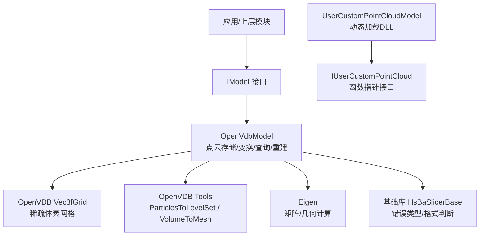
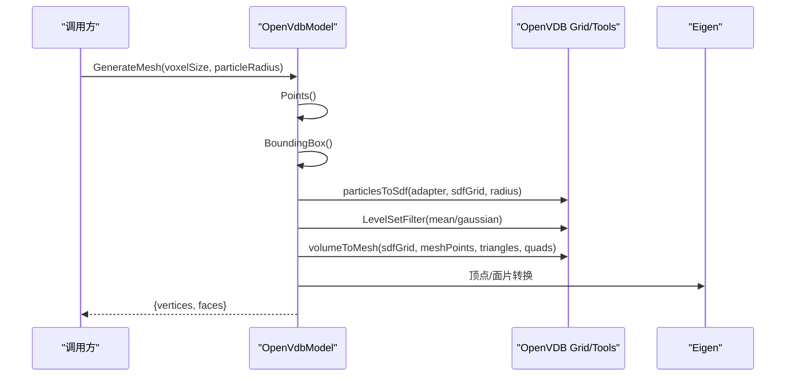
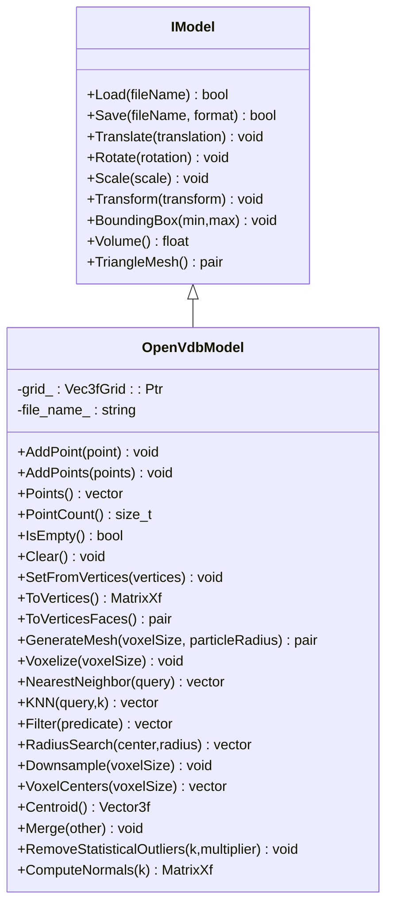
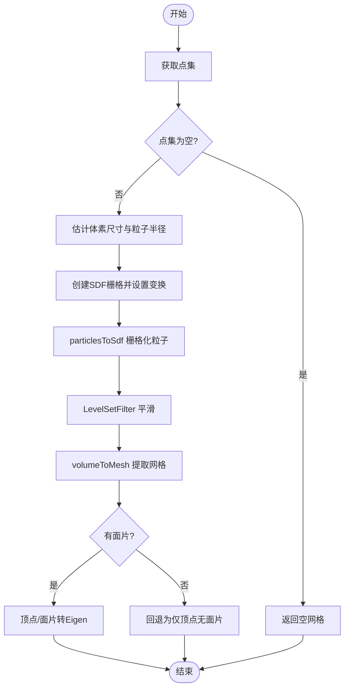
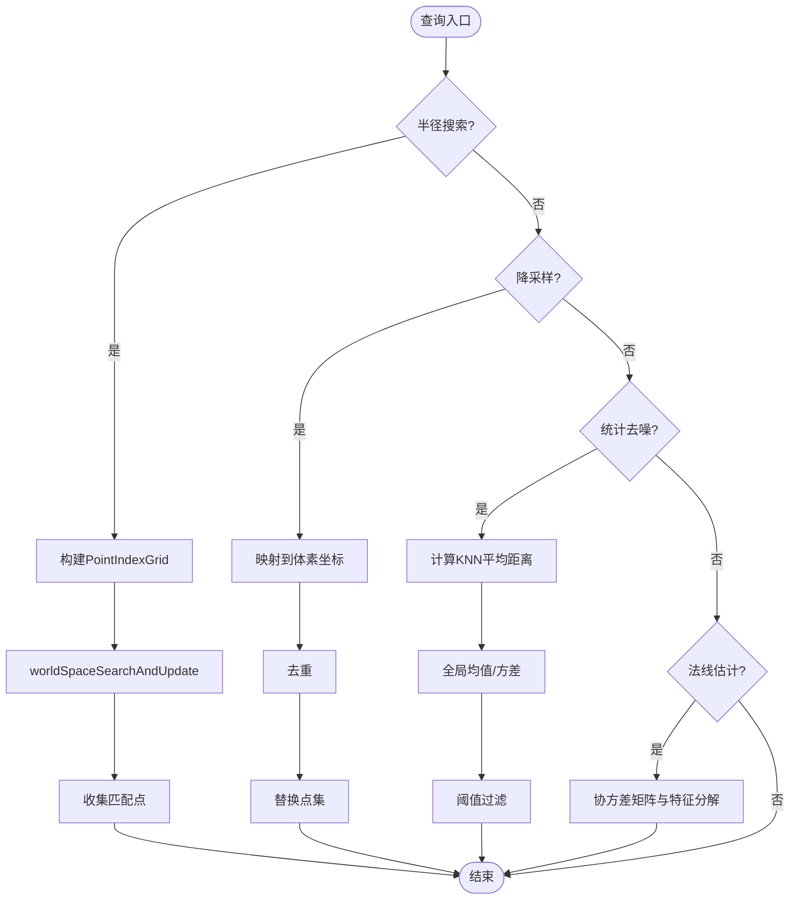
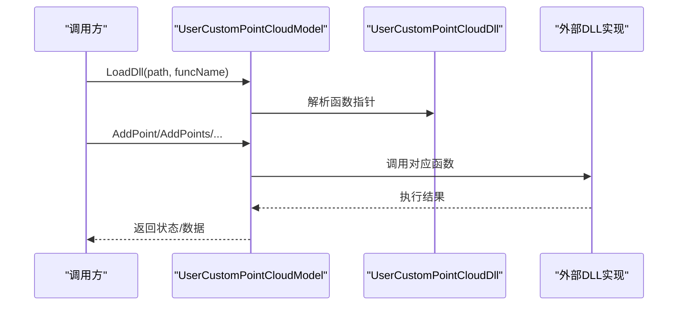
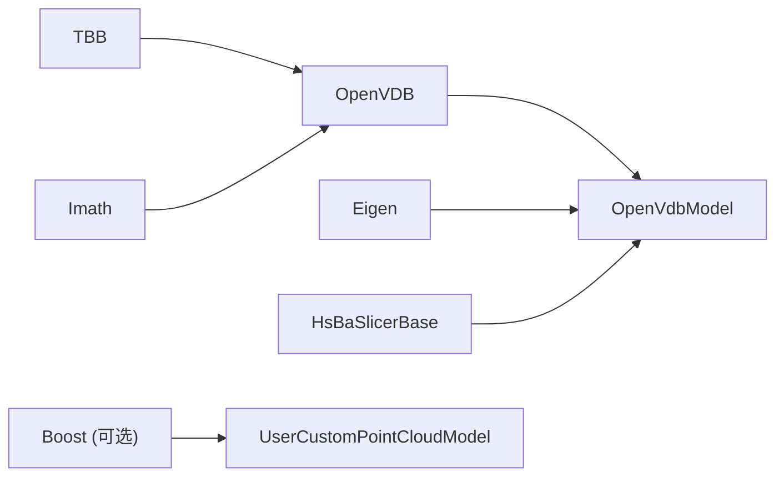

# 点云处理与OpenVDB集成

<cite>
**本文引用的文件**
- [pointcloud/OpenVdbModel.hpp](file://pointcloud/OpenVdbModel.hpp)
- [pointcloud/OpenVdbModel.cpp](file://pointcloud/OpenVdbModel.cpp)
- [pointcloud/OpenVdbModel_internal.h](file://pointcloud/OpenVdbModel_internal.h)
- [pointcloud/OpenVdbModel_mesh.cpp](file://pointcloud/OpenVdbModel_mesh.cpp)
- [pointcloud/OpenVdbModel_analysis.cpp](file://pointcloud/OpenVdbModel_analysis.cpp)
- [pointcloud/UserCustomPointCloudModel.hpp](file://pointcloud/UserCustomPointCloudModel.hpp)
- [base/IModel.hpp](file://base/IModel.hpp)
- [pointcloud/CMakeLists.txt](file://pointcloud/CMakeLists.txt)
- [tests/Models/openvdb_model_test.cpp](file://tests/Models/openvdb_model_test.cpp)
- [README.md](file://README.md)
</cite>

## 目录
1. [简介](#简介)
2. [项目结构](#项目结构)
3. [核心组件](#核心组件)
4. [架构总览](#架构总览)
5. [详细组件分析](#详细组件分析)
6. [依赖关系分析](#依赖关系分析)
7. [性能考量](#性能考量)
8. [故障排查指南](#故障排查指南)
9. [结论](#结论)
10. [附录](#附录)

## 简介
本仓库提供面向3D打印切片的高性能C++框架，其中点云模块基于OpenVDB实现点云的存储、变换、体素化、邻域查询、统计去噪、法线估计以及从点云重建三角网格。该模块通过统一的IModel接口暴露能力，既可直接使用内置的OpenVdbModel，也可通过动态加载用户自定义的点云模型（UserCustomPointCloudModel）扩展功能。

## 项目结构
点云相关代码集中在 pointcloud 目录，核心类为 OpenVdbModel，其内部工具函数位于 OpenVdbModel_internal.h；网格重建与分析逻辑分别拆分到独立源文件以避免MSVC对象文件节限制。构建配置在 pointcloud/CMakeLists.txt 中声明对OpenVDB、TBB、Imath等的依赖。

图表来源
- [pointcloud/OpenVdbModel.hpp:16-89](file://pointcloud/OpenVdbModel.hpp#L16-L89)
- [pointcloud/OpenVdbModel_mesh.cpp:21-117](file://pointcloud/OpenVdbModel_mesh.cpp#L21-L117)
- [pointcloud/OpenVdbModel_analysis.cpp:28-211](file://pointcloud/OpenVdbModel_analysis.cpp#L28-L211)
- [base/IModel.hpp:110-138](file://base/IModel.hpp#L110-L138)
- [pointcloud/UserCustomPointCloudModel.hpp:15-125](file://pointcloud/UserCustomPointCloudModel.hpp#L15-L125)

章节来源
- [pointcloud/CMakeLists.txt:1-58](file://pointcloud/CMakeLists.txt#L1-L58)
- [README.md:25-39](file://README.md#L25-L39)

## 核心组件
- OpenVdbModel：基于OpenVDB的三维点云模型，支持点增删、变换、边界框、体积（点云场景返回0）、体素化、最近邻/KNN、半径搜索、统计去噪、法线估计、网格重建等。
- UserCustomPointCloudModel：通过动态库加载用户自定义点云实现，暴露与OpenVdbModel一致的点云操作接口。
- IModel：统一模型抽象接口，定义加载/保存、变换、包围盒、体积、三角网格等通用能力。

章节来源
- [pointcloud/OpenVdbModel.hpp:16-89](file://pointcloud/OpenVdbModel.hpp#L16-L89)
- [pointcloud/UserCustomPointCloudModel.hpp:73-125](file://pointcloud/UserCustomPointCloudModel.hpp#L73-L125)
- [base/IModel.hpp:110-138](file://base/IModel.hpp#L110-L138)

## 架构总览
OpenVdbModel将点云数据以OpenVDB的Vec3fGrid形式存储，利用OpenVDB的稀疏体素特性高效管理大规模点集。网格重建流程通过粒子到符号距离场（SDF）转换、平滑滤波、Marching Cubes提取网格，最终输出IGL风格的顶点与面片。分析流程包括半径搜索、降采样、统计离群点去除和KNN协方差法线估计。

图表来源
- [pointcloud/OpenVdbModel_mesh.cpp:21-117](file://pointcloud/OpenVdbModel_mesh.cpp#L21-L117)
- [pointcloud/OpenVdbModel.cpp:314-317](file://pointcloud/OpenVdbModel.cpp#L314-L317)

## 详细组件分析

### OpenVdbModel 类设计
- 数据表示：内部维护 openvdb::Vec3fGrid::Ptr grid_，每个激活体素存储一个三维点坐标。
- 构造与赋值：支持从文件路径或IGL风格顶点对构造；支持从顶点矩阵设置内容。
- 变换：支持平移、旋转、缩放、多种仿射/齐次变换，遍历激活体素更新坐标。
- 查询与分析：最近邻、K近邻、过滤、半径搜索、体素中心、降采样、质心、合并、统计去噪、法线估计。
- 网格重建：GenerateMesh 通过粒子到SDF、平滑、Marching Cubes生成三角网格。
- 输入输出：Load/Save 支持 .vdb 与 .xyz/.txt 文本点云格式。

图表来源
- [base/IModel.hpp:110-138](file://base/IModel.hpp#L110-L138)
- [pointcloud/OpenVdbModel.hpp:16-89](file://pointcloud/OpenVdbModel.hpp#L16-L89)

章节来源
- [pointcloud/OpenVdbModel.hpp:16-89](file://pointcloud/OpenVdbModel.hpp#L16-L89)
- [pointcloud/OpenVdbModel.cpp:107-208](file://pointcloud/OpenVdbModel.cpp#L107-L208)
- [pointcloud/OpenVdbModel.cpp:210-317](file://pointcloud/OpenVdbModel.cpp#L210-L317)
- [pointcloud/OpenVdbModel.cpp:319-403](file://pointcloud/OpenVdbModel.cpp#L319-L403)
- [pointcloud/OpenVdbModel.cpp:405-547](file://pointcloud/OpenVdbModel.cpp#L405-L547)

### 网格重建流程（点云→三角网格）
- 自动参数估计：根据包围盒最大边长估算体素尺寸；根据点密度估算粒子半径。
- SDF栅格化：使用粒子适配器将点云转换为符号距离场（SDF），背景值设为半径倍数。
- 平滑滤波：均值与高斯滤波降低噪声。
- 网格提取：Marching Cubes提取等值面，得到三角形与四边形；四边形拆分为两个三角形。
- 结果转换：将OpenVDB网格点与索引转为Eigen矩阵，返回IGL风格顶点与面片。

图表来源
- [pointcloud/OpenVdbModel_mesh.cpp:21-117](file://pointcloud/OpenVdbModel_mesh.cpp#L21-L117)

章节来源
- [pointcloud/OpenVdbModel_mesh.cpp:21-117](file://pointcloud/OpenVdbModel_mesh.cpp#L21-L117)

### 空间查询与分析
- 半径搜索：基于OpenVDB PointIndexGrid进行世界空间范围搜索，返回指定半径内的点。
- 降采样：按体素尺寸将点映射到体素网格，去重后保留唯一代表点。
- 统计去噪：计算每点到K近邻的平均距离，统计全局均值与标准差，移除超过阈值的离群点。
- 法线估计：对每个点的K近邻计算协方差矩阵，最小特征向量即法线方向。

图表来源
- [pointcloud/OpenVdbModel_analysis.cpp:28-211](file://pointcloud/OpenVdbModel_analysis.cpp#L28-L211)

章节来源
- [pointcloud/OpenVdbModel_analysis.cpp:28-211](file://pointcloud/OpenVdbModel_analysis.cpp#L28-L211)

### 动态扩展：UserCustomPointCloudModel
- 通过 IUserCustomPointCloud 函数指针接口加载外部DLL中的点云实现。
- 封装了创建/销毁、点增删、查询、去噪、法线估计、体素化等操作。
- 适用于需要插件化或第三方点云算法的场景。

图表来源
- [pointcloud/UserCustomPointCloudModel.hpp:15-125](file://pointcloud/UserCustomPointCloudModel.hpp#L15-L125)

章节来源
- [pointcloud/UserCustomPointCloudModel.hpp:15-125](file://pointcloud/UserCustomPointCloudModel.hpp#L15-L125)

## 依赖关系分析
- OpenVDB：用于点云存储（Vec3fGrid）、粒子到SDF转换、平滑滤波、Marching Cubes网格提取。
- TBB/Imath：OpenVDB构建所需的基础并行与数学库。
- Eigen：矩阵与几何运算。
- 基础库：错误类型、文件格式判断、编码转换等。
- Boost：可选的动态库加载（桌面平台）。

图表来源
- [pointcloud/CMakeLists.txt:1-58](file://pointcloud/CMakeLists.txt#L1-L58)
- [pointcloud/OpenVdbModel.cpp:1-17](file://pointcloud/OpenVdbModel.cpp#L1-L17)
- [pointcloud/OpenVdbModel_mesh.cpp:12-16](file://pointcloud/OpenVdbModel_mesh.cpp#L12-L16)
- [pointcloud/OpenVdbModel_analysis.cpp:15-19](file://pointcloud/OpenVdbModel_analysis.cpp#L15-L19)

章节来源
- [pointcloud/CMakeLists.txt:1-58](file://pointcloud/CMakeLists.txt#L1-L58)

## 性能考量
- 体素化与稀疏存储：OpenVDB的稀疏体素网格适合大规模点云，内存占用与访问效率优于密集数组。
- 自动参数估计：GenerateMesh 根据包围盒与点密度自动选择体素尺寸与粒子半径，减少调参成本。
- 查询优化：半径搜索使用PointIndexGrid加速空间检索；KNN采用排序方式在小规模点集上可行，但大数据量建议结合更高效的KD树或OpenVDB索引。
- MSVC限制规避：将模板实例化较多的网格重建与分析逻辑拆分至独立源文件，避免对象文件节限制。
- 线程与并行：OpenVDB内部可能使用TBB进行并行处理，注意多线程环境下的资源管理与初始化。

[本节为通用指导，不直接分析具体文件]

## 故障排查指南
- 文件加载失败：检查路径是否有效、文件格式是否为.vdb或.xyz/.txt；确保OpenVDB已正确初始化。
- 不支持的保存格式：当保存格式非XYZ/VDB时抛出未支持错误；请确认目标格式。
- 体素尺寸非法：体素化与降采样要求正数体素尺寸；半径搜索要求正半径。
- 空点集处理：空点集的包围盒为零向量，体积为0；网格重建会返回空网格或仅顶点。
- 动态库加载：UserCustomPointCloudModel需确保DLL路径与导出函数名正确；若缺失则无法调用外部实现。

章节来源
- [pointcloud/OpenVdbModel.cpp:139-208](file://pointcloud/OpenVdbModel.cpp#L139-L208)
- [pointcloud/OpenVdbModel_analysis.cpp:28-159](file://pointcloud/OpenVdbModel_analysis.cpp#L28-L159)
- [pointcloud/UserCustomPointCloudModel.hpp:73-125](file://pointcloud/UserCustomPointCloudModel.hpp#L73-L125)

## 结论
本点云模块以OpenVDB为核心，提供了完整的点云存储、变换、查询、分析与网格重建能力，并通过IModel接口与动态扩展机制实现了良好的可插拔性与跨平台兼容性。对于大规模点云处理，推荐优先使用体素化与OpenVDB索引以提升性能；对于网格重建，合理设置体素尺寸与粒子半径可获得高质量表面。

[本节为总结性内容，不直接分析具体文件]

## 附录
- 单元测试覆盖：包含点云基本操作、邻居查询、过滤、体素化与往返保存一致性验证。
- 构建与安装：遵循项目根目录说明，使用CMake与vcpkg进行依赖管理与构建。

章节来源
- [tests/Models/openvdb_model_test.cpp:25-118](file://tests/Models/openvdb_model_test.cpp#L25-L118)
- [tests/Models/openvdb_model_test.cpp:120-156](file://tests/Models/openvdb_model_test.cpp#L120-L156)
- [README.md:41-124](file://README.md#L41-L124)