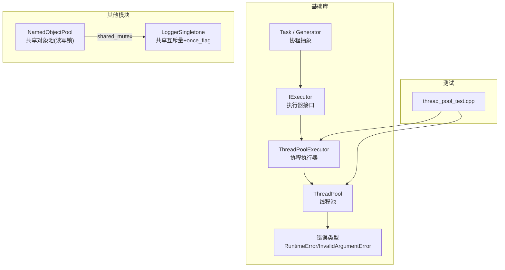
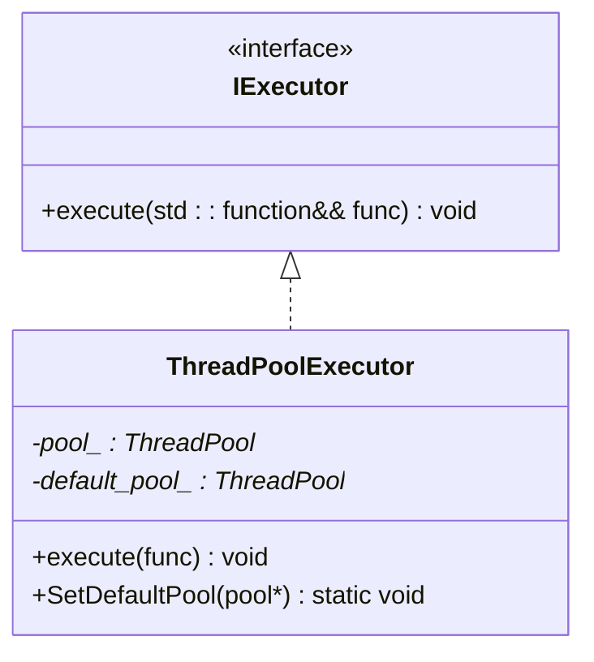
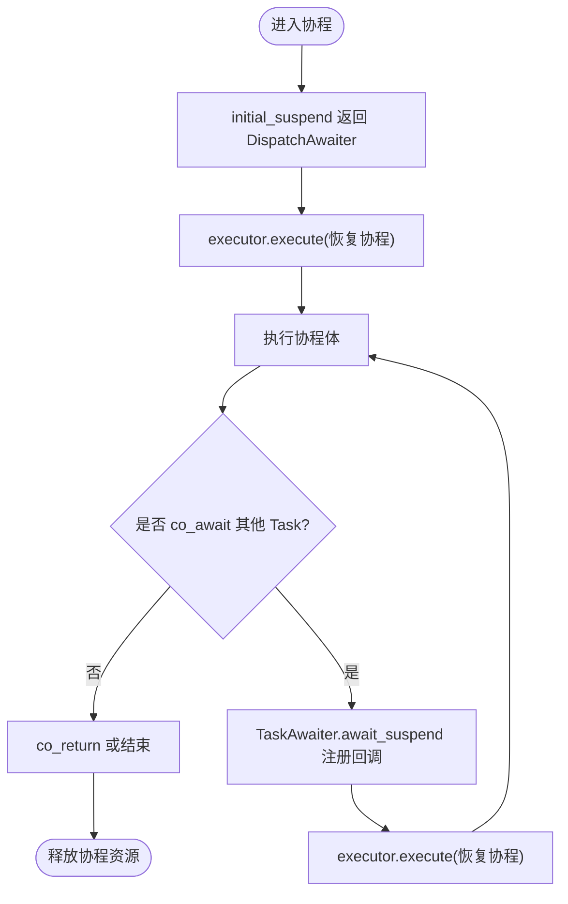
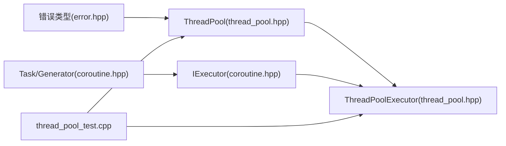

# 线程与并发处理

<cite>
**本文引用的文件**
- [base/thread_pool.hpp](file://base\thread_pool.hpp)
- [base/coroutine.hpp](file://base\coroutine.hpp)
- [tests/Pool/thread_pool_test.cpp](file://tests\Pool\thread_pool_test.cpp)
- [base/error.hpp](file://base\error.hpp)
- [base/object_pool.hpp](file://base\object_pool.hpp)
- [logger/logger.hpp](file://logger\logger.hpp)
- [docs/zh/base/thread_pool.md](file://docs\zh\base\thread_pool.md)
</cite>

## 目录
1. [简介](#简介)
2. [项目结构](#项目结构)
3. [核心组件](#核心组件)
4. [架构总览](#架构总览)
5. [详细组件分析](#详细组件分析)
6. [依赖关系分析](#依赖关系分析)
7. [性能考量](#性能考量)
8. [故障排查指南](#故障排查指南)
9. [结论](#结论)
10. [附录](#附录)

## 简介
本文件聚焦于 HsBaSlicer 项目中的“线程与并发处理”能力，系统性梳理线程池、协程执行器、任务调度、同步原语以及相关的错误处理与测试用例。文档旨在帮助读者快速理解：
- 如何提交与执行异步任务
- 如何在协程中复用线程池作为执行器
- 并发安全的设计要点与常见陷阱
- 性能优化建议与问题定位方法

## 项目结构
与线程和并发相关的关键代码集中在 base 模块，辅以 logger 的并发日志实现与单元测试验证。



图表来源
- [base/thread_pool.hpp:25-162](file://base\thread_pool.hpp#L25-L162)
- [base/coroutine.hpp:36-193](file://base\coroutine.hpp#L36-L193)
- [base/error.hpp:15-145](file://base\error.hpp#L15-L145)
- [base/object_pool.hpp:1-200](file://base\object_pool.hpp#L1-L200)
- [logger/logger.hpp:110-152](file://logger\logger.hpp#L110-L152)
- [tests/Pool/thread_pool_test.cpp:1-82](file://tests\Pool\thread_pool_test.cpp#L1-L82)

章节来源
- [base/thread_pool.hpp:25-162](file://base\thread_pool.hpp#L25-L162)
- [base/coroutine.hpp:36-193](file://base\coroutine.hpp#L36-L193)
- [base/error.hpp:15-145](file://base\error.hpp#L15-L145)
- [base/object_pool.hpp:1-200](file://base\object_pool.hpp#L1-L200)
- [logger/logger.hpp:110-152](file://logger\logger.hpp#L110-L152)
- [tests/Pool/thread_pool_test.cpp:1-82](file://tests\Pool\thread_pool_test.cpp#L1-L82)

## 核心组件
- ThreadPool：基于 std::thread + std::queue + condition_variable 的任务队列式线程池，支持 submit 返回 future、WaitAll 等待全部完成、PendingTasks/ActiveTasks 监控状态。
- ThreadPoolExecutor：实现 IExecutor 接口，将协程回调投递到 ThreadPool；支持设置默认池或绑定指定池实例。
- Task/Generator：C++20 协程封装，提供 then/catching/finally 链式回调、co_await 组合、自定义分配器等高级特性。
- 同步原语：std::mutex、std::condition_variable、std::atomic、std::shared_mutex 等广泛用于线程安全与无锁计数。
- 错误体系：继承自 std::runtime_error 的多种业务异常，用于参数校验、运行时错误、资源不足等场景。

章节来源
- [base/thread_pool.hpp:25-162](file://base\thread_pool.hpp#L25-L162)
- [base/coroutine.hpp:36-193](file://base\coroutine.hpp#L36-L193)
- [base/error.hpp:15-145](file://base\error.hpp#L15-L145)

## 架构总览
下图展示了从应用层提交任务到线程池执行、再到协程执行器桥接的整体流程。

```mermaid
sequenceDiagram
participant App as "应用代码"
participant TP as "ThreadPool"
participant Q as "任务队列"
participant W as "工作线程"
participant Exec as "ThreadPoolExecutor"
participant Task as "Task/协程"
App->>TP : submit(f, args...)
TP->>Q : 入队包装后的任务
TP-->>App : 返回 std : : future<Result>
W->>Q : 取任务并执行
W-->>W : 更新 active_tasks_
W-->>TP : finished_condition_.notify_all()
Note over Exec,Task : 协程路径
App->>Exec : execute(func)
Exec->>TP : submit([func](){ func(); })
TP-->>Exec : 返回 future忽略
```

图表来源
- [base/thread_pool.hpp:62-111](file://base\thread_pool.hpp#L62-L111)
- [base/thread_pool.hpp:117-154](file://base\thread_pool.hpp#L117-L154)
- [base/thread_pool.hpp:164-207](file://base\thread_pool.hpp#L164-L207)
- [base/coroutine.hpp:42-65](file://base\coroutine.hpp#L42-L65)

## 详细组件分析

### 线程池 ThreadPool
- 设计要点
  - 构造时创建固定数量工作线程，析构时置 stop_ 并唤醒所有工作线程后 join。
  - submit 使用 packaged_task + future 机制，保证结果与异常传播。
  - WorkerLoop 通过条件变量等待任务，避免忙等；任务完成后递减 active_tasks_ 并通知 WaitAll。
  - PendingTasks/ActiveTasks/WaitAll 均为线程安全。
- 关键数据结构
  - workers_: 工作线程集合
  - tasks_: 任务队列（函数对象）
  - queue_mutex_: 保护队列与 stop_
  - condition_: 新任务到达唤醒
  - finished_condition_: 任务完成唤醒 WaitAll
  - stop_: 原子标志，控制退出
  - active_tasks_: 原子计数器，跟踪正在执行的任务数
- 复杂度与性能
  - 入队/出队 O(1)，等待为阻塞型，适合 CPU 密集型并行计算。
  - 注意避免过多短任务导致队列开销放大。

```mermaid
classDiagram
class ThreadPool {
+submit(F&& f, Args&&... args) future
+PendingTasks() size_t
+ActiveTasks() size_t
+WaitAll() void
-WorkerLoop() void
-workers_ : vector<thread>
-tasks_ : queue<function<void()>>
-queue_mutex_ : mutex
-condition_ : condition_variable
-finished_condition_ : condition_variable
-stop_ : atomic<bool>
-active_tasks_ : atomic<size_t>
}
```

图表来源
- [base/thread_pool.hpp:29-162](file://base\thread_pool.hpp#L29-L162)

章节来源
- [base/thread_pool.hpp:37-111](file://base\thread_pool.hpp#L37-L111)
- [base/thread_pool.hpp:117-154](file://base\thread_pool.hpp#L117-L154)

### 协程执行器 ThreadPoolExecutor
- 作用：实现 IExecutor 接口，将协程回调投递到 ThreadPool，从而在协程中复用线程池。
- 默认池策略：若未显式绑定池，则使用静态默认池实例（按硬件并发度初始化）。
- 典型用法：SetDefaultPool 设置全局默认池，或在构造时传入具体池实例。



图表来源
- [base/coroutine.hpp:42-65](file://base\coroutine.hpp#L42-L65)
- [base/thread_pool.hpp:164-207](file://base\thread_pool.hpp#L164-L207)

章节来源
- [base/thread_pool.hpp:164-207](file://base\thread_pool.hpp#L164-L207)
- [base/coroutine.hpp:42-65](file://base\coroutine.hpp#L42-L65)

### 协程 Task/Generator 与执行器集成
- Task：封装协程生命周期、结果与异常，支持 then/catching/finally 回调链；内部通过 promise_type 管理初始挂起、最终挂起与结果通知。
- DispatchAwaiter：将协程恢复调度到指定执行器上下文。
- CustomAllocatorTask/CustomAllocatorTaskAwaiter：支持自定义分配器的协程任务变体。
- 与 ThreadPoolExecutor 协作：当 co_await 一个 Task 时，通过 await_transform 返回 TaskAwaiter，其 await_suspend 注册 finally 回调，在任务完成时通过 executor.execute 恢复协程。



图表来源
- [base/coroutine.hpp:179-193](file://base\coroutine.hpp#L179-L193)
- [base/coroutine.hpp:229-311](file://base\coroutine.hpp#L229-L311)
- [base/coroutine.hpp:383-483](file://base\coroutine.hpp#L383-L483)
- [base/coroutine.hpp:558-767](file://base\coroutine.hpp#L558-L767)

章节来源
- [base/coroutine.hpp:179-193](file://base\coroutine.hpp#L179-L193)
- [base/coroutine.hpp:229-311](file://base\coroutine.hpp#L229-L311)
- [base/coroutine.hpp:383-483](file://base\coroutine.hpp#L383-L483)
- [base/coroutine.hpp:558-767](file://base\coroutine.hpp#L558-L767)

### 同步与并发原语在其他模块的使用
- NamedObjectPool：使用 shared_mutex 实现读多写少的并发访问，读操作使用共享锁，写操作使用独占锁。
- LoggerSingletone：使用 shared_mutex 与 once_flag 保障单例创建与日志写入的线程安全。

章节来源
- [base/object_pool.hpp:129-169](file://base\object_pool.hpp#L129-L169)
- [logger/logger.hpp:110-152](file://logger\logger.hpp#L110-L152)

## 依赖关系分析
- ThreadPool 依赖标准库并发原语与错误类型；ThreadPoolExecutor 依赖 ThreadPool 与 IExecutor 接口；Task/Generator 依赖 IExecutor 及其实现。
- 测试用例覆盖基本提交、WaitAll、协程混用等场景。



图表来源
- [base/error.hpp:15-145](file://base\error.hpp#L15-L145)
- [base/thread_pool.hpp:25-207](file://base\thread_pool.hpp#L25-L207)
- [base/coroutine.hpp:36-193](file://base\coroutine.hpp#L36-L193)
- [tests/Pool/thread_pool_test.cpp:1-82](file://tests\Pool\thread_pool_test.cpp#L1-L82)

章节来源
- [base/thread_pool.hpp:25-207](file://base\thread_pool.hpp#L25-L207)
- [base/coroutine.hpp:36-193](file://base\coroutine.hpp#L36-L193)
- [tests/Pool/thread_pool_test.cpp:1-82](file://tests\Pool\thread_pool_test.cpp#L1-L82)

## 性能考量
- 线程数选择：CPU 密集型任务建议设置为硬件并发度；I/O 密集型可适当增加线程数以提升吞吐。
- 任务粒度：避免大量极短任务，减少队列与上下文切换开销。
- 等待策略：优先使用 future.get 获取单个任务结果；批量聚合时使用 WaitAll 统一收尾。
- 协程执行器：合理设置默认池或绑定专用池，避免跨域调度带来的额外开销。
- 内存与对象池：结合 NamedObjectPool 与 MemoryPool 降低频繁分配/释放的开销。

[本节为通用指导，不直接分析具体文件]

## 故障排查指南
- 提交失败：若在已停止的线程池上提交任务，会抛出运行时错误。检查线程池生命周期与 stop 标志。
- 参数非法：构造线程池时线程数为 0 会抛出无效参数错误。确保传入大于 0 的值。
- 任务异常：任务内抛出的异常会通过 future.get 传播；协程中异常会被捕获并通过 Result 暴露。
- 死锁风险：避免在任务中再次提交任务并立即 WaitAll；必要时拆分阶段或使用超时机制。
- 日志与对象池并发：确认读写锁使用正确，避免长时间持有独占锁影响并发度。

章节来源
- [base/thread_pool.hpp:37-90](file://base\thread_pool.hpp#L37-L90)
- [base/error.hpp:15-145](file://base\error.hpp#L15-L145)
- [base/coroutine.hpp:229-311](file://base\coroutine.hpp#L229-L311)

## 结论
本项目提供了完善的线程池与协程执行框架，既能满足传统异步任务模型（future/packaged_task），又能无缝对接 C++20 协程生态。通过合理的线程数配置、任务粒度划分与执行器选择，可在不同负载下获得稳定且高效的并发处理能力。配合对象池与内存池，可进一步降低系统开销，提升整体吞吐与稳定性。

[本节为总结性内容，不直接分析具体文件]

## 附录

### 常用 API 速查
- ThreadPool
  - 构造：explicit ThreadPool(size_t num_threads = hardware_concurrency())
  - 提交：template <typename F, typename... Args> auto submit(F&& f, Args&&... args) -> future<invoke_result_t<F, Args...>>
  - 查询：size_t PendingTasks() const; size_t ActiveTasks() const; void WaitAll()
- ThreadPoolExecutor
  - 构造：ThreadPoolExecutor() noexcept; explicit ThreadPoolExecutor(ThreadPool& pool) noexcept
  - 执行：void execute(std::function<void()>&& func) override
  - 默认池：static void SetDefaultPool(ThreadPool* pool) noexcept
- Task/Generator
  - 链式回调：then(...), catching(...), finally(...)
  - 协程关键字：co_await, co_yield, co_return

章节来源
- [base/thread_pool.hpp:37-111](file://base\thread_pool.hpp#L37-L111)
- [base/thread_pool.hpp:164-207](file://base\thread_pool.hpp#L164-L207)
- [base/coroutine.hpp:229-311](file://base\coroutine.hpp#L229-L311)
- [docs/zh/base/thread_pool.md:1-317](file://docs\zh\base\thread_pool.md#L1-L317)

### 测试用例参考
- 基本功能：提交两个任务并验证结果与 WaitAll 行为
- 协程集成：在启用协程宏的情况下，使用 ThreadPoolExecutor 作为执行器进行 co_await 与结果获取
- 混合模式：同时使用 future 与协程任务，验证线程池与执行器协同工作

章节来源
- [tests/Pool/thread_pool_test.cpp:14-37](file://tests\Pool\thread_pool_test.cpp#L14-L37)
- [tests/Pool/thread_pool_test.cpp:39-53](file://tests\Pool\thread_pool_test.cpp#L39-L53)
- [tests/Pool/thread_pool_test.cpp:55-80](file://tests\Pool\thread_pool_test.cpp#L55-L80)