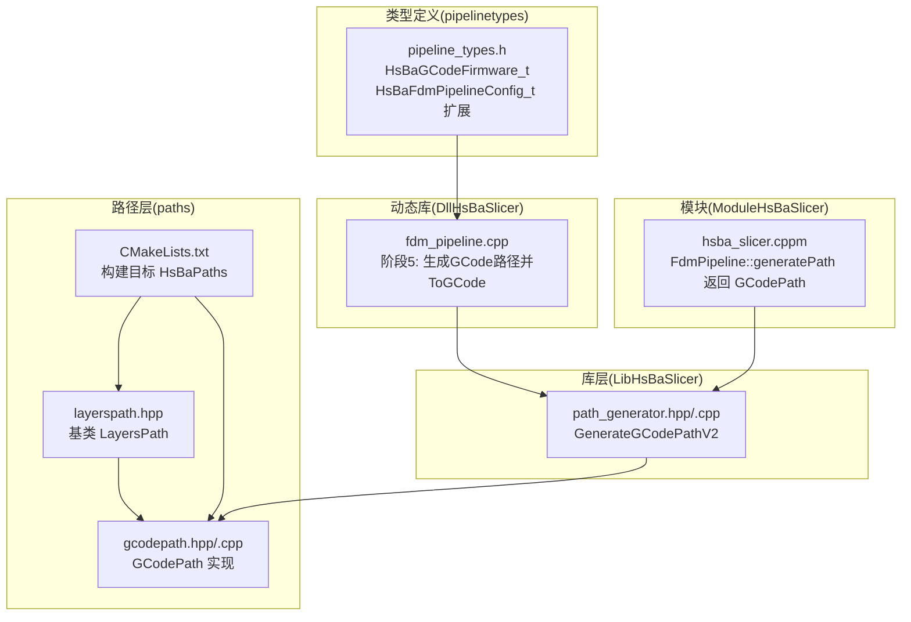
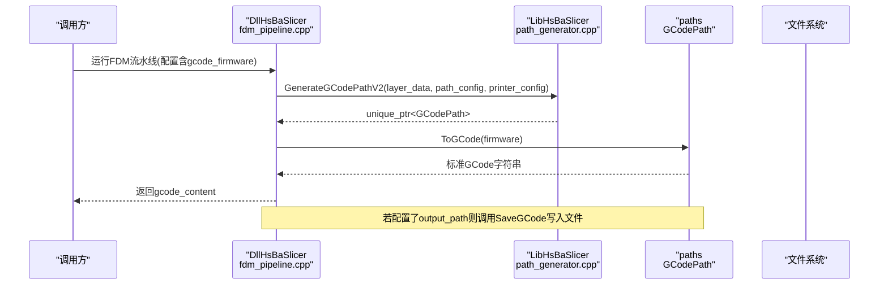
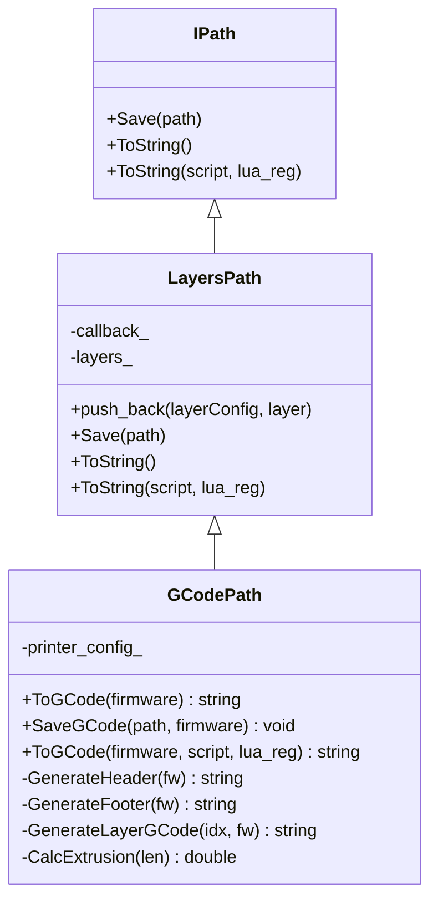
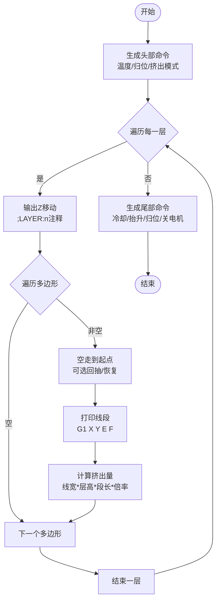
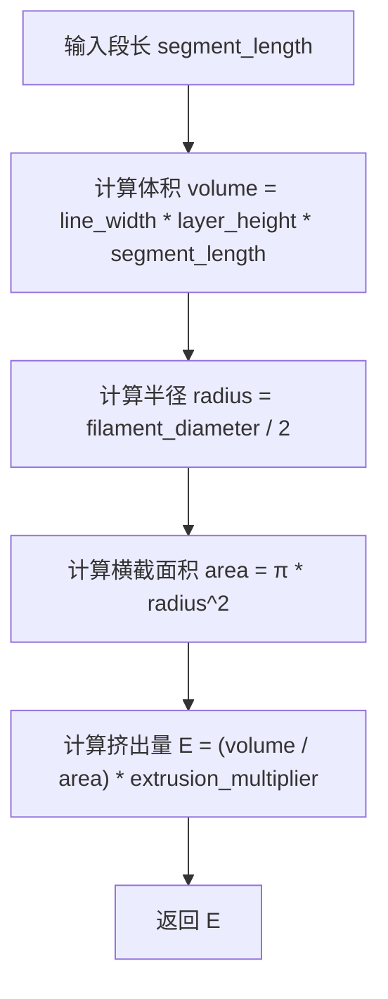
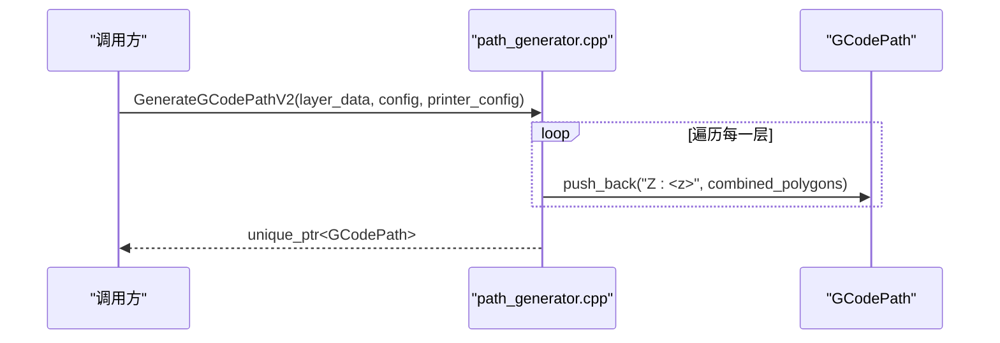
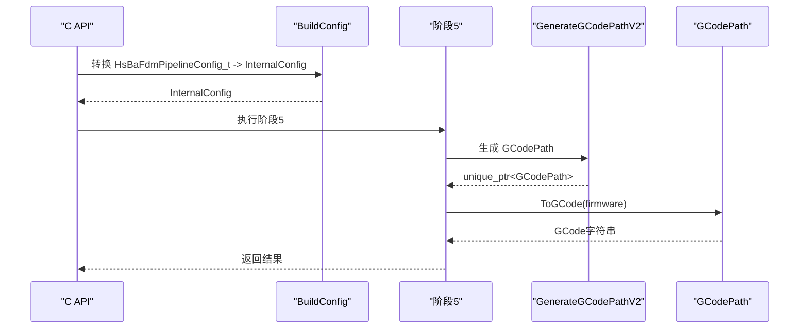
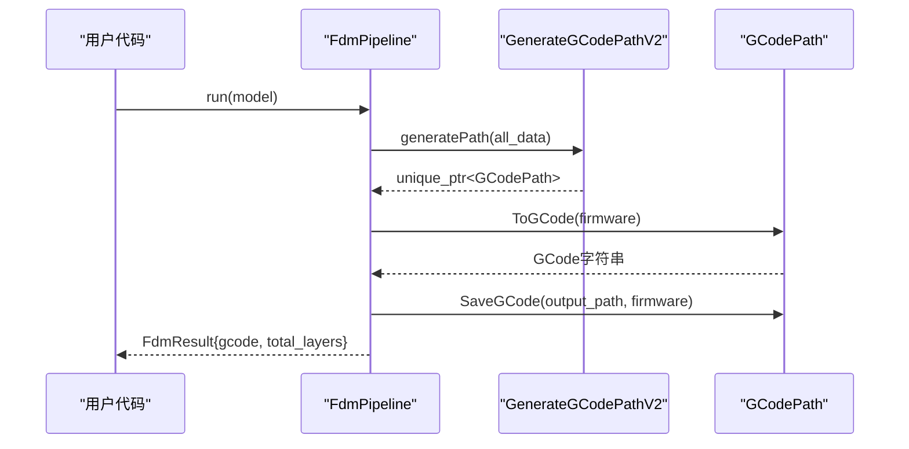
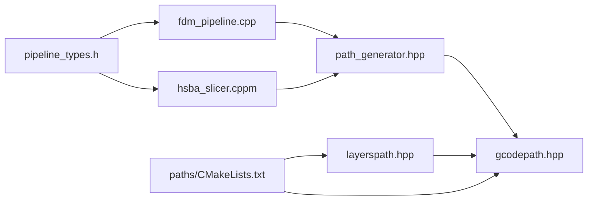

# GCode路径输出

<cite>
**本文引用的文件**   
- [paths/gcodepath.hpp](file://paths/gcodepath.hpp)
- [paths/gcodepath.cpp](file://paths/gcodepath.cpp)
- [paths/layerspath.hpp](file://paths/layerspath.hpp)
- [paths/CMakeLists.txt](file://paths/CMakeLists.txt)
- [pipelinetypes/pipeline_types.h](file://pipelinetypes/pipeline_types.h)
- [LibHsBaSlicer/Path/path_generator.hpp](file://LibHsBaSlicer/Path/path_generator.hpp)
- [LibHsBaSlicer/Path/path_generator.cpp](file://LibHsBaSlicer/Path/path_generator.cpp)
- [DllHsBaSlicer/fdm_pipeline.cpp](file://DllHsBaSlicer/fdm_pipeline.cpp)
- [ModuleHsBaSlicer/hsba_slicer.cppm](file://ModuleHsBaSlicer/hsba_slicer.cppm)
</cite>

## 目录
1. [简介](#简介)
2. [项目结构](#项目结构)
3. [核心组件](#核心组件)
4. [架构总览](#架构总览)
5. [详细组件分析](#详细组件分析)
6. [依赖关系分析](#依赖关系分析)
7. [性能考量](#性能考量)
8. [故障排查指南](#故障排查指南)
9. [结论](#结论)
10. [附录](#附录)

## 简介
本文件围绕 HsBaSlicer 的 FDM GCode 路径输出优化进行系统化说明。该优化在 paths 模块新增 GCodePath 类（继承 LayersPath），支持 Marlin、RepRap/RRF、Klipper 三种主流固件的标准 GCode 输出，并在 Lib/Dll/Module 三层统一接入新的路径生成与输出逻辑。同时保留原有 PointsPath 与 ToString() 行为以维持向后兼容。

## 项目结构
GCode 路径输出相关代码主要分布在以下位置：
- paths：路径类型与实现，包含 GCodePath、LayersPath、CMake 构建配置
- pipelinetypes：C 兼容的类型定义，含 GCode 固件枚举与 FDM 配置扩展字段
- LibHsBaSlicer/Path：路径生成器接口与实现，提供 GenerateGCodePathV2
- DllHsBaSlicer：C API 流水线实现，阶段5使用新路径生成与 ToGCode
- ModuleHsBaSlicer：C++20 module 封装，暴露 FdmPipeline::generatePath 返回 GCodePath

图表来源
- [paths/gcodepath.hpp:1-83](file://paths/gcodepath.hpp#L1-L83)
- [paths/gcodepath.cpp:1-377](file://paths/gcodepath.cpp#L1-L377)
- [paths/layerspath.hpp:1-47](file://paths/layerspath.hpp#L1-L47)
- [paths/CMakeLists.txt:1-19](file://paths/CMakeLists.txt#L1-L19)
- [pipelinetypes/pipeline_types.h:44-110](file://pipelinetypes/pipeline_types.h#L44-L110)
- [LibHsBaSlicer/Path/path_generator.hpp:1-74](file://LibHsBaSlicer/Path/path_generator.hpp#L1-L74)
- [LibHsBaSlicer/Path/path_generator.cpp:1-113](file://LibHsBaSlicer/Path/path_generator.cpp#L1-L113)
- [DllHsBaSlicer/fdm_pipeline.cpp:1-410](file://DllHsBaSlicer/fdm_pipeline.cpp#L1-L410)
- [ModuleHsBaSlicer/hsba_slicer.cppm:429-503](file://ModuleHsBaSlicer/hsba_slicer.cppm#L429-L503)

章节来源
- [paths/CMakeLists.txt:1-19](file://paths/CMakeLists.txt#L1-L19)
- [pipelinetypes/pipeline_types.h:44-110](file://pipelinetypes/pipeline_types.h#L44-L110)

## 核心组件
- GCodePath：继承自 LayersPath，负责按固件类型生成标准 GCode，支持 Lua 后处理脚本
- GCodePrinterConfig：打印机参数集合（喷嘴直径、耗材直径、温度、挤出倍率、回抽等）
- GCodeFirmware：固件类型枚举（Marlin、RepRap、Klipper）
- LayersPath：层数据容器，提供 push_back(layerConfig, PolygonsD) 与 ToString/Lua 扩展能力
- path_generator：路径生成器，提供 GenerateGCodePathV2 将 LayerPathData 转换为 GCodePath
- Dll/Module 集成：在 FDM 流水线阶段5调用 GenerateGCodePathV2 并输出 ToGCode(firmware)

章节来源
- [paths/gcodepath.hpp:18-78](file://paths/gcodepath.hpp#L18-L78)
- [paths/gcodepath.cpp:39-55](file://paths/gcodepath.cpp#L39-L55)
- [paths/layerspath.hpp:13-43](file://paths/layerspath.hpp#L13-L43)
- [LibHsBaSlicer/Path/path_generator.hpp:19-58](file://LibHsBaSlicer/Path/path_generator.hpp#L19-L58)
- [LibHsBaSlicer/Path/path_generator.cpp:89-110](file://LibHsBaSlicer/Path/path_generator.cpp#L89-L110)

## 架构总览
下图展示了从切片结果到最终 GCode 输出的完整流程，以及不同固件的差异点。

图表来源
- [DllHsBaSlicer/fdm_pipeline.cpp:328-351](file://DllHsBaSlicer/fdm_pipeline.cpp#L328-L351)
- [LibHsBaSlicer/Path/path_generator.cpp:89-110](file://LibHsBaSlicer/Path/path_generator.cpp#L89-L110)
- [paths/gcodepath.cpp:267-290](file://paths/gcodepath.cpp#L267-L290)

## 详细组件分析

### GCodePath 类设计
GCodePath 继承 LayersPath，封装打印机配置与固件差异化的 GCode 生成逻辑。关键方法包括：
- ToGCode(firmware)：生成指定固件的标准 GCode
- SaveGCode(path, firmware)：保存为文件
- ToGCode(firmware, script, lua_reg)：基于 Lua 脚本的后处理，可覆盖或修改基础 GCode

内部辅助方法：
- GenerateHeader/GenerateFooter：根据固件生成头尾命令（温度设置、归位、风扇控制、压力前馈等）
- GenerateLayerGCode：逐层输出 Z 移动、轮廓/填充/支撑路径（G0/G1 指令）
- CalcExtrusion：根据线宽、层高、段长与挤出倍率计算挤出量

图表来源
- [paths/layerspath.hpp:13-43](file://paths/layerspath.hpp#L13-L43)
- [paths/gcodepath.hpp:45-78](file://paths/gcodepath.hpp#L45-L78)

章节来源
- [paths/gcodepath.hpp:18-78](file://paths/gcodepath.hpp#L18-L78)
- [paths/gcodepath.cpp:45-55](file://paths/gcodepath.cpp#L45-L55)
- [paths/layerspath.hpp:13-43](file://paths/layerspath.hpp#L13-L43)

### 固件差异化输出
- Marlin：标准 M104/M109/M140/M190 温度等待，G92 E0，M82/M83 切换绝对/相对挤出
- RepRap/RRF：额外 M106 风扇控制，显式 M82/M83
- Klipper：SET_PRESSURE_ADVANCE、M220/M221 速度流量百分比、SET_FAN_SPEED

图表来源
- [paths/gcodepath.cpp:57-134](file://paths/gcodepath.cpp#L57-L134)
- [paths/gcodepath.cpp:136-185](file://paths/gcodepath.cpp#L136-L185)
- [paths/gcodepath.cpp:187-265](file://paths/gcodepath.cpp#L187-L265)

章节来源
- [paths/gcodepath.cpp:57-134](file://paths/gcodepath.cpp#L57-L134)
- [paths/gcodepath.cpp:136-185](file://paths/gcodepath.cpp#L136-L185)
- [paths/gcodepath.cpp:187-265](file://paths/gcodepath.cpp#L187-L265)

### 挤出量计算算法
挤出量基于体积守恒原理：
- 挤出体积 = 线宽 × 层高 × 段长
- 耗材横截面积 = π × (耗材直径/2)^2
- 挤出长度 E = 体积 / 横截面积 × 挤出倍率

图表来源
- [paths/gcodepath.cpp:45-55](file://paths/gcodepath.cpp#L45-L55)

章节来源
- [paths/gcodepath.cpp:45-55](file://paths/gcodepath.cpp#L45-L55)

### 路径生成器 V2
GenerateGCodePathV2 将每层的 outlines/fills/supports 合并为 PolygonsD，并通过 LayersPath::push_back 写入层数据。层配置字符串编码 Z 高度，供后续解析。

图表来源
- [LibHsBaSlicer/Path/path_generator.cpp:89-110](file://LibHsBaSlicer/Path/path_generator.cpp#L89-L110)

章节来源
- [LibHsBaSlicer/Path/path_generator.cpp:89-110](file://LibHsBaSlicer/Path/path_generator.cpp#L89-L110)

### DllHsBaSlicer 集成
BuildConfig 将 C 配置映射到 InternalConfig，包含 GCodePrinterConfig 与 GCodeFirmware。阶段5调用 GenerateGCodePathV2 并 ToGCode(firmware) 输出。

图表来源
- [DllHsBaSlicer/fdm_pipeline.cpp:129-183](file://DllHsBaSlicer/fdm_pipeline.cpp#L129-L183)
- [DllHsBaSlicer/fdm_pipeline.cpp:328-351](file://DllHsBaSlicer/fdm_pipeline.cpp#L328-L351)

章节来源
- [DllHsBaSlicer/fdm_pipeline.cpp:129-183](file://DllHsBaSlicer/fdm_pipeline.cpp#L129-L183)
- [DllHsBaSlicer/fdm_pipeline.cpp:328-351](file://DllHsBaSlicer/fdm_pipeline.cpp#L328-L351)

### ModuleHsBaSlicer 集成
FdmPipeline::generatePath 返回 std::unique_ptr<GCodePath>，run 方法中调用 ToGCode(firmware) 并可选保存到文件。

图表来源
- [ModuleHsBaSlicer/hsba_slicer.cppm:429-503](file://ModuleHsBaSlicer/hsba_slicer.cppm#L429-L503)

章节来源
- [ModuleHsBaSlicer/hsba_slicer.cppm:429-503](file://ModuleHsBaSlicer/hsba_slicer.cppm#L429-L503)

## 依赖关系分析
- GCodePath 依赖 LayersPath 存储层数据，依赖 Lua 环境进行后处理
- path_generator 依赖 2D 多边形类型（PolygonsD）与 GCodePath
- Dll/Module 层依赖 pipelinetypes 中的 C 兼容配置类型
- 构建系统通过 CMake 将 gcodepath 加入 HsBaPaths 静态库

图表来源
- [paths/gcodepath.hpp:10-10](file://paths/gcodepath.hpp#L10-L10)
- [LibHsBaSlicer/Path/path_generator.hpp:11-12](file://LibHsBaSlicer/Path/path_generator.hpp#L11-L12)
- [DllHsBaSlicer/fdm_pipeline.cpp:14-19](file://DllHsBaSlicer/fdm_pipeline.cpp#L14-L19)
- [ModuleHsBaSlicer/hsba_slicer.cppm:44-54](file://ModuleHsBaSlicer/hsba_slicer.cppm#L44-L54)
- [pipelinetypes/pipeline_types.h:44-110](file://pipelinetypes/pipeline_types.h#L44-L110)
- [paths/CMakeLists.txt:13-14](file://paths/CMakeLists.txt#L13-L14)

章节来源
- [paths/CMakeLists.txt:1-19](file://paths/CMakeLists.txt#L1-L19)
- [pipelinetypes/pipeline_types.h:44-110](file://pipelinetypes/pipeline_types.h#L44-L110)

## 性能考量
- 挤出量计算采用 O(n) 线性扫描，复杂度与路径点数成正比
- 层数据处理通过 reserve 预估容量减少重分配
- Lua 后处理仅在需要时启用，避免不必要的解释器开销
- 建议对大型模型分层批处理，避免一次性生成过大的 GCode 字符串

[本节为通用指导，不直接分析具体文件]

## 故障排查指南
- 文件写入失败：SaveGCode 抛出 RuntimeError，检查输出路径权限与磁盘空间
- Lua 脚本错误：加载或执行失败会抛出 RuntimeError，检查脚本语法与全局变量名
- 固件命令不匹配：确认 gcode_firmware 与实际固件一致，特别是 Klipper 的 SET_* 命令
- 挤出异常：检查 line_width、layer_height、filament_diameter 与 extrusion_multiplier 是否合理

章节来源
- [paths/gcodepath.cpp:281-290](file://paths/gcodepath.cpp#L281-L290)
- [paths/gcodepath.cpp:340-374](file://paths/gcodepath.cpp#L340-L374)

## 结论
本次优化通过引入 GCodePath 类与 GenerateGCodePathV2，实现了多固件标准的 GCode 输出，并在 Lib/Dll/Module 三层保持一致的调用方式。设计保持向后兼容，同时提供 Lua 扩展能力，便于定制化后处理。整体架构清晰，易于扩展与维护。

[本节为总结性内容，不直接分析具体文件]

## 附录
- 配置文件默认值：HsBaFdmConfigDefault 初始化所有字段，默认固件为 Marlin
- 测试建议：对同一模型分别输出 Marlin/RepRap/Klipper 格式，验证头部/层/尾部命令正确性

章节来源
- [pipelinetypes/pipeline_types.h:317-357](file://pipelinetypes/pipeline_types.h#L317-L357)