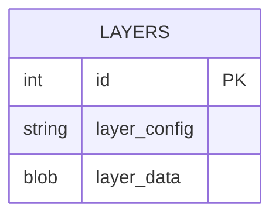
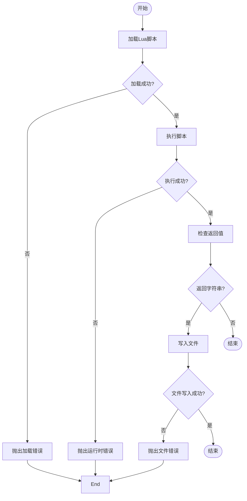

# 分层路径输出

<cite>
**本文档引用的文件**  
- [layerspath.hpp](file://paths/layerspath.hpp)
- [layerspath.cpp](file://paths/layerspath.cpp)
- [LuaAdapter.hpp](file://2D/LuaAdapter.hpp)
- [LuaAdapter.cpp](file://2D/LuaAdapter.cpp)
- [FloatPolygons.hpp](file://2D/FloatPolygons.hpp)
- [IntPolygon.hpp](file://2D/IntPolygon.hpp)
- [custom_fill.lua](file://tests/PolygonFill/custom_fill.lua)
- [image_from_polygons.lua](file://tests/PolygonFill/image_from_polygons.lua)
- [LuaAdapter.hpp](file://fileoperator/LuaAdapter.hpp)
- [LuaAdapter.cpp](file://fileoperator/LuaAdapter.cpp)
</cite>

## 目录
1. [简介](#简介)
2. [核心数据结构](#核心数据结构)
3. [默认JSON序列化机制](#默认json序列化机制)
4. [Lua脚本扩展输出格式](#lua脚本扩展输出格式)
5. [Lua接口参数说明](#lua接口参数说明)
6. [错误处理机制](#错误处理机制)
7. [性能建议](#性能建议)
8. [示例：CSV输出Lua脚本](#示例csv输出lua脚本)

## 简介

`LayersPath`类是HsBaSlicer系统中用于管理切片后二维多边形序列的核心组件。该类负责将不同层的几何数据按结构化方式保存，并支持通过Lua脚本进行输出格式的灵活扩展。本文档详细说明其工作原理、默认序列化机制以及如何通过Lua脚本自定义输出格式。

**Section sources**
- [layerspath.hpp](file://paths/layerspath.hpp#L1-L39)
- [layerspath.cpp](file://paths/layerspath.cpp#L1-L454)

## 核心数据结构

`LayersPath`类基于`IPath`接口实现，其内部使用`std::vector<LayersData>`来存储分层数据。每个`LayersData`包含一个字符串形式的层配置信息（`layerConfig`）和一个`PolygonsD`类型的二维多边形集合。`PolygonsD`是Clipper2库中`PathsD`的别名，表示一组二维浮点坐标点构成的多边形。

**Section sources**
- [layerspath.hpp](file://paths/layerspath.hpp#L28-L34)
- [FloatPolygons.hpp](file://2D/FloatPolygons.hpp#L13-L15)

## 默认JSON序列化机制

当调用`Save(const std::filesystem::path& path)`方法时，`LayersPath`会将数据以SQLite数据库格式保存。数据库包含一个名为`layers`的表，其结构如下：

- `id`: 整数主键，自动递增
- `layer_config`: 文本字段，存储层配置信息，非空
- `layer_data`: BLOB字段，存储多边形数据的字符串表示

多边形数据的字符串表示采用类似JSON的格式：`{[{(x1,y1),(x2,y2),...],[(x1,y1),...]},...]}`，其中每个点以`(x,y)`形式表示，多边形由点的列表组成，层由多边形的列表组成。



**Diagram sources**
- [layerspath.cpp](file://paths/layerspath.cpp#L36-L63)

**Section sources**
- [layerspath.cpp](file://paths/layerspath.cpp#L27-L65)

## Lua脚本扩展输出格式

`LayersPath`类支持通过Lua脚本扩展输出格式。当调用`Save(path, script_file, funcName)`时，C++代码会执行以下步骤：

1. 创建一个新的Lua状态机（`lua_State`）
2. 打开Lua标准库
3. 注册SQLite适配器等C++对象到Lua环境
4. 将`layers`数据以Lua表的形式暴露为全局变量
5. 加载并执行指定的Lua脚本文件
6. 调用指定的函数名（`funcName`）
7. 如果Lua脚本返回字符串，则将其写入指定路径

在Lua脚本中，可以通过全局变量`layers`访问分层数据。`layers`是一个表的数组，每个元素包含`config`（层配置）和`data`（多边形数据）字段。多边形数据本身也是一个表的数组，每个点包含`x`和`y`字段。

```mermaid
sequenceDiagram
participant C++ as C++代码
participant Lua as Lua状态机
participant Script as Lua脚本
C++->>Lua : 创建Lua状态机
Lua->>Lua : 打开标准库
C++->>Lua : 注册SQLite适配器
C++->>Lua : 设置layers全局变量
C++->>Lua : 设置output_path全局变量
C++->>Lua : 加载脚本文件
Lua->>Script : 执行脚本
Script->>Script : 调用指定函数
Script->>Lua : 返回字符串结果
Lua->>C++ : 返回结果
C++->>文件系统 : 写入输出文件
```

**Diagram sources**
- [layerspath.cpp](file://paths/layerspath.cpp#L249-L260)
- [LuaAdapter.cpp](file://fileoperator/LuaAdapter.cpp#L1060-L1079)

**Section sources**
- [layerspath.cpp](file://paths/layerspath.cpp#L249-L260)
- [LuaAdapter.cpp](file://fileoperator/LuaAdapter.cpp#L1060-L1079)

## Lua接口参数说明

| 参数名称 | 类型 | 描述 |
|---------|------|------|
| `layers` | 表数组 | 包含所有层数据的全局变量，每个元素有`config`和`data`字段 |
| `output_path` | 字符串 | 输出文件的路径，由C++代码设置 |
| `db` | SQLiteAdapter对象 | 可选的SQLite数据库连接，可用于直接写入数据库 |
| `funcName` | 字符串 | 要调用的Lua函数名，由C++代码作为全局变量传递 |

**Section sources**
- [layerspath.cpp](file://paths/layerspath.cpp#L214-L215)
- [layerspath.cpp](file://paths/layerspath.cpp#L124-L125)

## 错误处理机制

系统在Lua脚本执行过程中实现了多层次的错误处理：

1. **Lua加载错误**：如果脚本无法加载，`luaL_loadbuffer`会返回非`LUA_OK`状态，系统会抛出包含错误信息的`RuntimeError`。
2. **Lua运行时错误**：如果脚本执行过程中发生错误，`lua_pcall`会返回非`LUA_OK`状态，系统会捕获Lua栈顶的错误信息并抛出异常。
3. **文件操作错误**：如果无法打开输出文件，系统会抛出`RuntimeError`。
4. **函数未定义**：如果指定的函数名在Lua环境中不存在，调用时会触发Lua的运行时错误。
5. **类型不匹配**：如果Lua脚本期望的数据类型与实际传递的类型不符，可能会导致运行时错误或意外行为。



**Diagram sources**
- [layerspath.cpp](file://paths/layerspath.cpp#L127-L139)
- [layerspath.cpp](file://paths/layerspath.cpp#L217-L228)

**Section sources**
- [layerspath.cpp](file://paths/layerspath.cpp#L127-L139)
- [layerspath.cpp](file://paths/layerspath.cpp#L217-L228)

## 性能建议

1. **避免在Lua脚本中进行密集计算**：由于Lua是解释型语言，复杂的数学运算或大量数据处理应尽量在C++层完成。
2. **批量操作**：如果需要写入数据库，应尽量使用批量插入而非逐条插入。
3. **缓存常用对象**：在脚本中重复使用的对象（如数据库连接）应缓存以避免重复创建。
4. **最小化数据传输**：只传递Lua脚本真正需要的数据，避免不必要的数据序列化和反序列化。
5. **使用适当的Lua数据结构**：对于大量数据，使用Lua的数组（数值索引表）而非哈希表以提高性能。

**Section sources**
- [layerspath.cpp](file://paths/layerspath.cpp#L70-L86)
- [LuaAdapter.cpp](file://fileoperator/LuaAdapter.cpp#L1060-L1079)

## 示例：CSV输出Lua脚本

以下是一个将`LayersPath`输出转换为CSV格式的Lua脚本示例：

```lua
-- CSV输出脚本示例
local lines = {}
table.insert(lines, "config,x,y")

for i, layer in ipairs(layers) do
    for j, polygon in ipairs(layer.data) do
        for k, point in ipairs(polygon) do
            table.insert(lines, string.format("%s,%.4f,%.4f", layer.config, point.x, point.y))
        end
    end
end

return table.concat(lines, "\n")
```

此脚本创建一个包含表头的行列表，然后遍历每一层、每个轮廓和每个点，将它们格式化为CSV行。最后使用`table.concat`将所有行连接成一个字符串返回。

**Section sources**
- [custom_fill.lua](file://tests/PolygonFill/custom_fill.lua#L1-L16)
- [image_from_polygons.lua](file://tests/PolygonFill/image_from_polygons.lua#L1-L47)