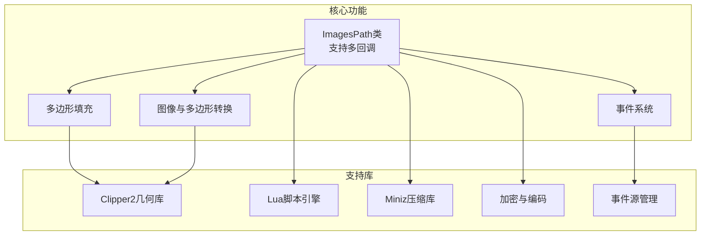
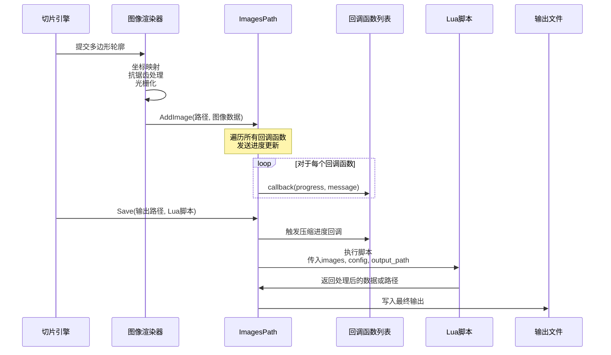
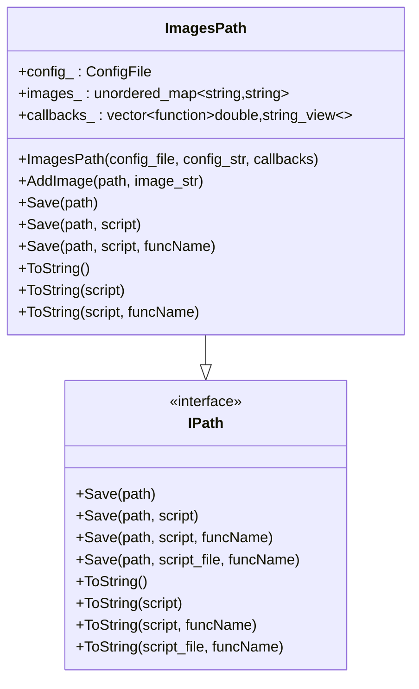
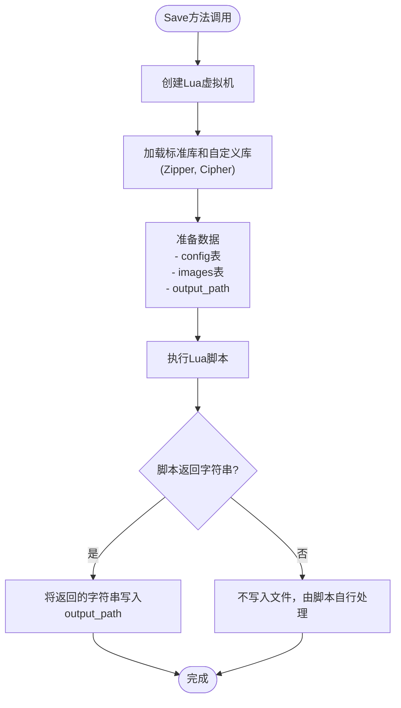
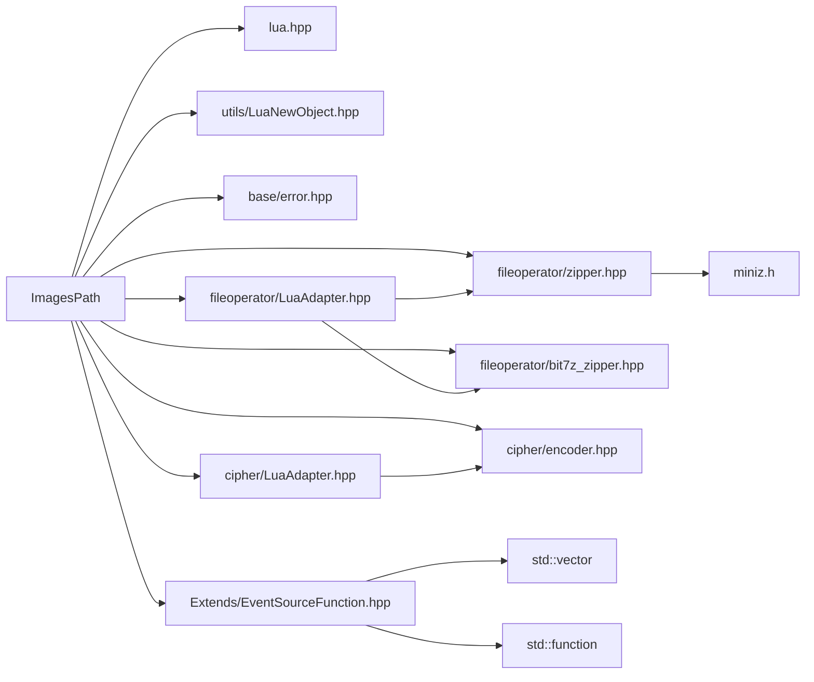

# 图像路径输出

<cite>
**本文档中引用的文件**
- [imagespath.hpp](file://paths/imagespath.hpp)
- [imagespath.cpp](file://paths/imagespath.cpp)
- [IPath.hpp](file://paths/IPath.hpp)
- [EventSourceFunction.hpp](file://LibHsBaSlicer/Extends/EventSourceFunction.hpp)
- [EventSourceFunction.cpp](file://LibHsBaSlicer/Extends/EventSourceFunction.cpp)
- [ImageToPolygons.hpp](file://2D/ImageToPolygons.hpp)
- [PolygonFill.hpp](file://2D/PolygonFill.hpp)
- [FloatPolygons.hpp](file://2D/FloatPolygons.hpp)
- [LuaAdapter.hpp](file://cipher/LuaAdapter.hpp)
- [LuaAdapter.hpp](file://fileoperator/LuaAdapter.hpp)
- [encoder.hpp](file://cipher/encoder.hpp)
- [zipper.hpp](file://fileoperator/zipper.hpp)
- [custom_fill.lua](file://tests/PolygonFill/custom_fill.lua)
- [image_from_polygons.lua](file://tests/PolygonFill/image_from_polygons.lua)
- [images_path_test.cpp](file://tests/PathsOut/images_path_test.cpp)
</cite>

## 更新摘要
**所做更改**
- 更新了ImagesPath类构造函数以支持多个回调函数而非单个回调
- 新增了多进度报告器功能，支持同时注册多个进度回调
- 增强了事件处理机制，允许并行处理多个进度监听器
- 更新了相关测试用例和示例代码

## 目录
1. [简介](#简介)
2. [项目结构](#项目结构)
3. [核心组件](#核心组件)
4. [架构概述](#架构概述)
5. [详细组件分析](#详细组件分析)
6. [依赖分析](#依赖分析)
7. [性能考虑](#性能考虑)
8. [故障排除指南](#故障排除指南)
9. [结论](#结论)

## 简介
本文档全面介绍 `ImagesPath` 类如何将每一层的二维多边形轮廓渲染为位图图像（如PNG格式），并打包生成配套的配置文件（如JSON或INI）。文档详细说明图像生成过程中的关键参数：分辨率、颜色模式、坐标映射（从世界坐标到像素坐标）、抗锯齿处理等。同时阐述其与Lua脚本的集成方式——通过 `Save` 接口调用外部脚本实现图像后处理（如添加水印、生成缩略图或转换为特定设备兼容格式）。**重要更新**：ImagesPath类现已支持多个回调函数，允许同时注册多个进度报告器，提供更灵活的进度监控和事件处理机制。提供一个使用Lua调用ImageMagick库进行格式转换的示例脚本。文档包含渲染效果对比图、典型应用场景（如可视化调试、质量检测）以及内存使用优化建议（如分层流式输出）。

## 项目结构
`ImagesPath` 类位于 `paths` 目录下，是路径生成系统的一部分，负责将切片层的二维多边形数据转换为图像并打包输出。该类依赖于2D几何处理库（使用Clipper2）进行多边形操作，并通过Lua脚本引擎实现灵活的后处理功能。**新增的多回调支持**使得该系统能够同时处理多个进度监听器和事件处理器。图像生成和多边形转换功能在 `2D` 子目录中实现，而文件压缩和加密功能则由 `fileoperator` 和 `cipher` 模块提供。

**图表来源**
- [imagespath.hpp:1-47](file://paths/imagespath.hpp#L1-L47)
- [EventSourceFunction.hpp:1-40](file://LibHsBaSlicer/Extends/EventSourceFunction.hpp#L1-L40)
- [ImageToPolygons.hpp:1-26](file://2D/ImageToPolygons.hpp#L1-L26)
- [PolygonFill.hpp:1-46](file://2D/PolygonFill.hpp#L1-L46)

**章节来源**
- [paths](file://paths)
- [2D](file://2D)
- [LibHsBaSlicer/Extends](file://LibHsBaSlicer/Extends)

## 核心组件
`ImagesPath` 类是图像输出系统的核心，它继承自 `IPath` 接口，实现了将切片数据保存为文件或转换为字符串的功能。**关键更新**：该类现在支持通过构造函数接收 `std::vector<std::function<void(double, std::string_view)>>` 类型的多个回调函数，每个回调函数都接收进度百分比（double类型）和状态消息（std::string_view类型）。其关键特性是支持通过Lua脚本进行后处理，这使得图像生成流程具有高度的可扩展性。

**章节来源**
- [imagespath.hpp:12-44](file://paths/imagespath.hpp#L12-L44)
- [IPath.hpp:12-34](file://paths/IPath.hpp#L12-L34)

## 架构概述
`ImagesPath` 的工作流程分为三个主要阶段：数据准备、图像生成和后处理。首先，切片引擎将三维模型分解为一系列二维多边形轮廓。然后，`ImageToPolygons` 模块将这些多边形渲染为位图图像，处理坐标映射、分辨率和抗锯齿等关键参数。**新增的事件处理阶段**：在图像生成过程中，系统会遍历所有注册的回调函数，向每个回调函数发送进度更新和状态信息。最后，`ImagesPath` 将生成的图像和配置文件收集起来，通过 `Save` 方法输出。在输出阶段，可以选择直接打包，或通过Lua脚本进行复杂的后处理。

**图表来源**
- [imagespath.cpp:30-43](file://paths/imagespath.cpp#L30-L43)
- [imagespath.cpp:330-333](file://paths/imagespath.cpp#L330-L333)
- [ImageToPolygons.hpp:15-22](file://2D/ImageToPolygons.hpp#L15-L22)
- [images_path_test.cpp:65-70](file://tests/PathsOut/images_path_test.cpp#L65-L70)

## 详细组件分析

### ImagesPath类分析
`ImagesPath` 类的设计体现了数据与处理逻辑的分离。**重大更新**：该类现在维护一个 `callbacks_` 向量来存储多个回调函数，而不是单一的回调函数。它本身不负责图像的生成，而是作为一个容器和调度器，管理图像数据和配置文件，并提供与Lua脚本的集成接口。

#### 类结构

**图表来源**
- [imagespath.hpp:12-44](file://paths/imagespath.hpp#L12-L44)
- [IPath.hpp:12-34](file://paths/IPath.hpp#L12-L34)

#### 多回调函数支持
**新增功能**：ImagesPath类现在支持多个回调函数的注册和处理。构造函数接受 `std::vector<std::function<void(double, std::string_view)>>` 类型的回调函数列表，每个回调函数都遵循统一的接口：
- **第一个参数 (double)**: 进度百分比，范围从0.0到100.0
- **第二个参数 (std::string_view)**: 状态消息，描述当前操作阶段

在 `Save` 和 `ToString` 方法中，系统会遍历所有注册的回调函数并调用它们，确保每个进度监听器都能收到实时更新。

#### 图像生成与坐标映射
虽然 `ImagesPath` 不直接生成图像，但它依赖于 `ImageToPolygons` 模块来完成这一任务。该模块处理从世界坐标到像素坐标的映射，关键参数包括：
- **分辨率 (pixelSize)**: 定义每个像素代表的实际物理尺寸（单位：毫米/像素），直接影响图像的精度和文件大小。
- **图像尺寸 (width, height)**: 输出图像的像素尺寸，由实际模型尺寸和分辨率共同决定。
- **抗锯齿处理**: 在 `ToImage` 函数中，通过简单的阈值处理将多边形轮廓转换为二值图像，更高级的抗锯齿算法可在Lua脚本中实现。

**章节来源**
- [ImageToPolygons.hpp:11-22](file://2D/ImageToPolygons.hpp#L11-L22)
- [FloatPolygons.hpp:13-15](file://2D/FloatPolygons.hpp#L13-L15)
- [imagespath.cpp:19-23](file://paths/imagespath.cpp#L19-L23)

#### Lua脚本集成
`ImagesPath` 通过 `Save` 方法的重载支持Lua脚本集成。当调用 `Save(path, script)` 时，系统会创建一个Lua虚拟机实例，将 `config`、`images` 和 `output_path` 作为全局变量注入脚本环境，然后执行脚本。这为图像后处理提供了极大的灵活性。

**图表来源**
- [imagespath.cpp:45-115](file://paths/imagespath.cpp#L45-L115)
- [LuaAdapter.hpp:18-28](file://fileoperator/LuaAdapter.hpp#L18-L28)
- [LuaAdapter.hpp](file://cipher/LuaAdapter.hpp#L8)

### 事件系统与回调机制
**新增组件**：事件系统通过 `EventSourceFunction` 模块提供统一的事件管理机制，支持多个回调函数的注册和管理。

#### 事件回调类型
系统定义了两种主要的事件回调类型：
- **ZipperEventCallback**: `std::function<void(double, std::string_view)>` - 用于压缩进度事件
- **DBEventCallback**: `std::function<void(std::string_view, std::string_view)>` - 用于数据库操作事件

#### 回调函数管理
系统提供以下API来管理回调函数：
- `AddZipperEventCallback(ZipperEventCallback func)`: 添加压缩事件回调
- `GetZipperEventCallback()`: 获取已注册的压缩事件回调列表
- `AddDBEventCallback(DBEventCallback func)`: 添加数据库事件回调
- `GetDBEventCallback()`: 获取已注册的数据库事件回调列表

**章节来源**
- [EventSourceFunction.hpp:14-37](file://LibHsBaSlicer/Extends/EventSourceFunction.hpp#L14-L37)
- [EventSourceFunction.cpp:5-22](file://LibHsBaSlicer/Extends/EventSourceFunction.cpp#L5-L22)

### 典型应用场景
#### 可视化调试
生成的PNG图像可以直观地展示每一层的切片结果，帮助开发者和用户验证切片算法的正确性，检查是否存在多边形断裂、重叠或填充异常等问题。

#### 质量检测
通过分析生成的图像，可以自动检测切片质量，例如计算填充密度、检查轮廓连续性等。

#### 设备兼容性转换
不同的3D打印机可能需要特定格式的图像文件。通过Lua脚本，可以轻松地将标准PNG转换为设备专用的格式。

#### 多进度监控
**新增场景**：支持同时显示多个进度指示器，如主进度条、详细日志输出、网络传输进度等，提供更好的用户体验。

**章节来源**
- [images_path_test.cpp](file://tests/PathsOut/images_path_test.cpp)
- [image_from_polygons.lua](file://tests/PolygonFill/image_from_polygons.lua)

## 依赖分析
`ImagesPath` 类依赖于多个关键模块，形成了一个功能完整的图像输出系统。**新增依赖**：现在还包括事件源管理模块，用于支持多回调函数机制。

**图表来源**
- [imagespath.cpp:7-16](file://paths/imagespath.cpp#L7-L16)
- [EventSourceFunction.hpp:1-40](file://LibHsBaSlicer/Extends/EventSourceFunction.hpp#L1-L40)
- [zipper.hpp](file://fileoperator/zipper.hpp#L11)
- [encoder.hpp](file://cipher/encoder.hpp#L9)

**章节来源**
- [imagespath.cpp:1-346](file://paths/imagespath.cpp#L1-L346)
- [zipper.hpp:1-65](file://fileoperator/zipper.hpp#L1-L65)
- [encoder.hpp:1-35](file://cipher/encoder.hpp#L1-L35)
- [EventSourceFunction.hpp:1-40](file://LibHsBaSlicer/Extends/EventSourceFunction.hpp#L1-L40)

## 性能考虑
为了优化内存使用，特别是处理大型模型时，可以采用分层流式输出策略。`ImagesPath` 类本身将所有图像数据存储在内存中的 `images_` 映射里，这在处理大量切片层时可能导致内存占用过高。**新增的性能考虑**：多回调函数机制引入了额外的函数调用开销，但在现代C++中，这种开销通常可以忽略不计。一个优化方案是修改 `Save` 流程，在生成每一层图像后立即通过Lua脚本将其写入归档文件，而不是全部缓存在内存中。此外，选择合适的图像分辨率和压缩级别（通过 `MinizCompression`）也能有效平衡文件大小和处理速度。

**章节来源**
- [imagespath.cpp:330-333](file://paths/imagespath.cpp#L330-L333)
- [imagespath.cpp:33-43](file://paths/imagespath.cpp#L33-L43)

## 故障排除指南
- **Lua脚本加载失败**: 检查脚本语法是否正确，确保没有使用Lua不支持的特性。
- **图像数据为空**: 确认 `AddImage` 方法在 `Save` 之前被正确调用，并且传入的图像数据是有效的Base64编码字符串。
- **输出文件损坏**: 检查Lua脚本是否正确处理了 `images` 表中的数据，特别是Base64解码步骤（使用 `Cipher.base64_decode`）。
- **性能低下**: 考虑降低图像分辨率或实现流式输出，避免一次性加载所有图像数据到内存。
- **回调函数未触发**: 确认在构造 `ImagesPath` 对象时正确传递了回调函数列表，检查回调函数签名是否符合要求。
- **多个回调函数冲突**: 确保不同回调函数之间不会相互干扰，特别是在并发访问共享资源时。

**章节来源**
- [imagespath.cpp:80-89](file://paths/imagespath.cpp#L80-L89)
- [encoder.hpp](file://cipher/encoder.hpp#L17)
- [images_path_test.cpp:36-45](file://tests/PathsOut/images_path_test.cpp#L36-L45)

## 结论
`ImagesPath` 类通过将图像生成与后处理逻辑分离，提供了一个强大而灵活的图像输出解决方案。**重大改进**：通过支持多个回调函数，该系统现在能够提供更加丰富的事件处理和进度监控能力。其核心价值在于通过Lua脚本集成，实现了高度可扩展的后处理能力。开发者可以利用这一机制，轻松实现添加水印、生成缩略图、格式转换等复杂功能，而无需修改核心代码库。结合 `ImageToPolygons` 和 `PolygonFill` 模块，该系统为3D切片软件提供了完整的二维可视化和数据输出能力。**新增的多回调支持**使得系统能够更好地适应复杂的应用场景，如实时进度监控、多目标输出、分布式处理等。