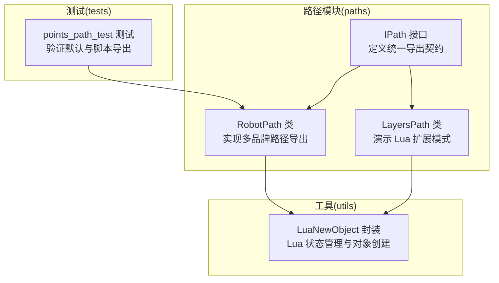
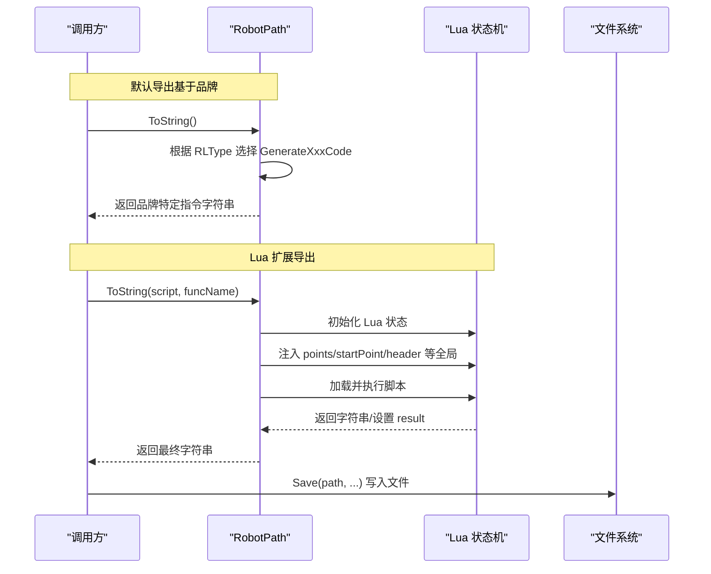
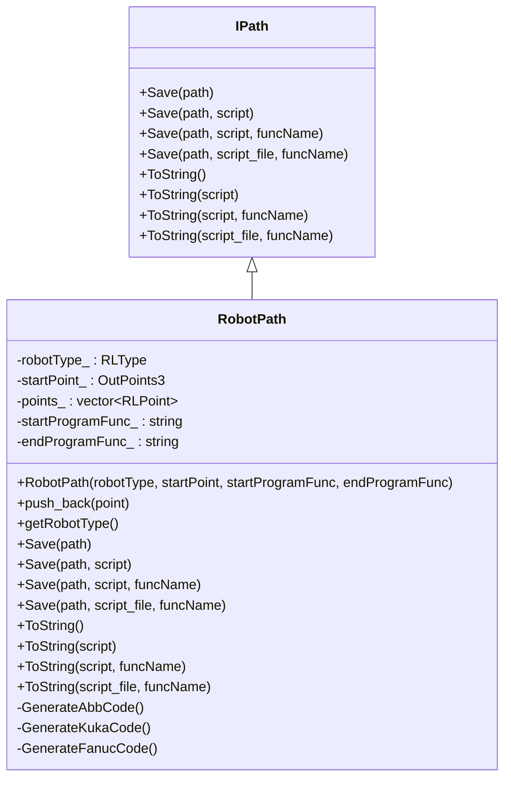
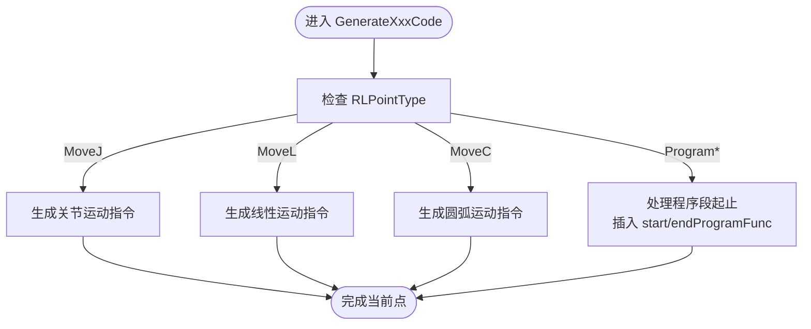
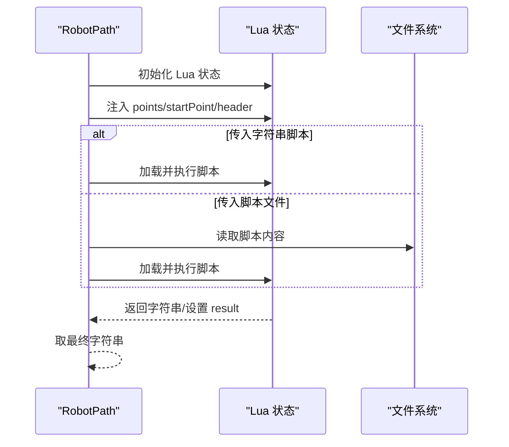
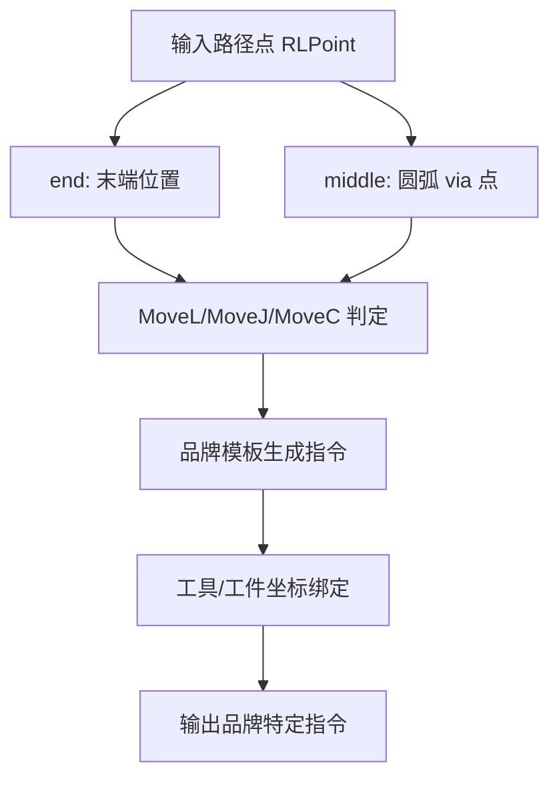
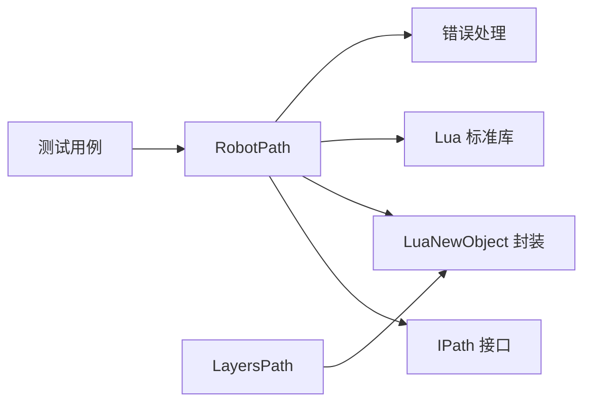
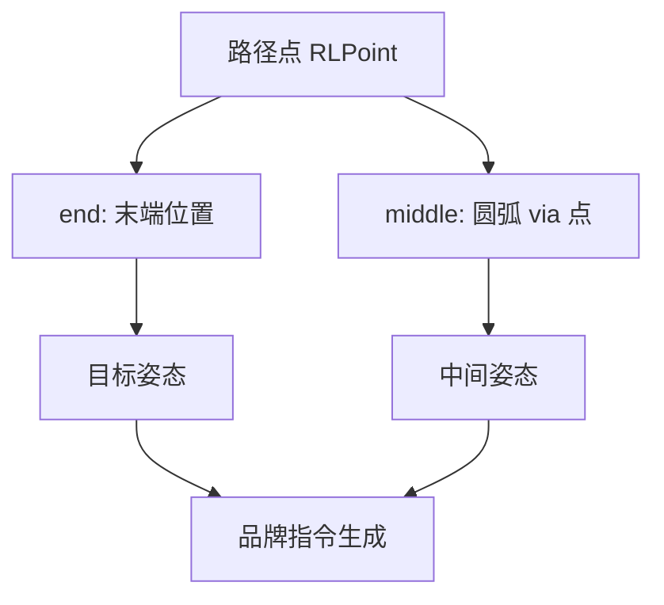

# 机器人专用路径输出

<cite>
**本文引用的文件列表**
- [robotpath.hpp](file://paths/robotpath.hpp)
- [robotpath.cpp](file://paths/robotpath.cpp)
- [IPath.hpp](file://paths/IPath.hpp)
- [LuaNewObject.hpp](file://utils/LuaNewObject.hpp)
- [points_path_test.cpp](file://tests/PathsOut/points_path_test.cpp)
- [layerspath.cpp](file://paths/layerspath.cpp)
</cite>

## 目录
1. [引言](#引言)
2. [项目结构](#项目结构)
3. [核心组件](#核心组件)
4. [架构总览](#架构总览)
5. [详细组件分析](#详细组件分析)
6. [依赖关系分析](#依赖关系分析)
7. [性能考量](#性能考量)
8. [故障排查指南](#故障排查指南)
9. [结论](#结论)
10. [附录](#附录)

## 引言
本文件系统性阐述 RobotPath 类在工业机器人（ABB、KUKA、FANUC）路径输出方面的设计与实现，重点说明：
- 如何根据目标机器人品牌选择对应的语法模板与坐标系语义；
- 通过 Lua 脚本扩展机制，利用 Save(path, script_file, funcName) 或 ToString(script, funcName) 调用外部脚本生成品牌特定指令（如 KUKA 的 KRL 语句或 ABB 的 RAPID 代码），覆盖关节角计算、工具姿态控制、I/O 信号触发等高级能力；
- 提供为 ABB 机器人生成带力控反馈循环的焊接路径的 Lua 脚本示例思路；
- 输出格式对照表、坐标变换原理图、安全规范建议以及与 ROS 系统的集成路径。

## 项目结构
RobotPath 所属模块位于 paths 子目录，遵循“接口 + 实现”的分层组织方式；Lua 扩展能力由 utils 中的 Lua 封装提供；测试用例位于 tests 子目录，验证默认导出与 Lua 扩展导出的行为。

图表来源
- [robotpath.hpp](file://paths/robotpath.hpp#L1-L74)
- [robotpath.cpp](file://paths/robotpath.cpp#L1-L120)
- [IPath.hpp](file://paths/IPath.hpp#L1-L34)
- [LuaNewObject.hpp](file://utils/LuaNewObject.hpp#L1-L64)
- [layerspath.cpp](file://paths/layerspath.cpp#L220-L260)
- [points_path_test.cpp](file://tests/PathsOut/points_path_test.cpp#L87-L188)

章节来源
- [robotpath.hpp](file://paths/robotpath.hpp#L1-L74)
- [robotpath.cpp](file://paths/robotpath.cpp#L1-L120)
- [IPath.hpp](file://paths/IPath.hpp#L1-L34)
- [LuaNewObject.hpp](file://utils/LuaNewObject.hpp#L1-L64)
- [layerspath.cpp](file://paths/layerspath.cpp#L220-L260)
- [points_path_test.cpp](file://tests/PathsOut/points_path_test.cpp#L87-L188)

## 核心组件
- RobotPath：继承自 IPath，负责接收路径点集（含末端位姿、中间点、速度、程序段索引等），支持直接导出到字符串或文件，并提供 Lua 扩展导出能力。
- RLPoint/RLType/RLPointType：定义路径点数据结构与移动类型枚举（关节/线性/圆弧、程序段起止标记等）。
- 默认品牌导出：分别生成 ABB（RAPID）、KUKA（KRL）、FANUC（FANUC）风格的文本指令。
- Lua 扩展：通过 MakeUniqueLuaState 创建 Lua 状态，向脚本注入全局变量 points、startPoint、header（可选）等，脚本返回字符串作为最终输出。

章节来源
- [robotpath.hpp](file://paths/robotpath.hpp#L1-L74)
- [robotpath.cpp](file://paths/robotpath.cpp#L68-L120)
- [IPath.hpp](file://paths/IPath.hpp#L1-L34)

## 架构总览
RobotPath 的导出流程分为两条主线：
- 默认导出：根据 RLType 分派到对应品牌的 GenerateXxxCode 模板函数，按 MoveJ/MoveL/MoveC 与程序段标记生成指令。
- Lua 扩展导出：将路径点与起点封装为 Lua 表，加载用户脚本并执行，优先取返回值作为结果字符串。

图表来源
- [robotpath.cpp](file://paths/robotpath.cpp#L68-L120)
- [robotpath.cpp](file://paths/robotpath.cpp#L92-L183)
- [robotpath.cpp](file://paths/robotpath.cpp#L353-L425)
- [robotpath.cpp](file://paths/robotpath.cpp#L427-L451)

## 详细组件分析

### RobotPath 类与接口契约
- 继承 IPath，提供 Save/ToString 多重重载，支持直接写文件与返回字符串两种模式。
- 支持通过构造参数传入起始程序函数名与结束程序函数名，用于在程序段起止处插入调用。
- 内部维护 RLType、起点、路径点集合，提供 push_back 与下标访问。

图表来源
- [IPath.hpp](file://paths/IPath.hpp#L1-L34)
- [robotpath.hpp](file://paths/robotpath.hpp#L1-L74)

章节来源
- [IPath.hpp](file://paths/IPath.hpp#L1-L34)
- [robotpath.hpp](file://paths/robotpath.hpp#L1-L74)

### 品牌导出模板与坐标语义
- ABB（RAPID）：使用 MOVEJ/MOVEL/MOVEC 语句，速度参数采用控制器常用的速度/加速度/最大速度四元组，程序段起止使用 fine/z10 等示教参数，工具与工作对象通过 tooldata1/Wobj=workjob1 表达。
- KUKA（KRL）：使用 LIN/CIRC 语句，程序段起止以注释形式标注，姿态角 A/B/C 默认为 0，C_DIS 表示定位精度。
- FANUC（FANUC）：使用 J/ARC 语句，圆弧使用 via 点与 end 点表达，程序段起止以注释标注，FINE 表示定位精度。

图表来源
- [robotpath.cpp](file://paths/robotpath.cpp#L185-L260)
- [robotpath.cpp](file://paths/robotpath.cpp#L262-L307)
- [robotpath.cpp](file://paths/robotpath.cpp#L309-L351)

章节来源
- [robotpath.cpp](file://paths/robotpath.cpp#L185-L351)

### Lua 扩展机制与数据传递
- 数据注入：将 points（数组，每项含 end/middle/velocity/type）、startPoint（表）、header（可选）注入为 Lua 全局。
- 执行流程：加载脚本 -> pcall 执行 -> 读取返回值或全局 result 作为最终字符串。
- 文件脚本：支持从文件加载脚本，便于复用与版本化管理。

图表来源
- [robotpath.cpp](file://paths/robotpath.cpp#L92-L183)
- [robotpath.cpp](file://paths/robotpath.cpp#L353-L425)
- [robotpath.cpp](file://paths/robotpath.cpp#L427-L451)
- [LuaNewObject.hpp](file://utils/LuaNewObject.hpp#L1-L64)

章节来源
- [robotpath.cpp](file://paths/robotpath.cpp#L92-L183)
- [robotpath.cpp](file://paths/robotpath.cpp#L353-L451)
- [LuaNewObject.hpp](file://utils/LuaNewObject.hpp#L1-L64)

### 坐标变换与姿态控制原理
- 路径点 RLPoint 同时包含 end 与 middle 字段，其中 middle 作为圆弧的中间点（via），用于表达 MoveC 圆弧运动。
- 默认导出模板中，姿态角（如 A/B/C）在 KUKA/FANUC 导出中默认为 0，表示姿态固定；若需动态姿态控制，可在 Lua 脚本中根据几何关系或外部传感器数据计算姿态矩阵并转换为品牌特定的姿态参数。
- 工具坐标系与工件坐标系：默认导出模板通过 tooldata1/Wobj=workjob1（ABB）或 PR[1]/P[0]（FANUC/KUKA）进行绑定，实际应用中应确保工具与工件数据在控制器侧已正确配置。

图表来源
- [robotpath.hpp](file://paths/robotpath.hpp#L34-L41)
- [robotpath.cpp](file://paths/robotpath.cpp#L185-L351)

章节来源
- [robotpath.hpp](file://paths/robotpath.hpp#L34-L41)
- [robotpath.cpp](file://paths/robotpath.cpp#L185-L351)

### 高级功能：关节角计算、工具姿态控制、I/O 触发
- 关节角计算：默认导出模板不包含逆解，若需要关节角输出，可在 Lua 脚本中调用外部逆解器或使用已知的关节角序列，结合 MoveJ 语句生成。
- 工具姿态控制：通过在 Lua 脚本中计算姿态矩阵并映射到品牌特定的姿态参数（如 KUKA 的 A/B/C 或 FANUC 的姿态字段），实现动态姿态控制。
- I/O 信号触发：在程序段起止处插入 start/endProgramFunc 调用，Lua 脚本可在此基础上生成 I/O 控制指令（如 KUKA 的 SET/DONE 或 FANUC 的 DO/GO）。

章节来源
- [robotpath.hpp](file://paths/robotpath.hpp#L43-L71)
- [robotpath.cpp](file://paths/robotpath.cpp#L68-L120)
- [robotpath.cpp](file://paths/robotpath.cpp#L262-L307)
- [robotpath.cpp](file://paths/robotpath.cpp#L309-L351)

### ABB 力控反馈循环的焊接路径 Lua 示例思路
以下为生成带力控反馈循环的焊接路径的 Lua 脚本示例思路（仅提供结构与关键步骤，不包含具体代码内容）：
- 输入：points（包含 end/middle/velocity/type）、startPoint、header。
- 步骤：
  1) 在程序段起始处插入启动 I/O 与力控初始化的调用（例如 startProgramFunc）。
  2) 遍历 points，对 MoveL/MoveC 点生成相应指令；对于圆弧点，使用 via 点与 end 点表达。
  3) 在每个程序段点插入力控反馈循环（如 ABB 的力控指令或 KUKA 的力控模块调用），并设置期望力/速度/跟踪误差阈值。
  4) 在程序段结束处插入停止 I/O 与力控释放的调用（例如 endProgramFunc）。
  5) 返回最终字符串作为输出。
- 注意：具体力控指令需参考目标控制器的编程手册，并在 Lua 脚本中进行适配。

章节来源
- [robotpath.cpp](file://paths/robotpath.cpp#L92-L183)
- [robotpath.cpp](file://paths/robotpath.cpp#L353-L425)
- [robotpath.cpp](file://paths/robotpath.cpp#L427-L451)

## 依赖关系分析
- RobotPath 依赖：
  - IPath 接口：统一导出契约。
  - LuaNewObject：提供 Lua 状态生命周期管理。
  - Lua 库：通过 luaL_openlibs 初始化标准库。
  - 错误处理：抛出 NotSupportedError/RuntimeError。
- 测试依赖：
  - points_path_test：验证默认导出与 Lua 扩展导出行为。
  - layerspath.cpp：展示类似的 Lua 扩展模式，可作为参考实现。

图表来源
- [robotpath.cpp](file://paths/robotpath.cpp#L1-L120)
- [robotpath.hpp](file://paths/robotpath.hpp#L1-L74)
- [LuaNewObject.hpp](file://utils/LuaNewObject.hpp#L1-L64)
- [layerspath.cpp](file://paths/layerspath.cpp#L220-L260)
- [points_path_test.cpp](file://tests/PathsOut/points_path_test.cpp#L127-L188)

章节来源
- [robotpath.cpp](file://paths/robotpath.cpp#L1-L120)
- [robotpath.hpp](file://paths/robotpath.hpp#L1-L74)
- [LuaNewObject.hpp](file://utils/LuaNewObject.hpp#L1-L64)
- [layerspath.cpp](file://paths/layerspath.cpp#L220-L260)
- [points_path_test.cpp](file://tests/PathsOut/points_path_test.cpp#L127-L188)

## 性能考量
- Lua 执行开销：每次导出都会创建 Lua 状态并执行脚本，建议在批量导出时尽量减少脚本加载次数，或将脚本内容缓存后复用。
- 字符串拼接：默认导出模板使用流式拼接，点数较多时建议预分配容量或采用更高效的缓冲策略。
- I/O 写入：Save 直接二进制写入，避免额外编码转换开销。

## 故障排查指南
- Lua 初始化失败：检查 MakeUniqueLuaState 是否成功创建状态。
- 脚本加载错误：查看 Lua 加载返回状态与错误信息。
- 运行时错误：捕获 pcall 返回的错误字符串并定位问题。
- 未支持品牌：当 RLType 未知时会抛出 NotSupportedError，需改用 Lua 脚本导出。

章节来源
- [robotpath.cpp](file://paths/robotpath.cpp#L92-L183)
- [robotpath.cpp](file://paths/robotpath.cpp#L353-L425)
- [robotpath.cpp](file://paths/robotpath.cpp#L427-L451)

## 结论
RobotPath 通过“默认模板 + Lua 扩展”的双轨设计，既满足快速导出品牌指令的需求，又为高级定制（如力控、姿态、I/O）提供了灵活的扩展空间。配合测试用例与现有实现，用户可以快速生成 ABB/KUKA/FANUC 的路径输出，并按需扩展为复杂的焊接或装配场景。

## 附录

### 输出格式对照表（默认导出）
- ABB（RAPID）
  - 关节运动：MOVEJ
  - 线性运动：MOVEL
  - 圆弧运动：MOVEC
  - 速度参数：[velocity,50,500,1000]
  - 精度：z10/fine
  - 工具/工件：tooldata1/Wobj=workjob1
- KUKA（KRL）
  - 线性：LIN
  - 圆弧：CIRC
  - 精度：C_DIS
  - 姿态角：A/B/C 默认 0
- FANUC（FANUC）
  - 关节：J
  - 圆弧：ARC
  - 精度：FINE
  - via/end：使用 via 点与 end 点表达

章节来源
- [robotpath.cpp](file://paths/robotpath.cpp#L185-L351)

### 坐标变换原理图

图表来源
- [robotpath.hpp](file://paths/robotpath.hpp#L34-L41)
- [robotpath.cpp](file://paths/robotpath.cpp#L185-L351)

### 安全规范建议
- 程序段起止：使用 Program* 标记程序段，确保在起止处插入 I/O 与力控初始化/释放逻辑。
- 精度与速度：根据工艺要求选择 z10/fine 与速度参数，避免过高速度导致轨迹偏差。
- 工具/工件数据：确保 tooldata 与 Wobj/PR/P[0] 已在控制器侧正确配置。
- 力控回路：在 Lua 脚本中设置合理的力/速度阈值与超限保护，防止碰撞与过载。

章节来源
- [robotpath.cpp](file://paths/robotpath.cpp#L185-L351)
- [robotpath.hpp](file://paths/robotpath.hpp#L1-L74)

### 与 ROS 系统的集成路径
- 路径规划：在 ROS 中生成路径点（包含 end/middle/velocity/type），通过 RobotPath 生成品牌指令。
- 实时控制：将力控反馈循环与 ROS 控制器（如 ros2_control）对接，通过 I/O 信号触发与状态反馈实现闭环控制。
- 文件导出：使用 Save(path, script_file, funcName) 将生成的指令写入控制器可读的文件系统，或通过网络下发至控制器。
- 测试验证：参考测试用例中的 Lua 扩展模式，编写 ROS 环境下的脚本，验证导出结果与仿真一致性。

章节来源
- [robotpath.cpp](file://paths/robotpath.cpp#L427-L451)
- [points_path_test.cpp](file://tests/PathsOut/points_path_test.cpp#L127-L188)
- [layerspath.cpp](file://paths/layerspath.cpp#L220-L260)