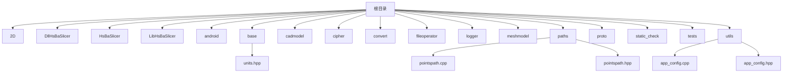
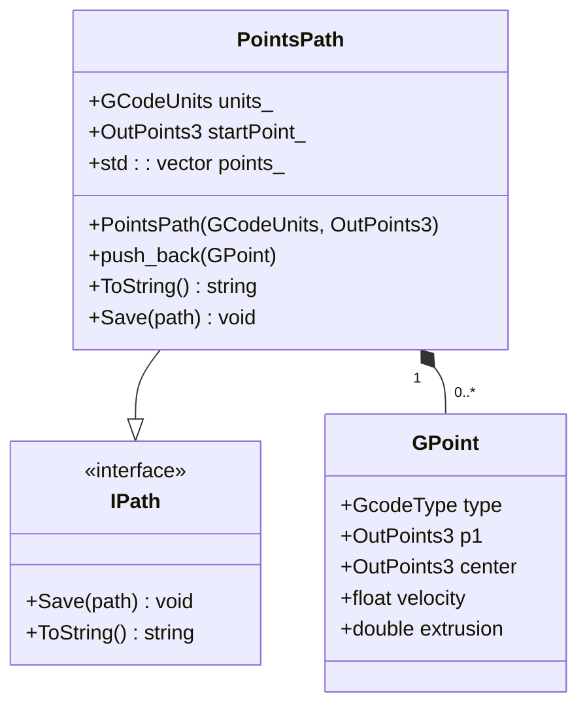
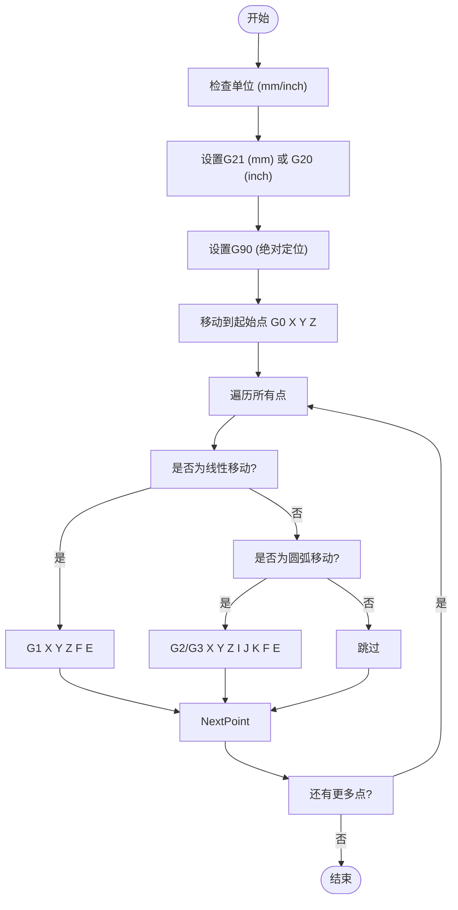
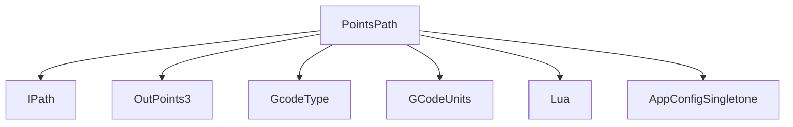

# 点云路径输出

<cite>
**本文档引用的文件**  
- [pointspath.hpp](file://paths/pointspath.hpp)
- [pointspath.cpp](file://paths/pointspath.cpp)
- [app_config.hpp](file://utils/app_config.hpp)
- [app_config.cpp](file://utils/app_config.cpp)
- [units.hpp](file://base/units.hpp)
- [IPath.hpp](file://paths/IPath.hpp)
- [points_path_test.cpp](file://tests/PathsOut/points_path_test.cpp)
- [custom_fill.lua](file://tests/PolygonFill/custom_fill.lua)
- [LuaAdapter.hpp](file://2D/LuaAdapter.hpp)
- [LuaAdapter.cpp](file://2D/LuaAdapter.cpp)
</cite>

## 目录
1. [简介](#简介)
2. [项目结构](#项目结构)
3. [核心组件](#核心组件)
4. [架构概述](#架构概述)
5. [详细组件分析](#详细组件分析)
6. [依赖分析](#依赖分析)
7. [性能考虑](#性能考虑)
8. [故障排除指南](#故障排除指南)
9. [结论](#结论)

## 简介
本文档深入解析了`PointsPath`类如何将填充路径转换为离散点序列，支持G-code等数控设备可读格式。文档详细说明了其单位系统切换机制（毫米与英寸），并通过`AppConfigSingletone`管理默认单位。描述了点序列生成算法：基于步长采样、速度规划插值或等弧长分割。重点讲解了Lua脚本在路径后处理中的作用——通过`Save`接口注入自定义逻辑，如添加起刀/收刀动作、插入延时指令或根据材料特性调整点密度。提供了一个生成带速度标记的G-code片段的Lua示例。文档包含输出格式样本、坐标系定义说明及与常见3D打印机固件（如Marlin）的兼容性指南。

## 项目结构
项目结构清晰地组织了各个功能模块，包括2D处理、路径生成、切片、模型处理等。`paths`目录下的`pointspath.cpp`和`pointspath.hpp`是本文档的核心文件，负责点云路径的生成和输出。



**图示来源**  
- [pointspath.cpp](file://paths/pointspath.cpp#L1-L332)
- [pointspath.hpp](file://paths/pointspath.hpp#L1-L69)
- [app_config.cpp](file://utils/app_config.cpp#L1-L37)
- [app_config.hpp](file://utils/app_config.hpp#L1-L24)

**章节来源**  
- [paths](file://paths)
- [utils](file://utils)
- [base](file://base)

## 核心组件
`PointsPath`类是本项目中用于生成点云路径的核心组件。它继承自`IPath`接口，提供了将路径转换为字符串或保存到文件的功能。`GPoint`结构体定义了每个点的类型、位置、速度和挤出量。

**章节来源**  
- [pointspath.hpp](file://paths/pointspath.hpp#L12-L41)
- [pointspath.cpp](file://paths/pointspath.cpp#L1-L332)

## 架构概述
`PointsPath`类通过`push_back`方法将`GPoint`对象添加到内部的`points_`向量中。`ToString`方法将这些点转换为G-code格式的字符串，支持毫米和英寸单位。`Save`方法将生成的G-code保存到指定文件。



**图示来源**  
- [pointspath.hpp](file://paths/pointspath.hpp#L42-L64)
- [pointspath.cpp](file://paths/pointspath.cpp#L39-L46)

**章节来源**  
- [pointspath.hpp](file://paths/pointspath.hpp#L1-L69)
- [pointspath.cpp](file://paths/pointspath.cpp#L1-L332)

## 详细组件分析
### PointsPath类分析
`PointsPath`类的构造函数接受单位和起始点作为参数，初始化内部状态。`push_back`方法将新的`GPoint`对象添加到`points_`向量中。`ToString`方法生成G-code字符串，包括单位设置、绝对定位和所有点的移动指令。

#### G-code生成逻辑


**图示来源**  
- [pointspath.cpp](file://paths/pointspath.cpp#L49-L97)

**章节来源**  
- [pointspath.cpp](file://paths/pointspath.cpp#L49-L97)

### Lua脚本后处理
`PointsPath`类支持通过Lua脚本进行后处理。`ToString`和`Save`方法的重载版本接受Lua脚本作为参数，允许用户自定义输出格式。Lua脚本可以访问`points`表、`startPoint`和`units`变量。

#### Lua脚本示例
```lua
-- 生成带速度标记的G-code片段
local lines = {}
table.insert(lines, "G21 ; units mm")
table.insert(lines, "G90 ; absolute positioning")
table.insert(lines, "G0 X0 Y0 Z0 ; move to start point")

for i, p in ipairs(points) do
    local code = p.type
    local line = string.format("%s X%.4f Y%.4f Z%.4f", code, p.p1.x, p.p1.y, p.p1.z)
    if p.velocity > 0 then
        line = line .. string.format(" F%.3f", p.velocity)
    end
    if p.extrusion > 0 then
        line = line .. string.format(" E%.6f", p.extrusion)
    end
    table.insert(lines, line)
end

return table.concat(lines, "\n")
```

**章节来源**  
- [pointspath.cpp](file://paths/pointspath.cpp#L100-L198)
- [points_path_test.cpp](file://tests/PathsOut/points_path_test.cpp#L61-L69)

## 依赖分析
`PointsPath`类依赖于`IPath`接口、`OutPoints3`结构体和`GcodeType`、`GCodeUnits`枚举。它还依赖于Lua库进行脚本处理，以及`AppConfigSingletone`类管理配置。



**图示来源**  
- [pointspath.hpp](file://paths/pointspath.hpp#L8-L41)
- [pointspath.cpp](file://paths/pointspath.cpp#L11-L12)
- [app_config.hpp](file://utils/app_config.hpp#L10-L20)

**章节来源**  
- [pointspath.hpp](file://paths/pointspath.hpp#L1-L69)
- [pointspath.cpp](file://paths/pointspath.cpp#L1-L332)
- [app_config.hpp](file://utils/app_config.hpp#L1-L24)
- [app_config.cpp](file://utils/app_config.cpp#L1-L37)

## 性能考虑
`PointsPath`类在生成G-code时使用`std::ostringstream`进行字符串拼接，避免了频繁的字符串连接操作。`push_back`方法使用`emplace_back`直接在向量末尾构造对象，减少了内存分配和复制开销。

## 故障排除指南
如果生成的G-code不符合预期，请检查以下几点：
1. 确认单位设置正确（G20/G21）
2. 确认起始点设置正确
3. 确认每个`GPoint`对象的`type`、`p1`、`velocity`和`extrusion`字段正确设置
4. 如果使用Lua脚本，确保脚本语法正确且返回期望的字符串

**章节来源**  
- [pointspath.cpp](file://paths/pointspath.cpp#L49-L97)
- [points_path_test.cpp](file://tests/PathsOut/points_path_test.cpp#L14-L38)

## 结论
`PointsPath`类提供了一个灵活且高效的机制，将填充路径转换为离散点序列，并支持G-code等数控设备可读格式。通过`AppConfigSingletone`管理默认单位，支持毫米和英寸单位切换。Lua脚本后处理功能允许用户自定义输出格式，满足不同应用场景的需求。该类与常见3D打印机固件（如Marlin）兼容，适用于各种增材制造和数控加工应用。