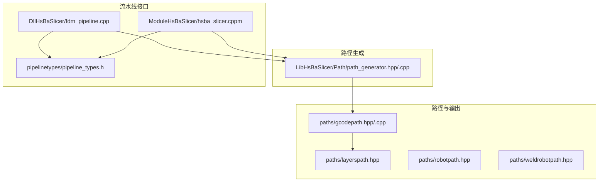
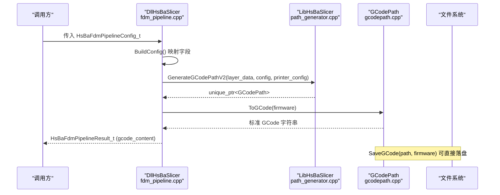
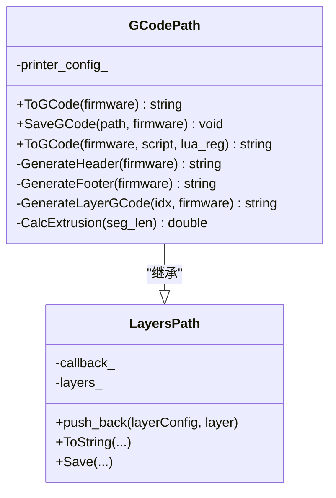
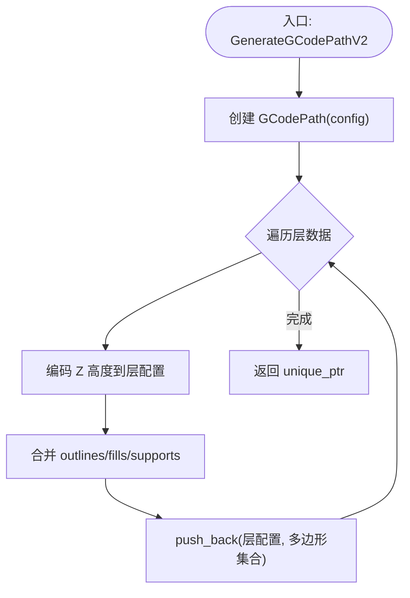
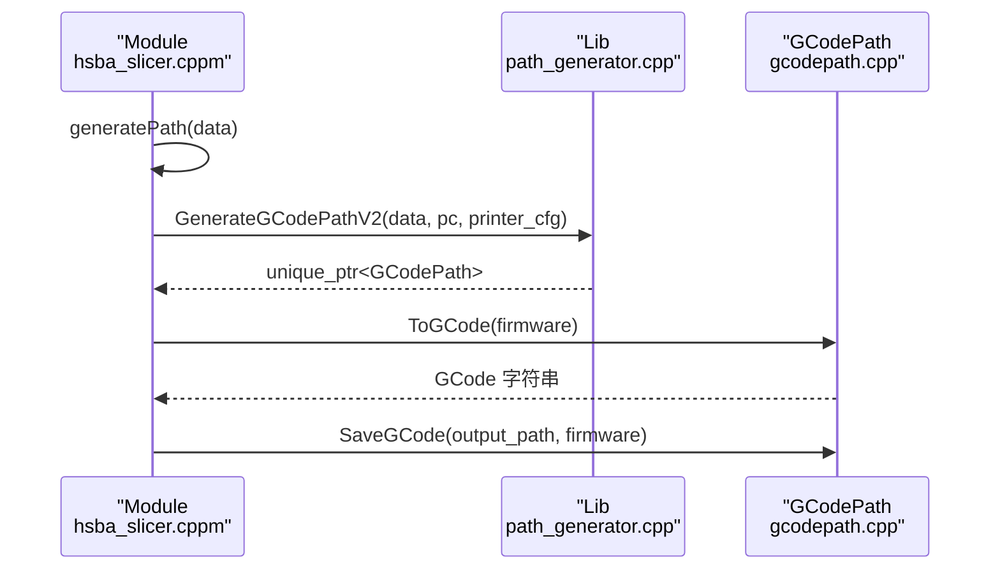
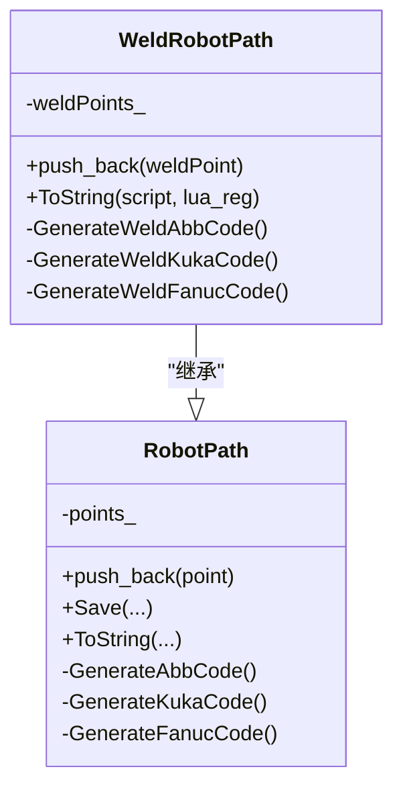
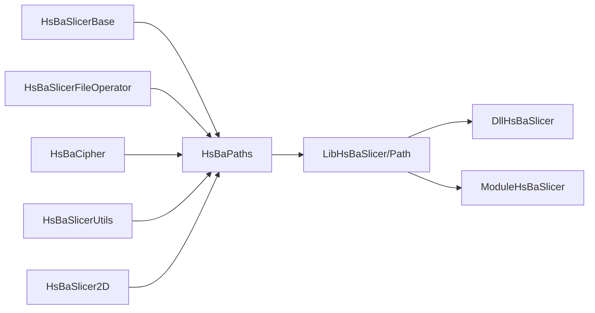

# 焊接机器人路径输出

<cite>
**本文引用的文件**   
- [gcodepath.hpp](file://paths/gcodepath.hpp)
- [gcodepath.cpp](file://paths/gcodepath.cpp)
- [layerspath.hpp](file://paths/layerspath.hpp)
- [CMakeLists.txt](file://paths/CMakeLists.txt)
- [pipeline_types.h](file://pipelinetypes/pipeline_types.h)
- [path_generator.hpp](file://LibHsBaSlicer/Path/path_generator.hpp)
- [path_generator.cpp](file://LibHsBaSlicer/Path/path_generator.cpp)
- [fdm_pipeline.cpp](file://DllHsBaSlicer/fdm_pipeline.cpp)
- [hsba_slicer.cppm](file://ModuleHsBaSlicer/hsba_slicer.cppm)
- [robotpath.hpp](file://paths/robotpath.hpp)
- [weldrobotpath.hpp](file://paths/weldrobotpath.hpp)
- [README.md](file://README.md)
</cite>

## 目录
1. [简介](#简介)
2. [项目结构](#项目结构)
3. [核心组件](#核心组件)
4. [架构总览](#架构总览)
5. [详细组件分析](#详细组件分析)
6. [依赖关系分析](#依赖关系分析)
7. [性能与可扩展性](#性能与可扩展性)
8. [故障排查指南](#故障排查指南)
9. [结论](#结论)
10. [附录](#附录)

## 简介
本仓库为面向 3D 打印切片的高性能 C++ 框架，提供模块化、跨平台的切片流水线能力。本次文档聚焦“焊接机器人路径输出”相关能力：在 paths 模块新增的 GCodePath 类支持多固件（Marlin/RepRap/Klipper）的标准 GCode 输出；同时，RobotPath/WeldRobotPath 提供面向 ABB/KUKA/FANUC 等主流机器人语言的轨迹与焊接参数输出。通过 Lib/Dll/Module 三层封装，用户可在 C API、C++ 库与 C++20 Module 三种方式下使用统一的 FDM 路径生成与输出能力。

## 项目结构
围绕“路径输出”的关键目录与文件如下：
- paths：层路径、点路径、机器人路径与 GCode 输出实现
- pipelinetypes：C 兼容的配置与枚举定义（含 GCode 固件类型）
- LibHsBaSlicer/Path：路径生成器（PointsPath/GCodePath）
- DllHsBaSlicer：C ABI 流水线接口（FDM）
- ModuleHsBaSlicer：C++20 Module 封装（FdmPipeline）

图表来源
- [gcodepath.hpp:1-83](file://paths/gcodepath.hpp#L1-L83)
- [layerspath.hpp:1-47](file://paths/layerspath.hpp#L1-L47)
- [path_generator.hpp:1-74](file://LibHsBaSlicer/Path/path_generator.hpp#L1-L74)
- [path_generator.cpp:1-113](file://LibHsBaSlicer/Path/path_generator.cpp#L1-L113)
- [fdm_pipeline.cpp:1-410](file://DllHsBaSlicer/fdm_pipeline.cpp#L1-L410)
- [hsba_slicer.cppm:1-692](file://ModuleHsBaSlicer/hsba_slicer.cppm#L1-L692)
- [pipeline_types.h:1-428](file://pipelinetypes/pipeline_types.h#L1-L428)

章节来源
- [README.md:1-199](file://README.md#L1-L199)

## 核心组件
- GCodePath：继承 LayersPath，按固件类型输出标准 GCode，支持 Lua 后处理脚本
- LayersPath：层数据容器与通用 ToString/Save 扩展点
- RobotPath/WeldRobotPath：机器人轨迹与焊接参数封装，支持多品牌语言输出
- path_generator：将切片结果转换为 PointsPath 或 GCodePath
- FDM 流水线（Dll/Module）：从模型到 GCode 的全流程编排

章节来源
- [gcodepath.hpp:1-83](file://paths/gcodepath.hpp#L1-L83)
- [layerspath.hpp:1-47](file://paths/layerspath.hpp#L1-L47)
- [robotpath.hpp:1-83](file://paths/robotpath.hpp#L1-L83)
- [weldrobotpath.hpp:1-94](file://paths/weldrobotpath.hpp#L1-L94)
- [path_generator.hpp:1-74](file://LibHsBaSlicer/Path/path_generator.hpp#L1-L74)
- [path_generator.cpp:1-113](file://LibHsBaSlicer/Path/path_generator.cpp#L1-L113)

## 架构总览
下图展示从配置到 GCode 输出的整体调用链，以及多固件差异的处理位置。

图表来源
- [fdm_pipeline.cpp:129-183](file://DllHsBaSlicer/fdm_pipeline.cpp#L129-L183)
- [path_generator.cpp:89-110](file://LibHsBaSlicer/Path/path_generator.cpp#L89-L110)
- [gcodepath.cpp:267-279](file://paths/gcodepath.cpp#L267-L279)

章节来源
- [fdm_pipeline.cpp:1-410](file://DllHsBaSlicer/fdm_pipeline.cpp#L1-L410)
- [path_generator.cpp:1-113](file://LibHsBaSlicer/Path/path_generator.cpp#L1-L113)
- [gcodepath.cpp:1-377](file://paths/gcodepath.cpp#L1-L377)

## 详细组件分析

### GCodePath：多固件 GCode 输出
- 设计要点
  - 继承 LayersPath，复用层数据存储与 Lua 扩展机制
  - 通过 GCodeFirmware 区分 Marlin/RepRap/Klipper，分别生成头部、层段与尾部命令
  - 挤出量计算基于线宽、层高、段长与挤出倍率，支持相对/绝对挤出模式
  - 支持 Lua 后处理脚本注入，可动态修改最终 GCode

图表来源
- [layerspath.hpp:1-47](file://paths/layerspath.hpp#L1-L47)
- [gcodepath.hpp:1-83](file://paths/gcodepath.hpp#L1-L83)

关键实现说明
- 头部/尾部：根据固件生成温度设置、归位、挤出模式、风扇控制等命令
- 层段：每层输出 Z 移动、轮廓/填充/支撑路径，按速度、挤出模式生成 G0/G1
- 挤出量：体积法计算，考虑线宽、层高、段长与挤出倍率
- Lua 后处理：将 gcode、firmware、printer_config 注入 Lua 环境，允许返回新 GCode

章节来源
- [gcodepath.cpp:57-185](file://paths/gcodepath.cpp#L57-L185)
- [gcodepath.cpp:187-265](file://paths/gcodepath.cpp#L187-L265)
- [gcodepath.cpp:267-374](file://paths/gcodepath.cpp#L267-L374)

### path_generator：路径生成器
- GenerateGCodePath：生成 PointsPath（旧接口，向后兼容）
- GenerateGCodePathV2：生成 GCodePath，将每层的 outlines/fills/supports 合并并写入层配置（Z 高度编码）

图表来源
- [path_generator.cpp:89-110](file://LibHsBaSlicer/Path/path_generator.cpp#L89-L110)

章节来源
- [path_generator.hpp:1-74](file://LibHsBaSlicer/Path/path_generator.hpp#L1-L74)
- [path_generator.cpp:1-113](file://LibHsBaSlicer/Path/path_generator.cpp#L1-L113)

### FDM 流水线（Dll/Module）：从配置到 GCode
- Dll 层：BuildConfig 将 C 配置映射到内部结构，阶段5 调用 GenerateGCodePathV2 并输出 ToGCode(firmware)
- Module 层：FdmPipeline::generatePath 返回 unique_ptr<GCodePath>，run 中执行 ToGCode(firmware) 并可保存文件

图表来源
- [hsba_slicer.cppm:429-503](file://ModuleHsBaSlicer/hsba_slicer.cppm#L429-L503)
- [path_generator.cpp:89-110](file://LibHsBaSlicer/Path/path_generator.cpp#L89-L110)
- [gcodepath.cpp:281-290](file://paths/gcodepath.cpp#L281-L290)

章节来源
- [fdm_pipeline.cpp:129-183](file://DllHsBaSlicer/fdm_pipeline.cpp#L129-L183)
- [fdm_pipeline.cpp:328-351](file://DllHsBaSlicer/fdm_pipeline.cpp#L328-L351)
- [hsba_slicer.cppm:429-503](file://ModuleHsBaSlicer/hsba_slicer.cppm#L429-L503)

### 机器人路径与焊接路径
- RobotPath：抽象机器人轨迹，支持 MoveJ/MoveL/MoveC 及程序块，导出 ABB/KUKA/FANUC 代码
- WeldRobotPath：在 RobotPath 基础上增加焊接参数（电流、电压、送丝速度、气体流量、行走速度等），支持弧起/弧停策略

图表来源
- [robotpath.hpp:1-83](file://paths/robotpath.hpp#L1-L83)
- [weldrobotpath.hpp:1-94](file://paths/weldrobotpath.hpp#L1-L94)

章节来源
- [robotpath.hpp:1-83](file://paths/robotpath.hpp#L1-L83)
- [weldrobotpath.hpp:1-94](file://paths/weldrobotpath.hpp#L1-L94)

## 依赖关系分析
- paths 库依赖 Lua 头与基础库（base/fileoperator/cipher/2D/utils）
- LibHsBaSlicer/Path 依赖 paths 与 2D 多边形类型
- DllHsBaSlicer 依赖 LibHsBaSlicer 与 paths（用于 GCodePath）
- ModuleHsBaSlicer 依赖 LibHsBaSlicer、paths 与 pipeline_types

图表来源
- [CMakeLists.txt:1-19](file://paths/CMakeLists.txt#L1-L19)

章节来源
- [CMakeLists.txt:1-19](file://paths/CMakeLists.txt#L1-L19)

## 性能与可扩展性
- 挤出量计算采用体积法，复杂度 O(N)，N 为路径段数；内存分配集中在层数据与字符串构建
- 支持 Lua 后处理，便于在不修改核心逻辑的情况下定制输出格式
- 建议优化方向
  - 对大模型路径进行分段生成与流式输出，降低峰值内存
  - 预分配字符串缓冲区，减少重复分配
  - 针对 Klipper/RRF 的特殊指令批量生成，减少格式化开销

[本节为通用指导，不直接分析具体文件]

## 故障排查指南
- 常见错误
  - Lua 初始化失败：检查 MakeUniqueLuaState 与 luaL_openlibs 调用
  - Lua 脚本加载/运行错误：查看返回的错误信息，确认脚本语法与全局变量名（gcode、firmware、printer_config）
  - 文件写入失败：确保输出路径有效且权限正确
- 定位方法
  - 启用日志（参考 logger 模块）
  - 逐步验证固件头部/层段/尾部命令是否符合目标固件规范
  - 对比不同固件的输出差异，确认 M82/M83、SET_FAN_SPEED、SET_PRESSURE_ADVANCE 等命令是否正确

章节来源
- [gcodepath.cpp:281-290](file://paths/gcodepath.cpp#L281-L290)
- [gcodepath.cpp:292-374](file://paths/gcodepath.cpp#L292-L374)

## 结论
本项目在 paths 模块引入 GCodePath，实现了面向 Marlin/RepRap/Klipper 的多固件标准 GCode 输出，并通过 Lua 后处理增强可扩展性。配合 RobotPath/WeldRobotPath，可覆盖从 3D 打印到焊接机器人的路径输出需求。Lib/Dll/Module 三层封装提供了统一、易用的接口，便于在不同平台与语言环境中集成。

[本节为总结，不直接分析具体文件]

## 附录
- C 兼容配置枚举与默认值
  - HsBaGCodeFirmware_t：HSBA_GCODE_MARLIN/REPRAP/KLIPPER
  - HsBaFdmPipelineConfig_t：包含 nozzle_diameter、filament_diameter、nozzle_temp、bed_temp、retract_length、retract_speed、first_layer_speed 等字段，默认由 HsBaFdmConfigDefault 初始化

章节来源
- [pipeline_types.h:44-110](file://pipelinetypes/pipeline_types.h#L44-L110)
- [pipeline_types.h:317-357](file://pipelinetypes/pipeline_types.h#L317-L357)