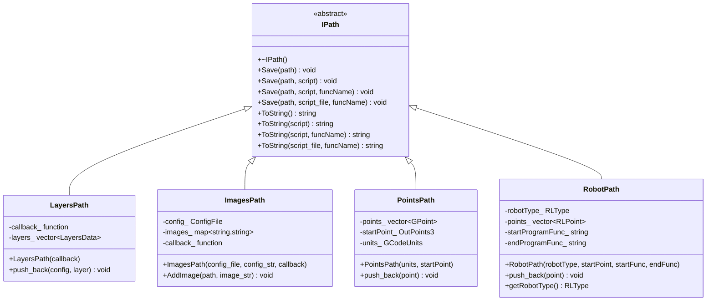
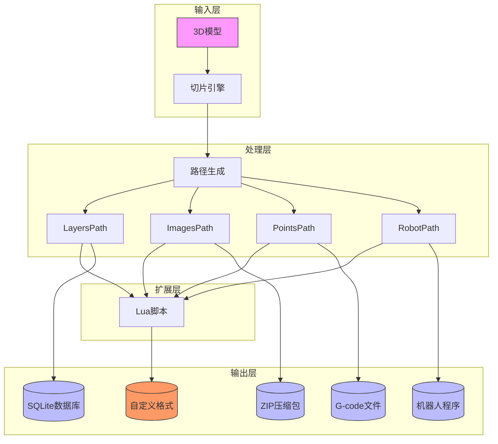

# 路径输出

<cite>
**本文引用的文件**
- [IPath.hpp](file://paths/IPath.hpp)
- [layerspath.hpp](file://paths/layerspath.hpp)
- [layerspath.cpp](file://paths/layerspath.cpp)
- [imagespath.hpp](file://paths/imagespath.hpp)
- [imagespath.cpp](file://paths/imagespath.cpp)
- [pointspath.hpp](file://paths/pointspath.hpp)
- [pointspath.cpp](file://paths/pointspath.cpp)
- [robotpath.hpp](file://paths/robotpath.hpp)
- [robotpath.cpp](file://paths/robotpath.cpp)
- [custom_fill.lua](file://tests/PolygonFill/custom_fill.lua)
- [image_from_polygons.lua](file://tests/PolygonFill/image_from_polygons.lua)
- [layers_path_test.cpp](file://tests/PathsOut/layers_path_test.cpp)
- [images_path_test.cpp](file://tests/PathsOut/images_path_test.cpp)
- [points_path_test.cpp](file://tests/PathsOut/points_path_test.cpp)
- [FloatPolygons.hpp](file://2D/FloatPolygons.hpp)
- [FloatPolygons.cpp](file://2D/FloatPolygons.cpp)
</cite>

## 更新摘要
**所做更改**
- 更新了坐标处理机制，从整数坐标系统迁移到双精度浮点坐标系统
- 改进了分层填充算法，支持更精确的多边形数据处理
- 优化了数据序列化过程，提高坐标精度和性能
- 增强了Lua脚本扩展机制的数据兼容性

## 目录
1. [引言](#引言)
2. [输出格式对比矩阵](#输出格式对比矩阵)
3. [IPath接口与继承体系](#ipath接口与继承体系)
4. [各输出类详解](#各输出类详解)
   1. [LayersPath：分层切片数据保存](#layerspath分层切片数据保存)
   2. [ImagesPath：轮廓图像与配置打包](#imagespath轮廓图像与配置打包)
   3. [PointsPath：G-code点云路径生成](#pointspathg-code点云路径生成)
   4. [RobotPath：工业机器人专用代码生成](#robotpath工业机器人专用代码生成)
5. [Lua脚本扩展机制](#lua脚本扩展机制)
6. [典型集成架构图](#典型集成架构图)
7. [适用场景对比](#适用场景对比)
8. [结论](#结论)

## 引言
本文档全面介绍HsBaSlicer系统中路径输出模块的核心功能。系统通过IPath接口及其实现类提供多种路径输出能力，支持从3D打印到工业机器人焊接的多样化应用场景。核心输出类包括LayersPath、ImagesPath、PointsPath和RobotPath，它们均继承自IPath接口，并通过统一的Lua脚本扩展机制实现输出格式的灵活定制。

**最新更新**：系统已升级到新的分层填充方法和改进的坐标处理机制，采用双精度浮点坐标系统（`Point2D`、`PolygonD`、`PolygonsD`），显著提高了几何计算的精度和性能。

## 输出格式对比矩阵
以下表格对比了四种主要输出格式的关键特性：

| 特性 | LayersPath | ImagesPath | PointsPath | RobotPath |
|------|-----------|-----------|-----------|----------|
| **主要用途** | 保存分层切片数据 | 渲染轮廓为图像 | 生成G-code路径 | 生成工业机器人代码 |
| **输出格式** | SQLite数据库 | ZIP压缩包 | 文本/G-code | ABB/KUKA/FANUC专用代码 |
| **数据结构** | 分层多边形（双精度） | 图像字节流 | 三维点云 | 机器人运动指令 |
| **单位支持** | 内部坐标（mm精度） | 像素 | mm/inch | mm |
| **序列化方式** | JSON/自定义脚本 | Base64编码 | G-code指令 | 机器人专用语法 |
| **典型应用** | 切片数据存档 | 视觉检测 | 3D打印 | 机器人焊接 |
| **扩展能力** | 支持Lua脚本 | 支持Lua脚本 | 支持Lua脚本 | 支持Lua脚本 |
| **坐标精度** | 双精度浮点 | 像素级 | 毫米级 | 毫米级 |

## IPath接口与继承体系
IPath接口是所有路径输出类的抽象基类，定义了统一的保存和序列化方法。该接口通过多态机制实现了不同输出格式的统一调用接口。



**图表来源**
- [IPath.hpp:16-34](file://paths/IPath.hpp#L16-L34)
- [layerspath.hpp:13-39](file://paths/layerspath.hpp#L13-L39)
- [imagespath.hpp:12-38](file://paths/imagespath.hpp#L12-L38)
- [pointspath.hpp:42-69](file://paths/pointspath.hpp#L42-L69)
- [robotpath.hpp:43-75](file://paths/robotpath.hpp#L43-L75)

## 各输出类详解

### LayersPath：分层切片数据保存
LayersPath类用于保存分层切片数据，支持将多边形数据序列化为SQLite数据库或通过Lua脚本生成自定义格式。

**核心功能：**
- 将每层的配置信息和多边形数据保存到SQLite数据库
- 支持JSON格式的字符串序列化
- 可通过Lua脚本定制输出格式
- **新增**：支持双精度浮点坐标数据，提高几何精度

**数据结构：**
```cpp
struct LayersData {
    std::string layerConfig;  // 层配置信息
    PolygonsD layer;          // 多边形数据（双精度）
};
```

**坐标处理改进：**
- 使用 `PolygonsD`（`Clipper2Lib::PathsD`）替代旧的整数多边形类型
- 支持 `Point2D`（`Clipper2Lib::PointD`）双精度坐标
- 提供更精确的几何计算和序列化

**序列化过程：**
1. 创建SQLite数据库连接
2. 创建layers表（id, layer_config, layer_data）
3. 遍历每层数据，将多边形转换为JSON字符串并插入数据库
4. **优化**：改进坐标序列化格式，保留双精度精度

**Section sources**
- [layerspath.hpp:13-39](file://paths/layerspath.hpp#L13-L39)
- [layerspath.cpp:21-55](file://paths/layerspath.cpp#L21-L55)
- [FloatPolygons.hpp:14-21](file://2D/FloatPolygons.hpp#L14-L21)

### ImagesPath：轮廓图像与配置打包
ImagesPath类将每层轮廓渲染为图像，并将图像与配置文件打包为ZIP压缩包。

**核心功能：**
- 管理配置文件和图像数据
- 将所有文件打包为ZIP格式
- 支持Base64编码的图像数据
- **增强**：改进图像数据处理流程

**数据结构：**
```cpp
struct ConfigFile {
    std::string path;      // 配置文件路径
    std::string configStr; // 配置内容
};
```

**打包流程：**
1. 创建Zipper对象
2. 添加配置文件到压缩包
3. 遍历所有图像，添加到压缩包
4. 保存压缩包到指定路径

**Section sources**
- [imagespath.hpp:12-38](file://paths/imagespath.hpp#L12-L38)
- [imagespath.cpp:19-40](file://paths/imagespath.cpp#L19-L40)

### PointsPath：G-code点云路径生成
PointsPath类生成G-code兼容的点云路径，支持mm和inch单位切换。

**核心功能：**
- 生成标准G-code指令
- 支持直线(G0/G1)和圆弧(G2/G3)运动
- 可配置进给速度和挤出量
- 支持单位切换(mm/inch)
- **改进**：优化坐标处理和精度控制

**G-code指令生成：**
- G21: 设置单位为mm
- G20: 设置单位为inch
- G90: 绝对坐标模式
- G0: 快速移动
- G1: 直线插补
- G2/G3: 圆弧插补

**数据结构：**
```cpp
struct GPoint {
    GcodeType type;        // 指令类型
    OutPoints3 p1;         // 目标点
    OutPoints3 center;     // 圆弧中心点
    float velocity;        // 速度
    double extrusion;      // 挤出量
};
```

**坐标处理优化：**
- 使用 `OutPoints3` 结构体存储三维坐标
- 改进坐标格式化输出，确保精度一致性
- 优化G-code生成性能

**Section sources**
- [pointspath.hpp:33-69](file://paths/pointspath.hpp#L33-L69)
- [pointspath.cpp:52-110](file://paths/pointspath.cpp#L52-L110)

### RobotPath：工业机器人专用代码生成
RobotPath类针对工业机器人生成ABB、KUKA、FANuc专用代码。

**核心功能：**
- 生成特定品牌的机器人程序
- 支持关节运动(MoveJ)、直线运动(MoveL)和圆弧运动(MoveC)
- 可定义程序段开始和结束函数
- 支持程序索引管理
- **增强**：改进坐标处理和程序生成逻辑

**支持的机器人品牌：**
- ABB: 生成MODULE/PROC结构的RAPID代码
- KUKA: 生成DEF/END结构的KRL代码
- FANUC: 生成PR指令的TP代码

**数据结构：**
```cpp
struct RLPoint {
    OutPoints3 end;        // 终点
    OutPoints3 middle;     // 中间点(圆弧)
    float velocity;        // 速度
    RLPointType type;      // 运动类型
    size_t programIndex;   // 程序索引
};
```

**Section sources**
- [robotpath.hpp:34-75](file://paths/robotpath.hpp#L34-L75)
- [robotpath.cpp:55-108](file://paths/robotpath.cpp#L55-L108)

## Lua脚本扩展机制
所有输出类都支持通过Lua脚本进行扩展，提供强大的格式定制能力。

### 脚本调用接口
```cpp
virtual void Save(const std::filesystem::path& path, 
                  const std::filesystem::path& script_file, 
                  std::string_view funcName) const = 0;
```

### 沙箱环境特性
- **隔离执行**：每个脚本在独立的Lua状态机中运行
- **安全限制**：禁止文件系统和网络访问
- **数据注入**：将输出数据作为全局变量注入
- **结果捕获**：捕获脚本返回值或result全局变量

### 数据序列化过程
1. 创建Lua状态机并加载标准库
2. 将输出数据转换为Lua表结构
3. 注入全局变量（如layers、images、points）
4. 执行用户脚本
5. 捕获输出结果并写入文件

### 数据兼容性改进
**新增**：所有输出类现在支持双精度浮点坐标数据：
- `layers` 表中的多边形数据使用 `Point2D` 坐标
- `points` 表中的三维点保持高精度
- 改进的Lua适配器确保数据类型正确转换

### 脚本接口定义
| 全局变量 | 类型 | 说明 |
|---------|------|------|
| layers | table | LayersPath的分层数据（双精度坐标） |
| images | table | ImagesPath的图像数据 |
| points | table | PointsPath/RobotPath的点云数据 |
| db | SQLiteAdapter | 数据库操作对象 |
| zipper | Zipper | 压缩包操作对象 |
| output_path | string | 输出文件路径 |
| funcName | string | 调用的函数名 |

**Lua脚本示例：**
```lua
-- 生成CSV格式的层数据（支持双精度坐标）
local lines = {}
table.insert(lines, "config,x,y")
for i,l in ipairs(layers) do
  for j,p in ipairs(l.data[1]) do
    table.insert(lines, string.format("%s,%.6f,%.6f", l.config, p.x, p.y))
  end
end
return table.concat(lines, "\n")
```

**Section sources**
- [IPath.hpp:16-34](file://paths/IPath.hpp#L16-L34)
- [layerspath.cpp:57-155](file://paths/layerspath.cpp#L57-L155)
- [imagespath.cpp:42-112](file://paths/imagespath.cpp#L42-L112)
- [pointspath.cpp:112-214](file://paths/pointspath.cpp#L112-L214)
- [robotpath.cpp:110-216](file://paths/robotpath.cpp#L110-L216)

## 典型集成架构图


**图表来源**
- [IPath.hpp](file://paths/IPath.hpp)
- [layerspath.hpp](file://paths/layerspath.hpp)
- [imagespath.hpp](file://paths/imagespath.hpp)
- [pointspath.hpp](file://paths/pointspath.hpp)
- [robotpath.hpp](file://paths/robotpath.hpp)

## 适用场景对比
### 3D打印场景
- **推荐使用**：PointsPath
- **优势**：
  - 标准G-code输出，兼容大多数3D打印机
  - 支持精确的速度和挤出量控制
  - mm/inch单位切换，适应不同设备
  - **改进**：更高的坐标精度确保打印质量
- **示例**：
  ```gcode
  G21 ; units mm
  G90
  G0 X0 Y0 Z0
  G1 X1.0000 Y2.0000 Z3.0000 F1500 E0.123456
  ```

### 机器人焊接场景
- **推荐使用**：RobotPath
- **优势**：
  - 生成特定品牌的机器人程序
  - 支持复杂的运动轨迹规划
  - 可定义程序段开始/结束逻辑
  - **增强**：改进的坐标处理提高运动精度
- **示例**：
  ```rapid
  MODULE mainModule
    PROC main()
      MOVEJ [0,0,0,0,0,0] ,v100 ,z10 ,tooldata1\\Wobj=workjob1;
      MOVEL [10,0,0,0,0,0] ,[50,50,50,1000] ,fine ,tooldata1\\Wobj=workjob1;
    ENDPROC
  ENDMODULE
  ```

### 数据存档场景
- **推荐使用**：LayersPath
- **优势**：
  - 结构化存储，便于查询和分析
  - 支持Lua脚本扩展，可生成多种格式
  - 数据完整性好，适合长期保存
  - **升级**：双精度坐标数据确保长期精度

### 视觉检测场景
- **推荐使用**：ImagesPath
- **优势**：
  - 将轮廓渲染为图像，便于视觉系统处理
  - 打包配置文件，保持数据完整性
  - 支持多种图像格式

**Section sources**
- [layers_path_test.cpp:15-53](file://tests/PathsOut/layers_path_test.cpp#L15-L53)
- [images_path_test.cpp](file://tests/PathsOut/images_path_test.cpp)
- [points_path_test.cpp:10-79](file://tests/PathsOut/points_path_test.cpp#L10-L79)

## 结论
HsBaSlicer的路径输出系统通过统一的IPath接口和灵活的Lua脚本扩展机制，提供了强大的输出能力。系统支持从简单的G-code生成到复杂的工业机器人编程，满足了不同应用场景的需求。

**最新改进**：系统已升级到新的分层填充方法和改进的坐标处理机制，采用双精度浮点坐标系统，显著提高了几何计算的精度和性能。LayersPath适合数据存档和分析，ImagesPath适用于视觉检测系统，PointsPath是3D打印的理想选择，而RobotPath则为工业自动化提供了专业的解决方案。通过Lua脚本扩展，用户可以轻松定制输出格式，实现与各种下游系统的无缝集成。

**技术优势**：
- 双精度坐标处理确保几何精度
- 优化的分层填充算法提高性能
- 增强的Lua脚本兼容性支持复杂数据处理
- 统一的接口设计简化系统集成