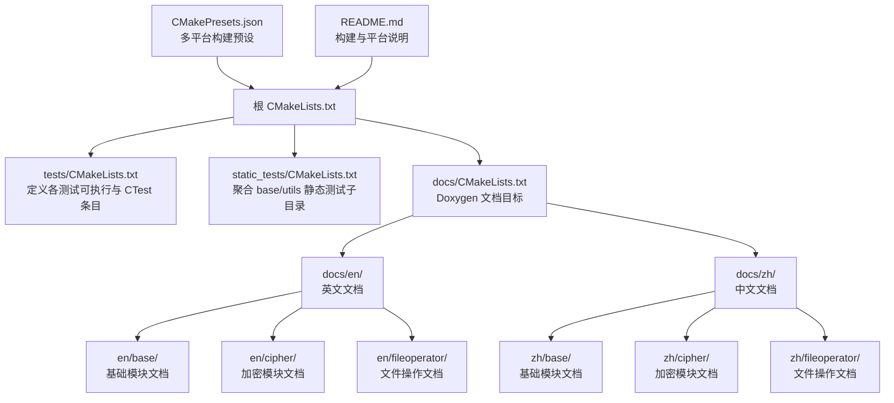
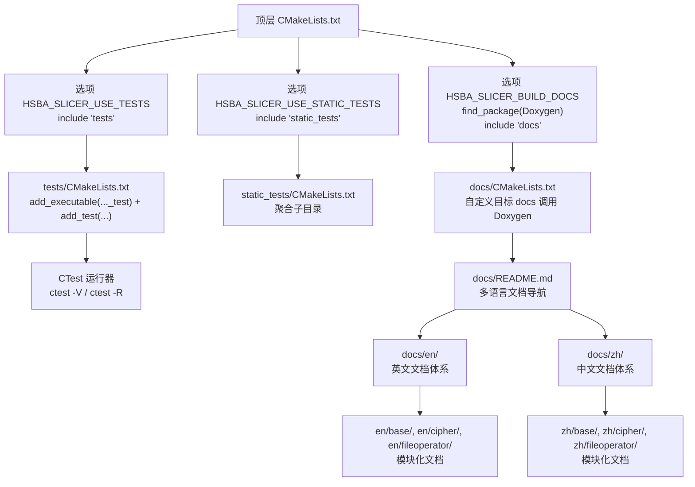
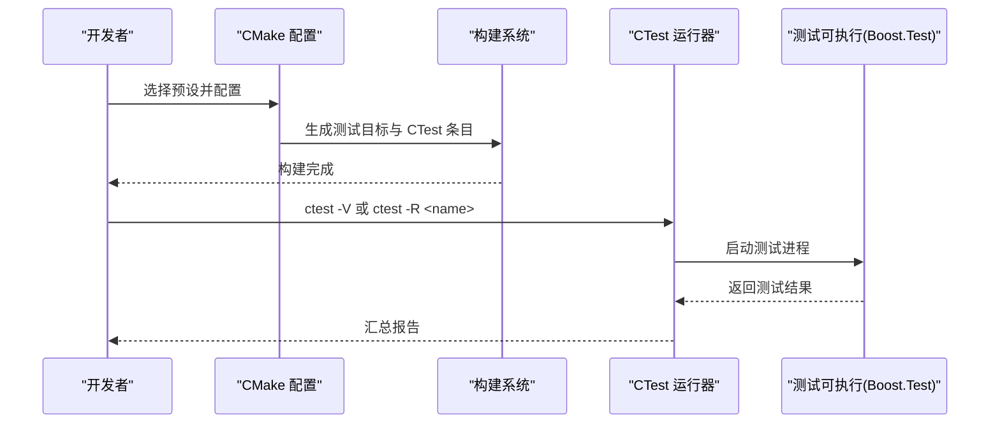
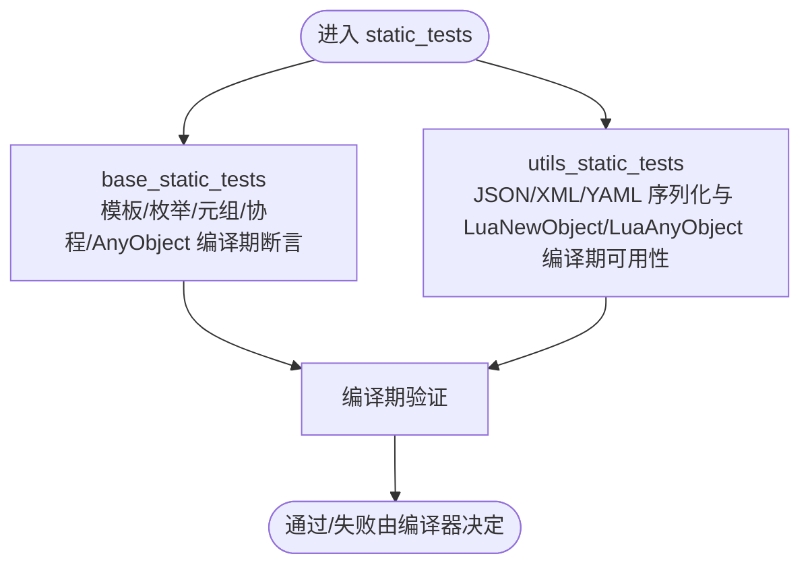
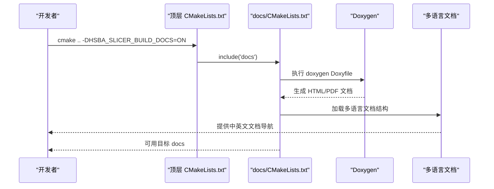
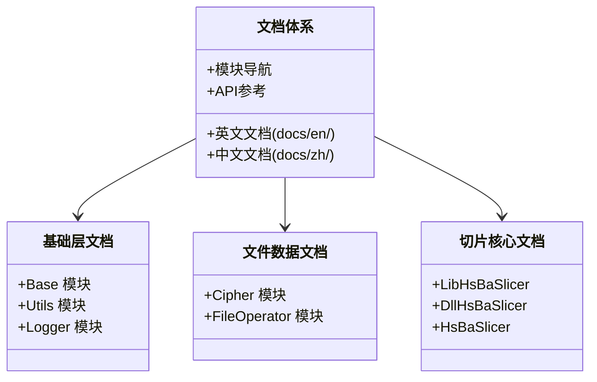
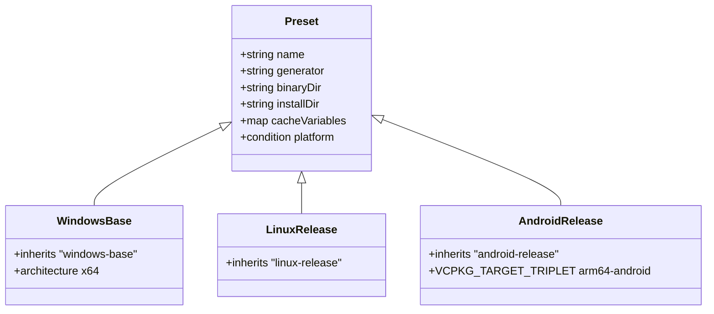
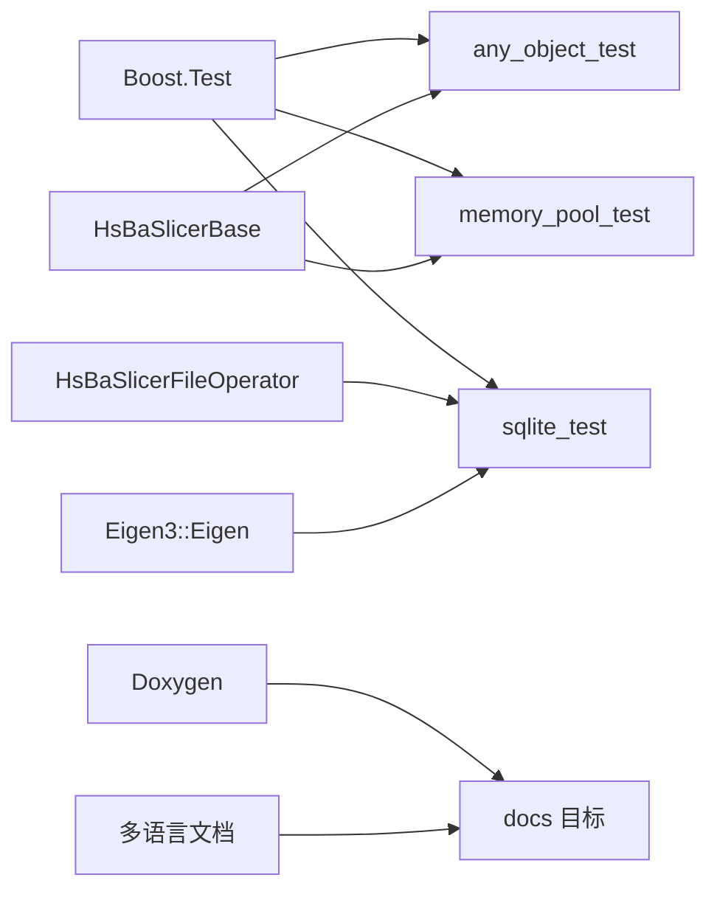

# 测试与文档基础设施

<cite>
**本文引用的文件**   
- [CMakeLists.txt](file://CMakeLists.txt)
- [tests/CMakeLists.txt](file://tests/CMakeLists.txt)
- [static_tests/CMakeLists.txt](file://static_tests/CMakeLists.txt)
- [static_tests/README.md](file://static_tests/README.md)
- [docs/CMakeLists.txt](file://docs/CMakeLists.txt)
- [docs/README.md](file://docs/README.md)
- [docs/en/README.md](file://docs/en/README.md)
- [docs/zh/README.md](file://docs/zh/README.md)
- [docs/en/base/README.md](file://docs/en/base/README.md)
- [docs/zh/base/README.md](file://docs/zh/base/README.md)
- [docs/en/LibHsBaSlicer/README.md](file://docs/en/LibHsBaSlicer/README.md)
- [docs/zh/LibHsBaSlicer/README.md](file://docs/zh/LibHsBaSlicer/README.md)
- [docs/en/cipher/README.md](file://docs/en/cipher/README.md)
- [docs/zh/cipher/README.md](file://docs/zh/cipher/README.md)
- [docs/en/fileoperator/README.md](file://docs/en/fileoperator/README.md)
- [docs/zh/fileoperator/README.md](file://docs/zh/fileoperator/README.md)
- [CMakePresets.json](file://CMakePresets.json)
- [README.md](file://README.md)
- [tests/AnyObject/any_object_test.cpp](file://tests/AnyObject/any_object_test.cpp)
- [tests/Pool/memory_pool_test.cpp](file://tests/Pool/memory_pool_test.cpp)
- [tests/FilesOperator/sqlite_test.cpp](file://tests/FilesOperator/sqlite_test.cpp)
- [static_tests/base_static_tests/base_static_tests.cpp](file://static_tests/base_static_tests/base_static_tests.cpp)
- [static_tests/utils_static_tests/utils_static_tests.cpp](file://static_tests/utils_static_tests/utils_static_tests.cpp)
</cite>

## 更新摘要
**所做更改**   
- 增强了多语言文档支持，包括完整的英文和中文文档结构
- 完善了各模块的 README 文件，提供详细的组件列表和使用说明
- 改进了技术文档的组织结构，按模块分类管理文档
- 更新了文档生成配置，支持多语言文档导航

## 目录
1. [简介](#简介)
2. [项目结构](#项目结构)
3. [核心组件](#核心组件)
4. [架构总览](#架构总览)
5. [详细组件分析](#详细组件分析)
6. [依赖分析](#依赖分析)
7. [性能考虑](#性能考虑)
8. [故障排查指南](#故障排查指南)
9. [结论](#结论)
10. [附录](#附录)

## 简介
本文件聚焦于 HsBaSlicer 项目的"测试与文档基础设施"，系统性梳理其构建配置、单元测试框架、静态编译期测试、Doxygen 文档生成以及多平台预设。内容面向不同技术背景的读者，既提供高层概览，也深入到关键 CMake 目标、测试用例组织方式与执行流程，帮助读者快速理解并扩展该基础设施。

**更新** 本次更新重点增强了多语言文档支持，提供了完整的英文和中文文档体系，包括各模块的详细使用说明和架构图。

## 项目结构
测试与文档相关的关键目录与文件：
- tests：基于 Boost.Test 的运行时单元测试集合，按功能模块分目录组织，并通过顶层 tests/CMakeLists.txt 统一注册为 CTest 测试项。
- static_tests：用于在编译期验证模板与 constexpr 行为的静态测试，仅桌面平台启用。
- docs：Doxygen 文档生成入口与多语言 README 说明；通过顶层 docs/CMakeLists.txt 暴露 docs 目标。
- CMakePresets.json：跨平台（Windows/Linux/macOS/iOS/Android）构建预设，便于一键配置与构建。
- 顶层 CMakeLists.txt：全局开关控制是否启用测试与文档构建，并包含子目录。

**图表来源**
- [CMakeLists.txt:318-354](file://CMakeLists.txt#L318-L354)
- [tests/CMakeLists.txt:1-30](file://tests/CMakeLists.txt#L1-L30)
- [static_tests/CMakeLists.txt:1-3](file://static_tests/CMakeLists.txt#L1-L3)
- [docs/CMakeLists.txt:1-13](file://docs/CMakeLists.txt#L1-L13)
- [docs/README.md:1-164](file://docs/README.md#L1-L164)
- [docs/en/README.md:1-164](file://docs/en/README.md#L1-L164)
- [docs/zh/README.md:1-164](file://docs/zh/README.md#L1-L164)

章节来源
- [CMakeLists.txt:318-354](file://CMakeLists.txt#L318-L354)
- [tests/CMakeLists.txt:1-30](file://tests/CMakeLists.txt#L1-L30)
- [static_tests/CMakeLists.txt:1-3](file://static_tests/CMakeLists.txt#L1-L3)
- [docs/CMakeLists.txt:1-13](file://docs/CMakeLists.txt#L1-L13)
- [CMakePresets.json:1-48](file://CMakePresets.json#L1-L48)
- [README.md:41-194](file://README.md#L41-L194)

## 核心组件
- 测试框架与运行器
  - 使用 Boost.Test 作为单元测试框架，每个测试目标链接 Boost::unit_test_framework，并通过 enable_testing() 与 add_test() 注册到 CTest。
  - 支持构建后自动运行单个或全部测试（HSBA_SLICER_RUN_TESTS_AFTER_BUILD）。
- 静态编译期测试
  - 针对模板与 constexpr 的断言性检查，确保接口与行为在编译期正确。
- 文档生成
  - 通过 Doxygen 生成 API 文档，顶层提供 docs 目标；若未找到 Doxygen 则跳过。
- 多平台构建预设
  - 提供 Windows/Linux/macOS/iOS/Android 的预设，统一工具链、输出目录与交叉编译参数。
- **新增** 多语言文档支持
  - 提供完整的英文和中文文档体系，包括模块概览、详细使用说明和架构图。

章节来源
- [tests/CMakeLists.txt:1-30](file://tests/CMakeLists.txt#L1-L30)
- [tests/CMakeLists.txt:241-277](file://tests/CMakeLists.txt#L241-L277)
- [static_tests/README.md:1-4](file://static_tests/README.md#L1-L4)
- [docs/CMakeLists.txt:1-13](file://docs/CMakeLists.txt#L1-L13)
- [CMakePresets.json:1-179](file://CMakePresets.json#L1-L179)
- [docs/README.md:1-164](file://docs/README.md#L1-L164)

## 架构总览
下图展示了从顶层 CMake 到测试与文档目标的依赖关系与执行路径。

**图表来源**
- [CMakeLists.txt:318-354](file://CMakeLists.txt#L318-L354)
- [tests/CMakeLists.txt:1-30](file://tests/CMakeLists.txt#L1-L30)
- [tests/CMakeLists.txt:241-277](file://tests/CMakeLists.txt#L241-L277)
- [static_tests/CMakeLists.txt:1-3](file://static_tests/CMakeLists.txt#L1-L3)
- [docs/CMakeLists.txt:1-13](file://docs/CMakeLists.txt#L1-L13)
- [docs/README.md:1-164](file://docs/README.md#L1-L164)

## 详细组件分析

### 测试子系统（Boost.Test + CTest）
- 测试目标组织
  - 每个功能域一个可执行目标，例如 any_object_test、memory_pool_test、sqlite_test 等，均链接 Boost::unit_test_framework。
  - 通过 add_test(NAME ... COMMAND ...) 将可执行注册为 CTest 测试项。
- 构建后自动运行
  - 当 HSBA_SLICER_RUN_TESTS_AFTER_BUILD=ON 时，为部分目标添加 POST_BUILD 命令，使用 ctest -V -R <target> 立即运行对应测试。
  - 提供 RunAllTests 自定义目标，依赖 ALL_TEST_TARGETS 列表，一次性运行所有测试。
- 条件编译与平台差异
  - Android/iOS/游戏主机默认关闭测试（HSBA_SLICER_USE_TESTS 被强制 OFF），避免输出限制问题。
  - Debug 模式下对 CGAL/IGL 布尔运算相关测试进行禁用，以避免性能与内存问题。

**图表来源**
- [tests/CMakeLists.txt:1-30](file://tests/CMakeLists.txt#L1-L30)
- [tests/CMakeLists.txt:241-277](file://tests/CMakeLists.txt#L241-L277)
- [tests/CMakeLists.txt:35-39](file://tests/CMakeLists.txt#L35-L39)
- [tests/CMakeLists.txt:100-104](file://tests/CMakeLists.txt#L100-L104)
- [tests/CMakeLists.txt:125-129](file://tests/CMakeLists.txt#L125-L129)
- [tests/CMakeLists.txt:150-154](file://tests/CMakeLists.txt#L150-L154)
- [tests/CMakeLists.txt:339-343](file://tests/CMakeLists.txt#L339-L343)
- [tests/CMakeLists.txt:369-373](file://tests/CMakeLists.txt#L369-L373)
- [tests/CMakeLists.txt:427-431](file://tests/CMakeLists.txt#L427-L431)
- [tests/CMakeLists.txt:454-458](file://tests/CMakeLists.txt#L454-L458)
- [tests/CMakeLists.txt:484-488](file://tests/CMakeLists.txt#L484-L488)
- [tests/CMakeLists.txt:514-518](file://tests/CMakeLists.txt#L514-L518)
- [tests/CMakeLists.txt:542-546](file://tests/CMakeLists.txt#L542-L546)
- [tests/CMakeLists.txt:571-575](file://tests/CMakeLists.txt#L571-L575)
- [tests/CMakeLists.txt:590-594](file://tests/CMakeLists.txt#L590-L594)
- [tests/CMakeLists.txt:616-625](file://tests/CMakeLists.txt#L616-L625)
- [tests/CMakeLists.txt:647-651](file://tests/CMakeLists.txt#L647-L651)
- [tests/CMakeLists.txt:675-679](file://tests/CMakeLists.txt#L675-L679)
- [tests/CMakeLists.txt:700-704](file://tests/CMakeLists.txt#L700-L704)
- [tests/CMakeLists.txt:727-731](file://tests/CMakeLists.txt#L727-731)
- [tests/CMakeLists.txt:755-759](file://tests/CMakeLists.txt#L755-759)
- [tests/CMakeLists.txt:782-786](file://tests/CMakeLists.txt#L782-786)
- [tests/CMakeLists.txt:809-813](file://tests/CMakeLists.txt#L809-L813)

章节来源
- [tests/CMakeLists.txt:1-30](file://tests/CMakeLists.txt#L1-L30)
- [tests/CMakeLists.txt:241-277](file://tests/CMakeLists.txt#L241-L277)
- [tests/CMakeLists.txt:35-39](file://tests/CMakeLists.txt#L35-L39)
- [tests/CMakeLists.txt:100-104](file://tests/CMakeLists.txt#L100-L104)
- [tests/CMakeLists.txt:125-129](file://tests/CMakeLists.txt#L125-L129)
- [tests/CMakeLists.txt:150-154](file://tests/CMakeLists.txt#L150-L154)
- [tests/CMakeLists.txt:339-343](file://tests/CMakeLists.txt#L339-L343)
- [tests/CMakeLists.txt:369-373](file://tests/CMakeLists.txt#L369-L373)
- [tests/CMakeLists.txt:427-431](file://tests/CMakeLists.txt#L427-L431)
- [tests/CMakeLists.txt:454-458](file://tests/CMakeLists.txt#L454-L458)
- [tests/CMakeLists.txt:484-488](file://tests/CMakeLists.txt#L484-L488)
- [tests/CMakeLists.txt:514-518](file://tests/CMakeLists.txt#L514-L518)
- [tests/CMakeLists.txt:542-546](file://tests/CMakeLists.txt#L542-L546)
- [tests/CMakeLists.txt:571-575](file://tests/CMakeLists.txt#L571-L575)
- [tests/CMakeLists.txt:590-594](file://tests/CMakeLists.txt#L590-L594)
- [tests/CMakeLists.txt:616-625](file://tests/CMakeLists.txt#L616-L625)
- [tests/CMakeLists.txt:647-651](file://tests/CMakeLists.txt#L647-L651)
- [tests/CMakeLists.txt:675-679](file://tests/CMakeLists.txt#L675-L679)
- [tests/CMakeLists.txt:700-704](file://tests/CMakeLists.txt#L700-L704)
- [tests/CMakeLists.txt:727-731](file://tests/CMakeLists.txt#L727-731)
- [tests/CMakeLists.txt:755-759](file://tests/CMakeLists.txt#L755-759)
- [tests/CMakeLists.txt:782-786](file://tests/CMakeLists.txt#L782-786)
- [tests/CMakeLists.txt:809-813](file://tests/CMakeLists.txt#L809-L813)

#### 典型测试用例模式
- 任意对象与 Lua 绑定测试
  - 通过自定义 TypeInfo 注册类型，并在 Lua 中创建对象、调用方法、遍历字段，验证 C++ 与 Lua 的双向交互。
- 内存池与协程结合测试
  - 使用自定义分配器的 Task/Generator 与容器/智能指针组合，验证内存分配策略与生命周期管理。
- SQLite 适配器与 Lua 集成测试
  - 在 C++ 侧注册 SQLiteAdapter 到 Lua，分别以方法调用与静态调用两种方式执行建表、插入、查询等操作，并处理文件锁清理。

章节来源
- [tests/AnyObject/any_object_test.cpp:1-318](file://tests/AnyObject/any_object_test.cpp#L1-L318)
- [tests/Pool/memory_pool_test.cpp:1-100](file://tests/Pool/memory_pool_test.cpp#L1-L100)
- [tests/FilesOperator/sqlite_test.cpp:1-251](file://tests/FilesOperator/sqlite_test.cpp#L1-L251)

### 静态编译期测试（Static Tests）
- 目的
  - 在编译期验证模板与 constexpr 的行为，确保接口契约与常量表达式语义正确。
- 覆盖范围
  - 基础模板工具（枚举名称转换、命名指针、元组遍历等）、AnyVisit、Coroutine 的编译期约束、AnyObject 的反射信息构造等。
- 组织方式
  - 通过 static_tests/CMakeLists.txt 聚合 base_static_tests 与 utils_static_tests 两个子目录。

**图表来源**
- [static_tests/CMakeLists.txt:1-3](file://static_tests/CMakeLists.txt#L1-L3)
- [static_tests/base_static_tests/base_static_tests.cpp:1-257](file://static_tests/base_static_tests/base_static_tests.cpp#L1-L257)
- [static_tests/utils_static_tests/utils_static_tests.cpp:1-108](file://static_tests/utils_static_tests/utils_static_tests.cpp#L1-L108)
- [static_tests/README.md:1-4](file://static_tests/README.md#L1-L4)

章节来源
- [static_tests/CMakeLists.txt:1-3](file://static_tests/CMakeLists.txt#L1-L3)
- [static_tests/base_static_tests/base_static_tests.cpp:1-257](file://static_tests/base_static_tests/base_static_tests.cpp#L1-L257)
- [static_tests/utils_static_tests/utils_static_tests.cpp:1-108](file://static_tests/utils_static_tests/utils_static_tests.cpp#L1-L108)
- [static_tests/README.md:1-4](file://static_tests/README.md#L1-L4)

### 文档生成（Doxygen）
- 目标与入口
  - 顶层 docs/CMakeLists.txt 查找 Doxygen 与 dot，若存在则创建 docs 自定义目标，调用 Doxyfile 生成 API 文档。
- 顶层开关
  - 顶层 CMakeLists.txt 检测 Doxygen，若未找到则强制关闭文档构建。
- **增强** 多语言文档支持
  - docs/README.md 提供多语言文档导航，包含英文和中文版本的完整文档体系。
  - 各模块提供独立的 README 文件，详细说明组件功能和使用方法。

**图表来源**
- [CMakeLists.txt:342-354](file://CMakeLists.txt#L342-L354)
- [docs/CMakeLists.txt:1-13](file://docs/CMakeLists.txt#L1-L13)
- [docs/README.md:1-164](file://docs/README.md#L1-L164)
- [docs/en/README.md:1-164](file://docs/en/README.md#L1-L164)
- [docs/zh/README.md:1-164](file://docs/zh/README.md#L1-L164)

章节来源
- [CMakeLists.txt:342-354](file://CMakeLists.txt#L342-L354)
- [docs/CMakeLists.txt:1-13](file://docs/CMakeLists.txt#L1-L13)
- [docs/README.md:1-164](file://docs/README.md#L1-L164)
- [docs/en/README.md:1-164](file://docs/en/README.md#L1-L164)
- [docs/zh/README.md:1-164](file://docs/zh/README.md#L1-L164)

### 多语言文档体系
**新增** 项目现已提供完整的英文和中文文档支持，涵盖所有主要模块：

- **基础层文档**
  - Base 模块：单例模式、模板辅助、委托、协程、元组遍历、任意类型访问、静态反射等
  - Utils 模块：应用配置、结构化 JSON/YAML/XML、Lua 绑定等
  - Logger 模块：线程安全的日志系统

- **文件与数据模块文档**
  - Cipher 模块：加密算法（AES/3DES/RSA）、哈希算法（MD5/SHA）、编码解码（Base64/Hex）
  - FileOperator 模块：ZIP 压缩解压、SQLite 数据库操作、Lua 适配器等

- **切片核心模块文档**
  - LibHsBaSlicer：预处理、切片、支撑、填充、路径生成五大核心接口
  - 提供详细的架构图和使用示例

**图表来源**
- [docs/en/base/README.md:1-37](file://docs/en/base/README.md#L1-L37)
- [docs/zh/base/README.md:1-37](file://docs/zh/base/README.md#L1-L37)
- [docs/en/cipher/README.md:1-9](file://docs/en/cipher/README.md#L1-L9)
- [docs/zh/cipher/README.md:1-9](file://docs/zh/cipher/README.md#L1-L9)
- [docs/en/fileoperator/README.md:1-9](file://docs/en/fileoperator/README.md#L1-L9)
- [docs/zh/fileoperator/README.md:1-9](file://docs/zh/fileoperator/README.md#L1-L9)
- [docs/en/LibHsBaSlicer/README.md:1-49](file://docs/en/LibHsBaSlicer/README.md#L1-L49)
- [docs/zh/LibHsBaSlicer/README.md:1-49](file://docs/zh/LibHsBaSlicer/README.md#L1-L49)

章节来源
- [docs/en/base/README.md:1-37](file://docs/en/base/README.md#L1-L37)
- [docs/zh/base/README.md:1-37](file://docs/zh/base/README.md#L1-L37)
- [docs/en/cipher/README.md:1-9](file://docs/en/cipher/README.md#L1-L9)
- [docs/zh/cipher/README.md:1-9](file://docs/zh/cipher/README.md#L1-L9)
- [docs/en/fileoperator/README.md:1-9](file://docs/en/fileoperator/README.md#L1-L9)
- [docs/zh/fileoperator/README.md:1-9](file://docs/zh/fileoperator/README.md#L1-L9)
- [docs/en/LibHsBaSlicer/README.md:1-49](file://docs/en/LibHsBaSlicer/README.md#L1-L49)
- [docs/zh/LibHsBaSlicer/README.md:1-49](file://docs/zh/LibHsBaSlicer/README.md#L1-L49)

### 多平台构建预设（CMakePresets）
- 预设能力
  - 提供 Windows/Linux/macOS/iOS/Android 的 configure 预设，统一 Ninja/Xcode 生成器、工具链、输出目录与交叉编译参数。
- 典型用途
  - 一键配置与构建，减少手工设置错误；便于 CI 与团队协作。

**图表来源**
- [CMakePresets.json:1-179](file://CMakePresets.json#L1-L179)

章节来源
- [CMakePresets.json:1-179](file://CMakePresets.json#L1-L179)

## 依赖分析
- 测试子系统对外部库的依赖
  - Boost.Test（unit_test_framework）：所有测试目标均链接该库。
  - 业务库：如 HsBaSlicerBase、HsBaSlicerFileOperator、HsBaSlicerMesh、HsBaSlicer2D、HsBaCipher、Eigen3 等，按测试目标需要链接。
- 文档子系统对外部工具的依赖
  - Doxygen（可选）：未安装则禁用文档构建。
- 平台与特性开关
  - 顶层 CMake 根据平台与特性（如 CGAL/IGL、OpenCASCADE、Lua、Protobuf 等）动态调整测试与文档行为。

**图表来源**
- [tests/CMakeLists.txt:16-22](file://tests/CMakeLists.txt#L16-L22)
- [tests/CMakeLists.txt:82-87](file://tests/CMakeLists.txt#L82-87)
- [tests/CMakeLists.txt:317-325](file://tests/CMakeLists.txt#L317-325)
- [docs/CMakeLists.txt:1-13](file://docs/CMakeLists.txt#L1-L13)
- [docs/README.md:1-164](file://docs/README.md#L1-L164)

章节来源
- [tests/CMakeLists.txt:16-22](file://tests/CMakeLists.txt#L16-L22)
- [tests/CMakeLists.txt:82-87](file://tests/CMakeLists.txt#L82-87)
- [tests/CMakeLists.txt:317-325](file://tests/CMakeLists.txt#L317-325)
- [docs/CMakeLists.txt:1-13](file://docs/CMakeLists.txt#L1-L13)

## 性能考虑
- 调试模式下的布尔运算测试禁用
  - 为避免 CGAL/IGL 在 Debug 下的高内存占用与慢速，顶层 CMake 在 Debug 配置下禁用相关测试与功能，提升构建与测试效率。
- 测试自动化开关
  - 通过 HSBA_SLICER_RUN_TESTS_AFTER_BUILD 控制是否每次构建后运行测试，可在大型项目中按需关闭以提升迭代速度。
- 静态测试优先
  - 将尽可能多的校验前置到编译期（static_tests），可减少运行时开销与回归风险。
- **新增** 文档生成优化
  - 多语言文档采用模块化组织，可按需生成特定语言的文档，减少不必要的构建时间。

章节来源
- [CMakeLists.txt:223-227](file://CMakeLists.txt#L223-L227)
- [tests/CMakeLists.txt:319-330](file://tests/CMakeLists.txt#L319-L330)
- [static_tests/README.md:1-4](file://static_tests/README.md#L1-L4)
- [docs/README.md:1-164](file://docs/README.md#L1-L164)

## 故障排查指南
- 找不到 Doxygen
  - 现象：顶层提示未找到 Doxygen，文档构建被禁用。
  - 处理：安装 Doxygen 与 dot，重新配置；或通过 -DHSBA_SLICER_BUILD_DOCS=OFF 显式关闭。
- 测试未在构建后自动运行
  - 现象：构建完成后未触发 ctest。
  - 处理：确认 HSBA_SLICER_RUN_TESTS_AFTER_BUILD=ON；或在命令行手动执行 ctest -V 或 ctest -R <test_name>。
- 交叉编译环境无法运行测试
  - 现象：交叉编译时测试目标已构建但不会执行。
  - 处理：这是预期行为（顶层 CMake 在交叉编译时强制关闭构建后运行），需将产物拷贝至目标平台执行。
- SQLite 文件锁定导致删除失败
  - 现象：测试结束后无法删除 test.db/lua_test.db。
  - 处理：确保显式销毁 Lua 状态与数据库连接；必要时采用重试删除逻辑（参考 sqlite_test.cpp 中的实现）。
- **新增** 多语言文档访问问题
  - 现象：无法访问特定语言的文档页面。
  - 处理：确认 docs/en/ 或 docs/zh/ 目录下存在相应的 README.md 文件；检查文档链接是否正确。

章节来源
- [CMakeLists.txt:346-350](file://CMakeLists.txt#L346-L350)
- [tests/CMakeLists.txt:319-330](file://tests/CMakeLists.txt#L319-L330)
- [tests/CMakeLists.txt:327-330](file://tests/CMakeLists.txt#L327-L330)
- [tests/FilesOperator/sqlite_test.cpp:98-122](file://tests/FilesOperator/sqlite_test.cpp#L98-L122)
- [tests/FilesOperator/sqlite_test.cpp:160-184](file://tests/FilesOperator/sqlite_test.cpp#L160-L184)
- [docs/README.md:1-164](file://docs/README.md#L1-L164)

## 结论
本项目围绕 Boost.Test 与 CTest 构建了完善的运行时测试体系，辅以 static_tests 在编译期保障模板与常量表达式的正确性；同时通过 Doxygen 提供 API 文档生成能力，并以 CMakePresets 统一多平台构建体验。**本次更新显著增强了多语言文档支持**，提供了完整的英文和中文文档体系，包括各模块的详细使用说明和架构图，大大提升了项目的可维护性和用户体验。整体设计清晰、可扩展性强，适合持续集成与团队协作。

## 附录
- 常用命令
  - 配置与构建（示例）：cmake --preset windows-release && cmake --build out/build/windows-release
  - 运行全部测试：ctest -V
  - 运行指定测试：ctest -R any_object_test
  - 生成文档：cmake --build out/build/windows-release --target docs
- **新增** 文档访问
  - 英文文档：docs/en/README.md
  - 中文文档：docs/zh/README.md
  - 基础模块文档：docs/en/base/README.md 或 docs/zh/base/README.md
  - 核心库文档：docs/en/LibHsBaSlicer/README.md 或 docs/zh/LibHsBaSlicer/README.md

章节来源
- [README.md:41-194](file://README.md#L41-L194)
- [CMakePresets.json:1-179](file://CMakePresets.json#L1-L179)
- [tests/CMakeLists.txt:241-277](file://tests/CMakeLists.txt#L241-L277)
- [docs/CMakeLists.txt:1-13](file://docs/CMakeLists.txt#L1-L13)
- [docs/README.md:1-164](file://docs/README.md#L1-L164)
- [docs/en/README.md:1-164](file://docs/en/README.md#L1-L164)
- [docs/zh/README.md:1-164](file://docs/zh/README.md#L1-L164)