# 测试与调试

<cite>
**本文引用的文件列表**
- [tests/CMakeLists.txt](file://tests/CMakeLists.txt)
- [tests/AnyVisit/anyvisit_test.cpp](file://tests/AnyVisit/anyvisit_test.cpp)
- [tests/Cipher/cipher_test.cpp](file://tests/Cipher/cipher_test.cpp)
- [tests/Models/cgal_model_test.cpp](file://tests/Models/cgal_model_test.cpp)
- [tests/Models/full_topo_model_test.cpp](file://tests/Models/full_topo_model_test.cpp)
- [tests/PolygonFill/polygon_fill_test.cpp](file://tests/PolygonFill/polygon_fill_test.cpp)
- [tests/PathsOut/points_path_test.cpp](file://tests/PathsOut/points_path_test.cpp)
- [tests/Preprocess/model_loader_test.cpp](file://tests/Preprocess/model_loader_test.cpp)
- [tests/Support/support_test.cpp](file://tests/Support/support_test.cpp)
- [preprocess/ModelLoader.hpp](file://preprocess/ModelLoader.hpp)
- [preprocess/ModelLoader.cpp](file://preprocess/ModelLoader.cpp)
- [support/FdmSupport.hpp](file://support/FdmSupport.hpp)
- [support/FdmSupport.cpp](file://support/FdmSupport.cpp)
- [LibHsBaSlicer/Preprocess/model_preprocess.hpp](file://LibHsBaSlicer/Preprocess/model_preprocess.hpp)
- [LibHsBaSlicer/Support/fdm_support.hpp](file://LibHsBaSlicer/Support/fdm_support.hpp)
- [LibHsBaSlicer/Fill/polygon_fill.hpp](file://LibHsBaSlicer/Fill/polygon_fill.hpp)
- [LibHsBaSlicer/Path/path_generator.hpp](file://LibHsBaSlicer/Path/path_generator.hpp)
- [DllHsBaSlicer/fdm_pipeline.h](file://DllHsBaSlicer/fdm_pipeline.h)
- [DllHsBaSlicer/fdm_pipeline.cpp](file://DllHsBaSlicer/fdm_pipeline.cpp)
- [logger/logger.hpp](file://logger/logger.hpp)
- [logger/logger.cpp](file://logger/logger.cpp)
- [utils/logcfg.ini](file://utils/logcfg.ini)
- [static_check/cpp_analyzer.py](file://static_check/cpp_analyzer.py)
- [CMakePresets.json](file://CMakePresets.json)
- [README.md](file://README.md)
</cite>

## 更新摘要
**所做更改**
- 新增模型加载器测试套件（364行），覆盖池管理、布尔运算和厚实体操作
- 新增支撑生成测试套件（323行），覆盖悬垂检测、FDM平面/树状/蜂窝支撑、SLA牺牲支撑和Lua脚本支持
- 更新测试架构以反映新增的预处理、支撑、填充和路径生成接口
- 增强测试依赖关系分析，包含新模块的链接配置

## 目录
1. [引言](#引言)
2. [项目结构](#项目结构)
3. [核心组件](#核心组件)
4. [架构总览](#架构总览)
5. [详细组件分析](#详细组件分析)
6. [依赖关系分析](#依赖关系分析)
7. [性能考量](#性能考量)
8. [故障排查指南](#故障排查指南)
9. [结论](#结论)
10. [附录](#附录)

## 引言
本文件面向开发者，系统化梳理本项目的测试与调试体系，目标是：
- 建立基于 Boost.Test 的单元测试框架规范
- 明确 tests 目录下各子模块的测试范围与职责
- 提供编译与运行测试套件的完整流程
- 解析关键测试用例的设计意图与验证要点
- 指导新增测试的步骤与最佳实践
- 分享调试技巧与工具，包括日志系统、CMake 调试模式、内存分析与静态检查

**更新** 新增了针对FDM全流程协程接口的全面测试套件，包括模型加载器和支撑生成的完整测试覆盖。

## 项目结构
测试相关的核心组织如下：
- tests/CMakeLists.txt：集中定义所有测试可执行文件、链接库、编译宏、ctest 注册与自定义命令
- tests/*/ 子目录：按功能域划分测试，如 AnyVisit、Cipher、Models、PolygonFill、PathsOut、Preprocess、Support 等
- logger：统一的日志系统，支持控制台与文件输出、级别过滤、源码位置注入
- static_check：静态分析脚本，辅助发现潜在问题
- CMakePresets.json：多平台 CMake 预设，包含 Debug/Release 配置

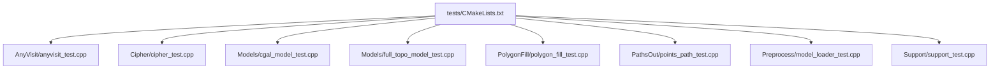

**图表来源**
- [tests/CMakeLists.txt:1-875](file://tests/CMakeLists.txt#L1-L875)
- [tests/Preprocess/model_loader_test.cpp:1-365](file://tests/Preprocess/model_loader_test.cpp#L1-L365)
- [tests/Support/support_test.cpp:1-323](file://tests/Support/support_test.cpp#L1-L323)

**章节来源**
- [tests/CMakeLists.txt:1-875](file://tests/CMakeLists.txt#L1-L875)
- [CMakePresets.json:1-153](file://CMakePresets.json#L1-L153)

## 核心组件
- Boost.Test 测试框架：通过动态链接宏与头文件包含方式集成，每个测试文件以 BOOST_TEST_MODULE 定义模块名，使用 BOOST_AUTO_TEST_CASE/BOOST_AUTO_TEST_SUITE 组织用例
- 日志系统：LoggerSingletone 单例封装，支持不同平台（含 Android），自动从配置文件读取日志级别、输出路径与格式；提供便捷的字面量日志接口
- 静态分析：cpp_analyzer.py 对代码进行规则扫描，跳过 tests 与 examples，识别 catch(...)、using namespace、不安全函数、魔法数字、潜在内存泄漏与高圈复杂度等

**更新** 新增了对 FDM 全流程协程接口的测试支持，包括预处理、支撑、填充和路径生成的完整测试覆盖。

**章节来源**
- [tests/CMakeLists.txt:1-120](file://tests/CMakeLists.txt#L1-L120)
- [logger/logger.hpp:1-62](file://logger/logger.hpp#L1-L62)
- [logger/logger.cpp:1-293](file://logger/logger.cpp#L1-L293)
- [static_check/cpp_analyzer.py:1-377](file://static_check/cpp_analyzer.py#L1-L377)

## 架构总览
测试执行链路概览：
- CMake 配置阶段：查找 Boost.Test，设置 UTF-8 编码，注册 add_test 并启用 testing
- 构建阶段：为每个测试目标编译并链接所需库，设置 BOOST_TEST_DYN_LINK
- 运行阶段：ctest 执行测试，支持按名称筛选与详细输出；也可通过自定义命令在构建后立即运行单个测试

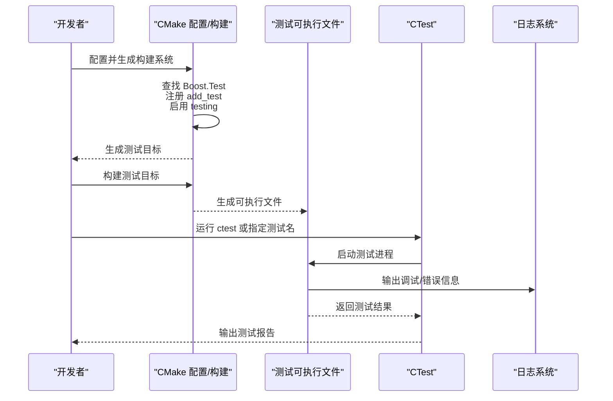

**图表来源**
- [tests/CMakeLists.txt:1-875](file://tests/CMakeLists.txt#L1-L875)
- [logger/logger.cpp:1-293](file://logger/logger.cpp#L1-L293)

## 详细组件分析

### Boost.Test 框架与测试组织
- 动态链接宏：每个测试目标均设置 BOOST_TEST_DYN_LINK，确保与动态链接的 Boost.Test 库兼容
- 测试模块：每个测试文件以 BOOST_TEST_MODULE 定义模块名，便于在 ctest 中按模块筛选
- 用例组织：使用 BOOST_AUTO_TEST_CASE/BOOST_AUTO_TEST_SUITE 组织测试用例，便于分组与命名
- 条件编译：部分测试在 Debug 下禁用耗时或不稳定逻辑（如布尔运算）

**更新** 新增的模型加载器测试和支撑测试遵循相同的组织模式，使用条件编译处理可选功能。

**章节来源**
- [tests/CMakeLists.txt:1-120](file://tests/CMakeLists.txt#L1-L120)
- [tests/AnyVisit/anyvisit_test.cpp:1-134](file://tests/AnyVisit/anyvisit_test.cpp#L1-L134)
- [tests/Models/cgal_model_test.cpp:1-49](file://tests/Models/cgal_model_test.cpp#L1-L49)

### 模型加载器测试：全面的模型管理功能
**新增** 模型加载器测试套件（364行）提供了对 ModelLoader 类的完整测试覆盖：

- **池管理测试**：验证模型的插入、检索、删除、清理等操作
- **布尔运算测试**：覆盖并集、交集、差集、异或等几何运算
- **厚实体操作测试**：验证 OCCT 模型的壳化操作
- **异常处理测试**：确保错误情况下的适当异常抛出

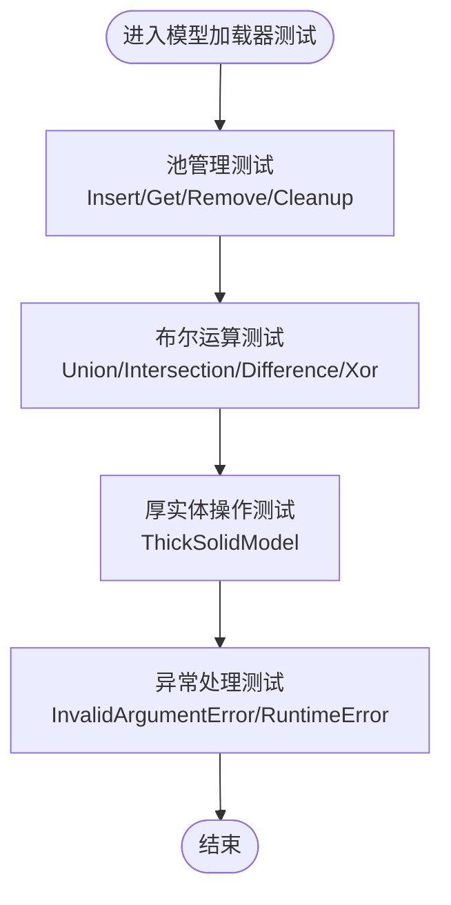

**图表来源**
- [tests/Preprocess/model_loader_test.cpp:1-365](file://tests/Preprocess/model_loader_test.cpp#L1-L365)

**章节来源**
- [tests/Preprocess/model_loader_test.cpp:1-365](file://tests/Preprocess/model_loader_test.cpp#L1-L365)
- [preprocess/ModelLoader.hpp:1-131](file://preprocess/ModelLoader.hpp#L1-L131)
- [preprocess/ModelLoader.cpp:1-200](file://preprocess/ModelLoader.cpp#L1-L200)

### 支撑生成测试：完整的支撑算法验证
**新增** 支撑生成测试套件（323行）覆盖了所有支撑算法的实现：

- **悬垂检测测试**：验证 OverhangDetector 的角度阈值和桥接距离计算
- **FDM 平面支撑**：简单的柱状支撑生成
- **FDM 树状支撑**：树形分支结构的支撑生成
- **FDM 蜂窝支撑**：六边形网格模式的支撑生成
- **SLA 牺牲支撑**：光固化打印的专用支撑
- **Lua 脚本支持**：自定义支撑算法的脚本化实现

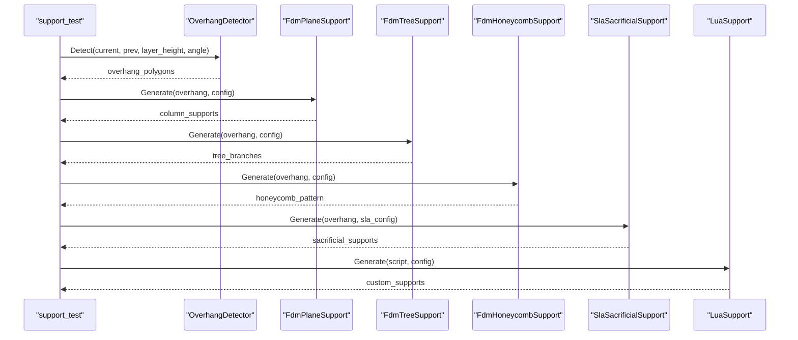

**图表来源**
- [tests/Support/support_test.cpp:1-323](file://tests/Support/support_test.cpp#L1-L323)
- [support/FdmSupport.hpp:1-63](file://support/FdmSupport.hpp#L1-L63)

**章节来源**
- [tests/Support/support_test.cpp:1-323](file://tests/Support/support_test.cpp#L1-L323)
- [support/FdmSupport.hpp:1-63](file://support/FdmSupport.hpp#L1-L63)
- [support/FdmSupport.cpp:39-231](file://support/FdmSupport.cpp#L39-L231)

### AnyVisit 测试：类型安全访问与回调
- 覆盖场景：std::any 与 boost::any 的访问回调、多类型匹配、指针与智能指针处理
- 断言策略：使用 BOOST_REQUIRE_MESSAGE/BOOST_CHECK 确保行为符合预期
- 设计要点：验证 Visit 在不同类型下的分支选择与默认返回值

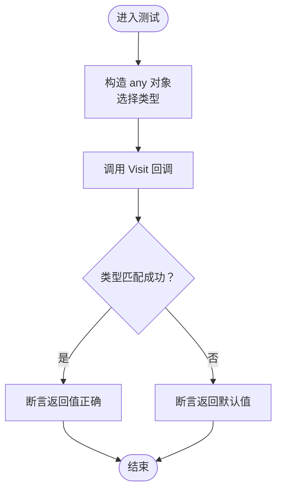

**图表来源**
- [tests/AnyVisit/anyvisit_test.cpp:1-134](file://tests/AnyVisit/anyvisit_test.cpp#L1-L134)

**章节来源**
- [tests/AnyVisit/anyvisit_test.cpp:1-134](file://tests/AnyVisit/anyvisit_test.cpp#L1-L134)

### Cipher 测试：编码、加密与哈希
- 功能覆盖：Base64/Hex 编解码往返、AES/DES3 ECB/CBC 加解密、RSA 公私钥加解密与自动生成、MD5 哈希
- OpenSSL 使用：直接调用 EVP/RSA 接口生成密钥对并进行加解密
- 调试辅助：在 Debug 下关闭 CRT 泄漏检查，减少误报干扰

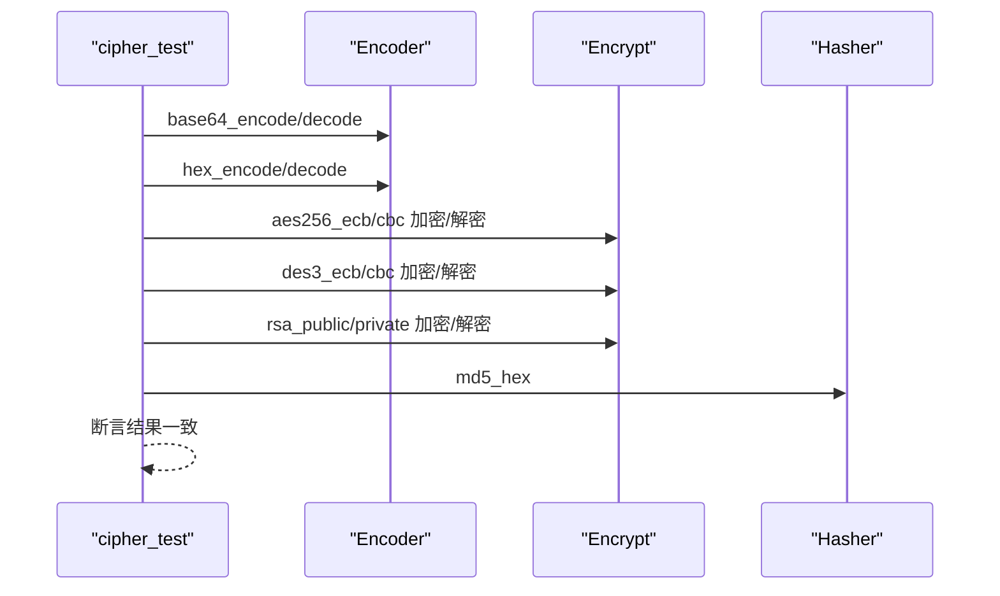

**图表来源**
- [tests/Cipher/cipher_test.cpp:1-150](file://tests/Cipher/cipher_test.cpp#L1-L150)

**章节来源**
- [tests/Cipher/cipher_test.cpp:1-150](file://tests/Cipher/cipher_test.cpp#L1-L150)

### Models 测试：CGAL/IGL/全拓扑模型与布尔运算
- CGAL 模型：创建几何体、三角网格提取、体积校验；Debug 下禁用布尔运算以提升稳定性
- 全拓扑模型：基于 IModel 的最小实现，验证切片输出为闭合多边形且面积大于零
- Lua 切片：通过 Lua 脚本计算交点并生成凸包作为切片结果，验证安全与非安全切片接口

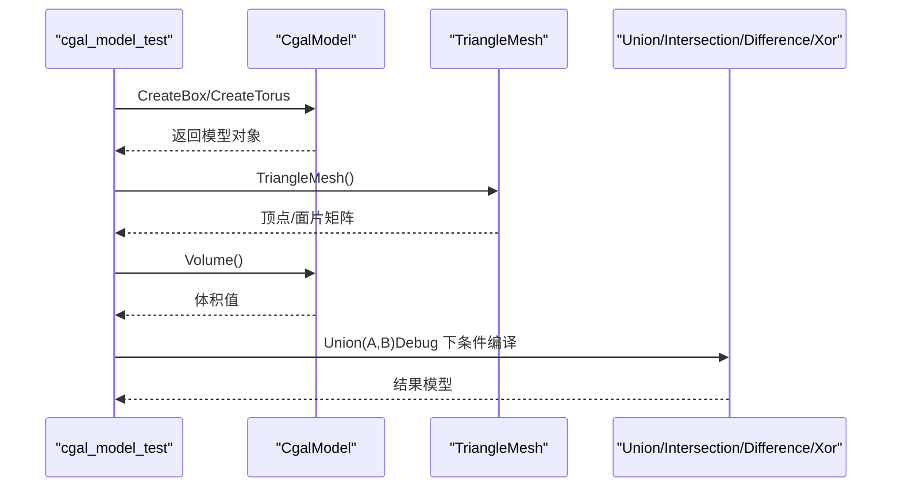

**图表来源**
- [tests/Models/cgal_model_test.cpp:1-49](file://tests/Models/cgal_model_test.cpp#L1-L49)
- [tests/Models/full_topo_model_test.cpp:1-167](file://tests/Models/full_topo_model_test.cpp#L1-L167)

**章节来源**
- [tests/Models/cgal_model_test.cpp:1-49](file://tests/Models/cgal_model_test.cpp#L1-L49)
- [tests/Models/full_topo_model_test.cpp:1-167](file://tests/Models/full_topo_model_test.cpp#L1-L167)

### PolygonFill 测试：填充算法正确性
- 基础填充：线性与锯齿填充，断言产生路径数量与每段路径顶点数
- 几何约束：确保路径顶点位于原多边形内部或边界
- 复合与 Lua 自定义：复合偏移、混合填充与 Lua 脚本生成填充路径，断言存在线段路径

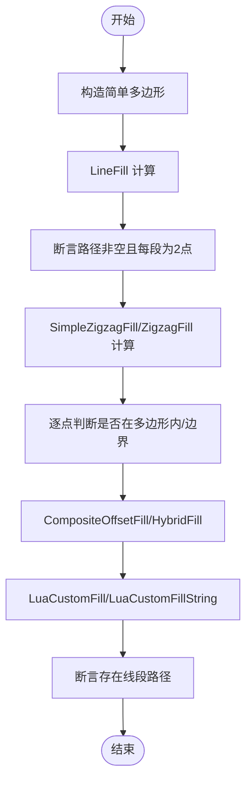

**图表来源**
- [tests/PolygonFill/polygon_fill_test.cpp:1-117](file://tests/PolygonFill/polygon_fill_test.cpp#L1-L117)

**章节来源**
- [tests/PolygonFill/polygon_fill_test.cpp:1-117](file://tests/PolygonFill/polygon_fill_test.cpp#L1-L117)

### PathsOut 测试：路径输出与脚本定制
- GCode 输出：验证单位、绝对坐标、移动指令、速度与挤出参数
- 脚本输出：Lua 脚本生成 CSV，断言字段与数值格式
- 机器人路径：针对不同品牌（ABB/KUKA/FANUC）输出关键字与运动类型

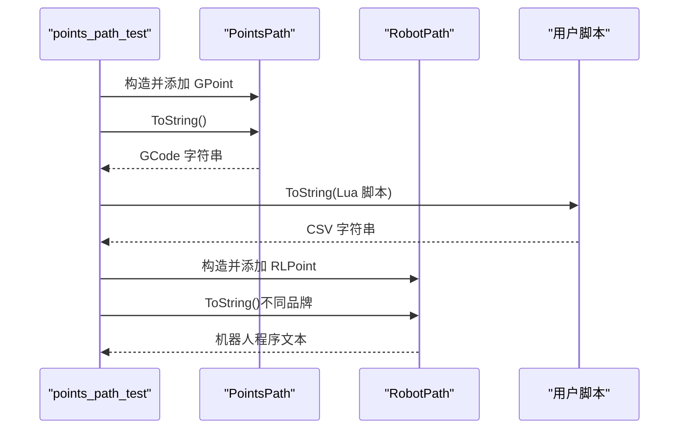

**图表来源**
- [tests/PathsOut/points_path_test.cpp:1-188](file://tests/PathsOut/points_path_test.cpp#L1-L188)

**章节来源**
- [tests/PathsOut/points_path_test.cpp:1-188](file://tests/PathsOut/points_path_test.cpp#L1-L188)

## 依赖关系分析
- 测试目标与库依赖：各测试目标通过 target_link_libraries 链接所需模块库与 Boost.Test
- 条件依赖：仅当目标 HsBaSlicerCADModel 存在时才编译 OCCT 模型测试
- 调试宏：在 Debug 配置下为 CGAL/IGL 测试启用 DISABLE_BOOLEAN_OPERATIONS_TESTS，避免耗时或不稳定逻辑影响调试效率

**更新** 新增的模型加载器测试依赖 HsBaPreprocess 库，支撑测试依赖 HsBaSupport 库和 Lua 库。

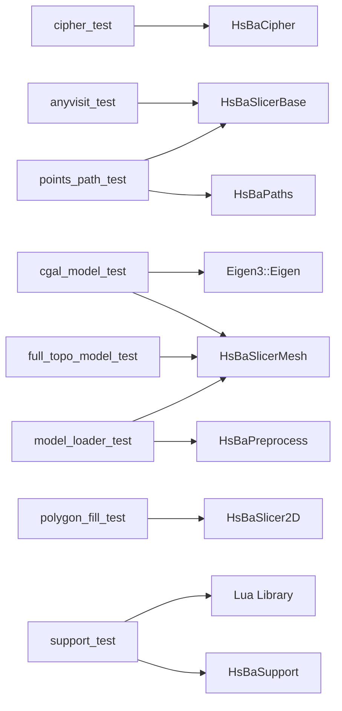

**图表来源**
- [tests/CMakeLists.txt:1-875](file://tests/CMakeLists.txt#L1-L875)

**章节来源**
- [tests/CMakeLists.txt:1-875](file://tests/CMakeLists.txt#L1-L875)

## 性能考量
- Debug 下禁用耗时测试：CGAL/IGL 的布尔运算在 Debug 下被条件编译禁用，有助于缩短调试周期
- CTest 并行与筛选：可通过 ctest -jN 与 -R 正则表达式并行运行或筛选特定测试
- 日志级别：Release 默认较低日志级别，减少运行时开销；Debug 默认较高日志级别，便于定位问题

**更新** 模型加载器测试在 Debug 模式下也禁用了布尔运算测试，以提高测试执行效率。

**章节来源**
- [tests/CMakeLists.txt:808-809](file://tests/CMakeLists.txt#L808-L809)
- [logger/logger.cpp:72-110](file://logger/logger.cpp#L72-L110)
- [utils/logcfg.ini:1-8](file://utils/logcfg.ini#L1-L8)

## 故障排查指南

### 编译与运行测试
- 预设与构建类型：使用 CMakePresets.json 中的 x64-debug/x64-release 等预设，确保工具链与构建类型一致
- 运行测试：在构建目录执行 ctest，或使用 -R 指定测试名；也可通过自定义命令在构建后立即运行单个测试
- 平台差异：Windows 使用 Ninja 与 MSVC；Linux 需要 X11 开发包与 OpenCASCADE 依赖（如启用 CAD 模型）

**章节来源**
- [CMakePresets.json:1-153](file://CMakePresets.json#L1-L153)
- [README.md:41-156](file://README.md#L41-L156)

### 日志系统使用
- 初始化与配置：LoggerSingletone 从 logcfg.ini 读取日志级别、输出路径与时间格式；Debug 默认较低日志级别
- 输出接口：提供 LogDebug/LogInfo/LogWarning/LogError 与字面量 _log_debug/_log_info/_log_warning/_log_error
- 平台适配：非 Android 平台使用 Boost.Log 控制台与文件输出；Android 使用系统日志

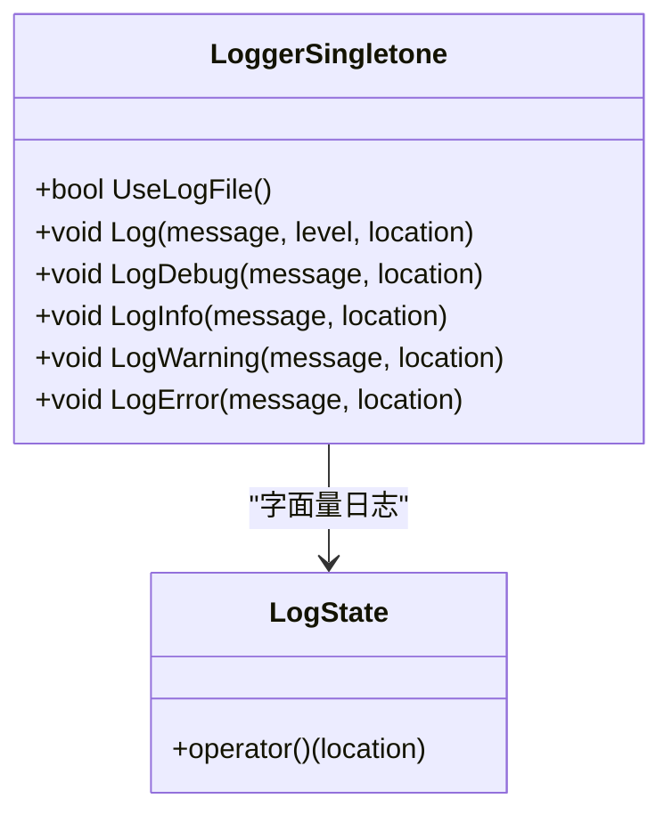

**图表来源**
- [logger/logger.hpp:1-62](file://logger/logger.hpp#L1-L62)
- [logger/logger.cpp:1-293](file://logger/logger.cpp#L1-L293)
- [utils/logcfg.ini:1-8](file://utils/logcfg.ini#L1-L8)

**章节来源**
- [logger/logger.hpp:1-62](file://logger/logger.hpp#L1-L62)
- [logger/logger.cpp:1-293](file://logger/logger.cpp#L1-L293)
- [utils/logcfg.ini:1-8](file://utils/logcfg.ini#L1-L8)

### 添加新测试步骤
- 新增测试文件：在 tests/<子目录>/ 新建 <name>_test.cpp
- 定义模块与用例：在文件顶部定义 BOOST_TEST_MODULE，编写 BOOST_AUTO_TEST_CASE/BOOST_AUTO_TEST_SUITE
- 在 tests/CMakeLists.txt 中：
  - add_executable(<name>_test 子目录/<name>_test.cpp)
  - target_link_libraries(<name>_test ... Boost::unit_test_framework ...)
  - target_compile_definitions(<name>_test PRIVATE BOOST_TEST_DYN_LINK)
  - enable_testing() 与 add_test(NAME <name>_test COMMAND $<TARGET_FILE:<name>_test> ...)
  - 可选：为构建后自动运行添加 add_custom_command
- 重新配置并构建，使用 ctest 验证

**更新** 参考新增的 model_loader_test 和 support_test 的 CMakeLists.txt 配置示例。

**章节来源**
- [tests/CMakeLists.txt:793-821](file://tests/CMakeLists.txt#L793-L821)
- [tests/CMakeLists.txt:763-791](file://tests/CMakeLists.txt#L763-L791)

### 调试技巧
- 使用日志输出中间状态：在关键路径调用日志接口，结合源码位置信息快速定位
- 使用 CMake Debug 模式：在 Debug 预设下编译，启用断点与更详细的日志
- 分析内存使用：结合静态分析工具与日志，关注 new/malloc 与 delete/free 匹配，避免潜在泄漏

**章节来源**
- [logger/logger.cpp:144-293](file://logger/logger.cpp#L144-L293)
- [CMakePresets.json:1-153](file://CMakePresets.json#L1-L153)

### 静态分析与质量门禁
- 使用 static_check/cpp_analyzer.py：
  - 跳过 tests 与 examples
  - 检测 catch(...)、using namespace、不安全函数、魔法数字、潜在内存泄漏、高圈复杂度
  - 支持输出报告文件与退出码，便于 CI 集成
- 建议：在提交前运行静态分析，修复高复杂度与潜在泄漏，保持代码一致性

**章节来源**
- [static_check/cpp_analyzer.py:1-377](file://static_check/cpp_analyzer.py#L1-L377)

## 结论
本项目的测试与调试体系以 Boost.Test 为核心，配合统一日志系统与静态分析工具，形成从编译、运行到定位问题的闭环。通过明确的测试组织、条件编译与配置文件管理，开发者可以在不同平台上高效地验证功能正确性与稳定性，并借助日志与静态分析工具快速定位问题与优化代码质量。

**更新** 新增的模型加载器和支撑生成测试套件显著增强了系统的测试覆盖率，特别是针对 FDM 全流程协程接口的关键功能模块。这些测试确保了预处理、支撑生成、填充算法和路径生成等核心功能的正确性和稳定性。

## 附录

### 关键测试用例解析
- polygon_fill_test.cpp：验证填充算法的正确性，包括基础线性/锯齿填充、几何约束、复合与 Lua 自定义填充
- cgal_model_test.cpp：验证 CGAL 模型创建、网格提取与体积校验；Debug 下禁用布尔运算
- full_topo_model_test.cpp：基于最小 IModel 实现验证切片输出为闭合多边形且面积大于零，支持 Lua 切片
- **model_loader_test.cpp**：验证模型加载器的完整功能，包括池管理、布尔运算、厚实体操作和异常处理
- **support_test.cpp**：覆盖所有支撑算法的实现，包括悬垂检测、FDM 各种支撑模式、SLA 支撑和 Lua 脚本支持

**章节来源**
- [tests/PolygonFill/polygon_fill_test.cpp:1-117](file://tests/PolygonFill/polygon_fill_test.cpp#L1-L117)
- [tests/Models/cgal_model_test.cpp:1-49](file://tests/Models/cgal_model_test.cpp#L1-L49)
- [tests/Models/full_topo_model_test.cpp:1-167](file://tests/Models/full_topo_model_test.cpp#L1-L167)
- [tests/Preprocess/model_loader_test.cpp:1-365](file://tests/Preprocess/model_loader_test.cpp#L1-L365)
- [tests/Support/support_test.cpp:1-323](file://tests/Support/support_test.cpp#L1-L323)

### FDM 全流程协程接口测试架构
**新增** 项目现已支持完整的 FDM 全流程协程接口测试：

- **LibHsBaSlicer 接口层**：提供预处理、支撑、填充、路径生成的封装接口
- **DllHsBaSlicer 协程实现**：基于 C++20 协程实现完整的 FDM 流水线
- **测试覆盖**：通过独立的测试套件验证每个接口的功能和性能

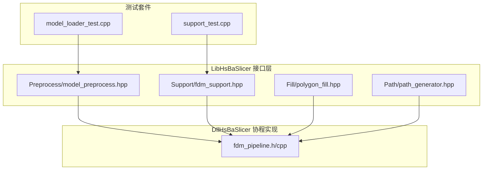

**图表来源**
- [LibHsBaSlicer/Preprocess/model_preprocess.hpp:1-88](file://LibHsBaSlicer/Preprocess/model_preprocess.hpp#L1-L88)
- [LibHsBaSlicer/Support/fdm_support.hpp:1-36](file://LibHsBaSlicer/Support/fdm_support.hpp#L1-L36)
- [LibHsBaSlicer/Fill/polygon_fill.hpp:1-36](file://LibHsBaSlicer/Fill/polygon_fill.hpp#L1-L36)
- [LibHsBaSlicer/Path/path_generator.hpp:1-62](file://LibHsBaSlicer/Path/path_generator.hpp#L1-L62)
- [DllHsBaSlicer/fdm_pipeline.h:1-127](file://DllHsBaSlicer/fdm_pipeline.h#L1-L127)