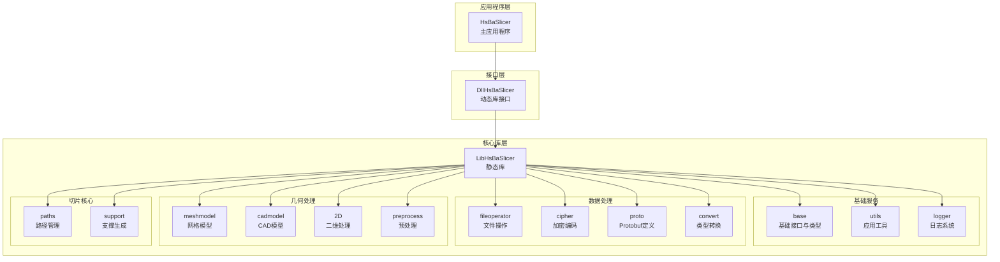
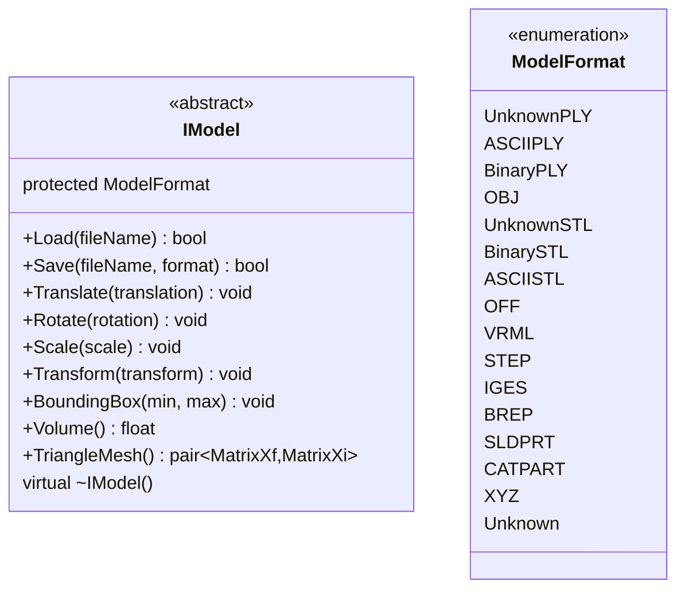
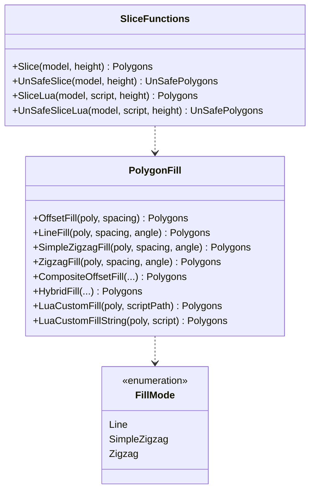
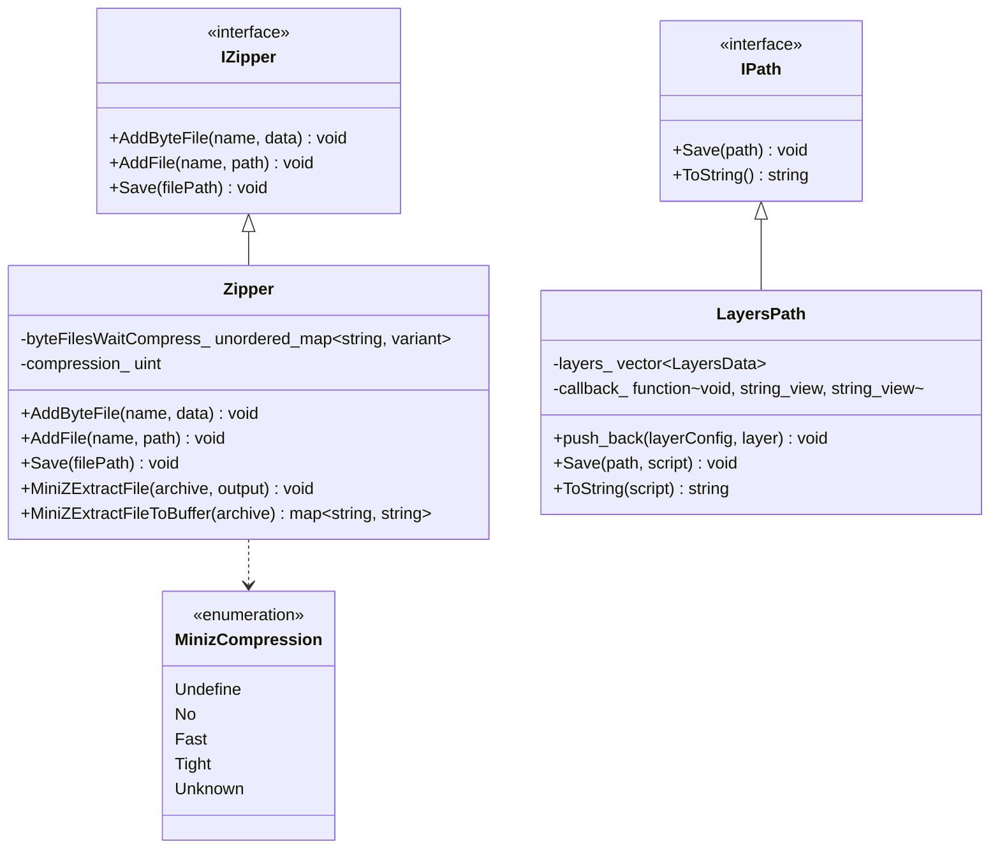
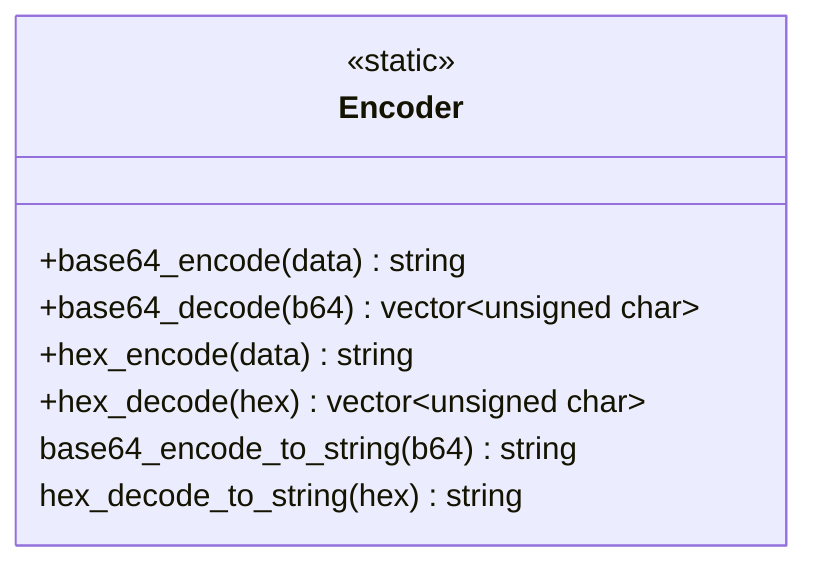
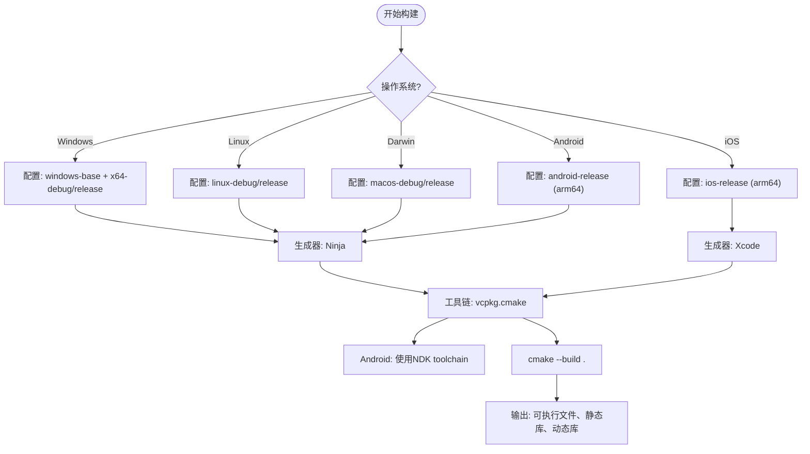

# 项目概述

<cite>
**本文引用的文件**  
- [README.md](file://README.md)
- [CMakeLists.txt](file://CMakeLists.txt)
- [CMakePresets.json](file://CMakePresets.json)
- [IModel.hpp](file://base/IModel.hpp)
- [export.h](file://LibHsBaSlicer/export.h)
- [dllexport.h](file://DllHsBaSlicer/dllexport.h)
- [pch_headers.hpp](file://LibHsBaSlicer/pch_headers.hpp)
- [mesh_slice.hpp](file://LibHsBaSlicer/Slice/mesh_slice.hpp)
- [PolygonFill.hpp](file://2D/PolygonFill.hpp)
- [layerspath.hpp](file://paths/layerspath.hpp)
- [zipper.hpp](file://fileoperator/zipper.hpp)
- [encoder.hpp](file://cipher/encoder.hpp)
- [android/README.md](file://android/README.md)
</cite>

## 更新摘要
**所做更改**   
- 增强了全面的项目概览，包含详细的模块描述，涵盖基础层、文件与数据模块、几何模型和切片核心组件
- 添加了完整的架构图表和改进了文档结构
- 更新了项目结构说明以反映最新的模块化设计
- 完善了各核心组件的详细分析

## 目录
1. [简介](#简介)
2. [项目结构](#项目结构)
3. [核心功能](#核心功能)
4. [系统架构](#系统架构)
5. [详细组件分析](#详细组件分析)
6. [跨平台构建支持](#跨平台构建支持)
7. [代码调用示例](#代码调用示例)
8. [目标用户](#目标用户)
9. [结论](#结论)

## 简介

HsBaSlicer 是一个面向3D打印和CNC加工领域的高性能3D模型切片处理系统。该项目采用现代化的C++20标准，提供模块化、跨平台的切片核心能力。系统设计注重分层架构与可扩展性，通过清晰的模块划分实现了从模型加载、几何变换、分层切片、二维路径填充到结果压缩输出的完整处理能力。

项目采用三层架构设计：应用程序层（HsBaSlicer）、接口层（DllHsBaSlicer）和核心库层（LibHsBaSlicer），并通过动态库接口实现跨语言集成。其核心功能包括安全/非安全切片、多模式填充路径生成、基于Lua的自定义算法扩展、文件压缩与加密等，适用于工业级增材制造与减材加工场景。

**Section sources**
- [README.md:1-399](file://README.md#L1-L399)

## 项目结构

HsBaSlicer 采用分层模块化架构，各目录职责明确，便于维护与扩展。项目结构按照功能域进行清晰划分：

```mermaid
graph TD
A[根目录] --> B[基础层]
A --> C[文件与数据层]
A --> D[几何模型层]
A --> E[切片核心层]
A --> F[应用层]
B --> B1[base - 基本类型与接口]
B --> B2[utils - 扩展工具]
B --> B3[logger - 日志系统]
C --> C1[fileoperator - 文件操作]
C --> C2[cipher - 加密编解码]
C --> C3[proto - Protobuf定义]
C --> C4[convert - 类型转换]
D --> D1[2D - 二维多边形处理]
D --> D2[meshmodel - 网格模型]
D --> D3[cadmodel - CAD模型]
D --> D4[preprocess - 预处理]
E --> E1[paths - 路径管理]
E --> E2[support - 支撑生成]
E --> E3[LibHsBaSlicer - 静态库]
E --> E4[DllHsBaSlicer - 动态库]
E --> E5[HsBaSlicer - 主程序]
F --> F1[samples - 使用示例]
F --> F2[tests - 测试套件]
F --> F3[docs - 项目文档]
F --> F4[android - Android工程]
```



**Diagram sources**
- [README.md:7-52](file://README.md#L7-L52)

### 基础层

基础层提供整个系统的核心基础设施：

| 文件夹 | 说明 |
|--------|------|
| **base** | 基本类型、基础组件和接口定义（单例、模板辅助、委托、协程、对象池、线程池、静态反射等） |
| **utils** | 相对于 base 的扩展工具（应用配置、Lua 绑定、结构化 JSON/YAML/XML 等） |
| **logger** | 线程安全的单例日志系统 |

### 文件与数据层

文件与数据层负责数据的持久化和传输：

| 文件夹 | 说明 |
|--------|------|
| **fileoperator** | 文件和属性配置树操作，包含 ZIP 压缩/解压、SQLite 数据库、Lua 适配器等 |
| **cipher** | 加密、哈希和编解码工具（AES/3DES/RSA、MD5/SHA、Base64/Hex） |
| **proto** | Protobuf 消息定义（网格、切片配置、路径、点、变换等） |
| **convert** | 切片过程中的类型与 Protobuf 消息的相互转换 |

### 几何模型层

几何模型层处理各种3D模型的表示和操作：

| 文件夹 | 说明 |
|--------|------|
| **2D** | 二维多边形处理（整数/浮点多边形、凸包、图像转多边形、多边形填充） |
| **meshmodel** | 网格模型（CGAL / IGL / OpenCascade 三种后端） |
| **cadmodel** | CAD 模型（基于 OpenCascade 的 B-Rep 建模与布尔运算） |
| **preprocess** | 模型预处理与加载 |

### 切片核心层

切片核心层是项目的核心业务逻辑所在：

| 文件夹 | 说明 |
|--------|------|
| **paths** | 输出路径管理（层路径、点路径、图像路径、机器人路径） |
| **support** | 支撑生成（FDM/SLA 支撑、悬垂检测、Lua 自定义支撑） |
| **LibHsBaSlicer** | 底层 C++ 静态库，提供预处理、切片、支撑、填充、路径生成五大核心接口 |
| **DllHsBaSlicer** | 上层 C 动态库，提供基于协程优化的 FDM 全流程 Pipeline 接口 |
| **HsBaSlicer** | 最终应用程序入口 |

**Section sources**
- [README.md:7-52](file://README.md#L7-L52)

## 核心功能

HsBaSlicer 提供以下关键功能：

- **模型加载与保存**：通过 `IModel` 接口支持多种3D模型格式的读写，包括STL、OBJ、PLY、STEP、IGES等格式。
- **几何变换**：支持平移、旋转、缩放及仿射变换，基于Eigen数学库实现高精度计算。
- **分层切片**：在指定高度进行Z向平面切片，生成封闭轮廓，支持安全与非安全两种模式。
- **二维路径填充**：提供直线、锯齿、偏移等多种填充模式，支持复合填充和混合填充策略。
- **Lua脚本扩展**：允许通过Lua脚本自定义切片与填充逻辑，提供灵活的算法扩展机制。
- **路径输出管理**：支持将多层切片结果序列化为结构化数据，可定制序列化格式。
- **文件压缩与编码**：集成miniz实现ZIP压缩，支持Base64与Hex编码，可选bit7z支持。
- **跨平台构建**：通过CMake Presets支持Windows、Linux、macOS、Android等多平台一键构建。

**Section sources**
- [README.md:1-399](file://README.md#L1-L399)
- [mesh_slice.hpp:1-28](file://LibHsBaSlicer/Slice/mesh_slice.hpp#L1-L28)
- [PolygonFill.hpp:1-130](file://2D/PolygonFill.hpp#L1-L130)
- [layerspath.hpp:1-47](file://paths/layerspath.hpp#L1-L47)

## 系统架构

HsBaSlicer 采用三层架构设计，清晰划分职责边界，确保系统的可维护性和可扩展性：



### 架构层次说明

- **HsBaSlicer**：主应用程序，负责调用DLL接口执行切片任务，提供用户界面或命令行交互。
- **DllHsBaSlicer**：动态链接库，封装核心功能并提供C/C++ API导出，支持跨语言调用。
- **LibHsBaSlicer**：静态库，包含所有核心算法与业务逻辑，是系统的核心实现。
- **基础服务**：提供模型接口、文件操作、路径生成、加密编码等公共服务。
- **数据处理**：负责数据的持久化、传输和格式转换。
- **几何处理**：处理各种3D模型的表示、变换和几何运算。
- **切片核心**：实现具体的切片算法、路径规划和支撑生成。

**Diagram sources**
- [CMakeLists.txt:314-337](file://CMakeLists.txt#L314-L337)
- [export.h:1-15](file://LibHsBaSlicer/export.h#L1-L15)
- [dllexport.h:1-16](file://DllHsBaSlicer/dllexport.h#L1-L16)

**Section sources**
- [CMakeLists.txt:314-337](file://CMakeLists.txt#L314-L337)

## 详细组件分析

### 基础接口组件

`IModel` 是所有3D模型的抽象基类，定义了加载、保存、变换和查询等统一接口。该接口提供了跨不同几何内核的统一访问方式，支持多种模型格式的读写操作。



**Diagram sources**
- [IModel.hpp:108-136](file://base/IModel.hpp#L108-L136)
- [IModel.hpp:66-106](file://base/IModel.hpp#L66-L106)

**Section sources**
- [IModel.hpp:1-148](file://base/IModel.hpp#L1-L148)

### 切片与填充组件

切片组件提供核心的三维到二维转换功能，支持安全与非安全两种切片模式。填充组件实现多种二维填充算法，并支持Lua脚本扩展。



**Diagram sources**
- [mesh_slice.hpp:17-24](file://LibHsBaSlicer/Slice/mesh_slice.hpp#L17-L24)
- [PolygonFill.hpp:23-126](file://2D/PolygonFill.hpp#L23-L126)
- [PolygonFill.hpp:59-64](file://2D/PolygonFill.hpp#L59-L64)

**Section sources**
- [mesh_slice.hpp:1-28](file://LibHsBaSlicer/Slice/mesh_slice.hpp#L1-L28)
- [PolygonFill.hpp:1-130](file://2D/PolygonFill.hpp#L1-L130)

### 文件与路径管理组件

文件管理组件提供压缩、解压和序列化功能，路径管理组件负责切片结果的组织和存储。



**Diagram sources**
- [zipper.hpp:37-75](file://fileoperator/zipper.hpp#L37-L75)
- [zipper.hpp:21-28](file://fileoperator/zipper.hpp#L21-L28)
- [layerspath.hpp:13-43](file://paths/layerspath.hpp#L13-L43)

**Section sources**
- [zipper.hpp:1-92](file://fileoperator/zipper.hpp#L1-L92)
- [layerspath.hpp:1-47](file://paths/layerspath.hpp#L1-L47)

### 编码与加密组件

编码组件提供Base64和Hex编解码功能，为数据传输和存储提供便利。



**Diagram sources**
- [encoder.hpp:10-38](file://cipher/encoder.hpp#L10-L38)

**Section sources**
- [encoder.hpp:1-41](file://cipher/encoder.hpp#L1-L41)

## 跨平台构建支持

项目通过 `CMakePresets.json` 提供完善的多平台构建支持，涵盖Windows、Linux、macOS和Android平台。预设配置使用Ninja作为生成器，并集成vcpkg进行依赖管理。



### 平台特性支持

- **Windows**：支持Visual Studio 2022+，使用MSVC编译器，支持动态库和静态库构建
- **Linux**：支持Ubuntu 20.04+，使用GCC/Clang编译器，完整功能支持
- **macOS**：支持Clang编译器，部分功能受限
- **Android**：支持ARM64架构，使用NDK r27d+，移动端优化
- **iOS**：支持arm64架构，最低部署目标16.3

**Diagram sources**
- [CMakePresets.json:4-176](file://CMakePresets.json#L4-L176)

**Section sources**
- [CMakePresets.json:1-179](file://CMakePresets.json#L1-L179)
- [README.md:53-399](file://README.md#L53-L399)

## 代码调用示例

以下是一个典型的C++代码示例，展示如何使用HsBaSlicer核心API完成一次基本切片流程：

```cpp
#include "base/IModel.hpp"
#include "meshmodel/IglModel.hpp"
#include "LibHsBaSlicer/Slice/mesh_slice.hpp"
#include "2D/PolygonFill.hpp"
#include "paths/layerspath.hpp"
#include "fileoperator/zipper.hpp"

int main() {
    try {
        // 1. 创建模型实例并加载
        HsBa::Slicer::IModel* model = new HsBa::Slicer::IglModel();
        if (!model->Load("input.stl")) {
            throw std::runtime_error("Failed to load model");
        }
        
        // 2. 应用几何变换
        Eigen::Vector3f scale(2.0f, 2.0f, 2.0f);
        model->Scale(scale);
        
        Eigen::Vector3f translation(10.0f, 10.0f, 0.0f);
        model->Translate(translation);
        
        // 3. 执行分层切片
        float layerHeight = 0.2f;
        auto slices = HsBa::Slicer::Slice(*model, layerHeight);
        
        // 4. 生成填充路径
        double spacing = 0.8f;
        double angle = 45.0f;
        auto filled = HsBa::Slicer::LineFill(slices, spacing, angle);
        
        // 5. 保存路径结果
        HsBa::Slicer::LayersPath path;
        path.push_back("layer_config", filled);
        path.Save("output.path");
        
        // 6. 压缩输出文件
        HsBa::Slicer::Zipper zipper;
        zipper.AddFile("path", "output.path");
        zipper.Save("output.zip");
        
        delete model;
        
    } catch (const std::exception& e) {
        std::cerr << "Error: " << e.what() << std::endl;
        return 1;
    }
    
    return 0;
}
```

**Section sources**
- [IModel.hpp:108-136](file://base/IModel.hpp#L108-L136)
- [mesh_slice.hpp:17-24](file://LibHsBaSlicer/Slice/mesh_slice.hpp#L17-L24)
- [PolygonFill.hpp:34-54](file://2D/PolygonFill.hpp#L34-L54)
- [layerspath.hpp:33-43](file://paths/layerspath.hpp#L33-L43)
- [zipper.hpp:54-60](file://fileoperator/zipper.hpp#L54-L60)

## 目标用户

HsBaSlicer 主要面向以下三类用户：

- **C++开发者**：可直接集成LibHsBaSlicer静态库，调用丰富的API实现定制化切片逻辑，适合需要深度集成的应用场景。
- **系统集成工程师**：通过DllHsBaSlicer动态库接口，将切片功能嵌入现有制造系统或桌面应用，支持跨语言调用。
- **高级用户与研究人员**：利用Lua脚本扩展机制，开发新型填充算法或工艺参数优化策略，无需修改核心代码。

项目设计充分考虑可扩展性与易用性，初学者应重点关注 `IModel` 接口、`Slice` 函数和 `LayersPath` 类作为入门切入点。

**Section sources**
- [README.md:1-399](file://README.md#L1-L399)
- [IModel.hpp:108-136](file://base/IModel.hpp#L108-L136)
- [mesh_slice.hpp:17-24](file://LibHsBaSlicer/Slice/mesh_slice.hpp#L17-L24)
- [layerspath.hpp:13-43](file://paths/layerspath.hpp#L13-L43)

## 结论

HsBaSlicer 是一个功能完备、架构清晰的3D切片处理系统，具备高性能、跨平台和可扩展等优势。其模块化设计使得核心算法与接口分离，便于独立开发与测试。通过支持多种建模内核、Lua脚本扩展和多平台构建，项目为3D打印与CNC加工领域提供了灵活可靠的解决方案。

项目采用现代化的C++20标准，结合CMake构建系统和vcpkg依赖管理，确保了良好的开发体验和部署便利性。未来可进一步完善文档、增加测试用例并优化Android集成体验，同时考虑添加更多填充算法和工艺支持。